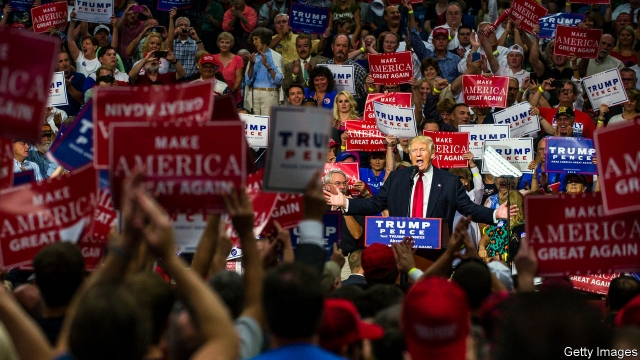
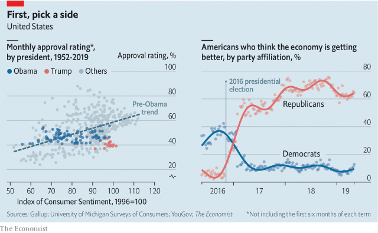

###### Polling and consumer confidence

# American voters don’t care about the economy 

##### If you’re a Republican, it looks great—and vice versa 

 

> May 23rd 2019 

JAMES CARVILLE, who worked for Bill Clinton’s presidential campaign, hung a sign in his Arkansas headquarters in 1992. Designed to keep the candidate on-message, it read: “Change vs. more of the same. The economy, stupid. Don’t forget health care.” The second injunction has become famous. It is common knowledge that a strong economy helps an incumbent, whereas a weak one is a liability. But this is less true than it used to be. 

Between 1952 and 2009, when Barack Obama became president, the popularity of America’s leaders was quite strongly influenced by the economy. Excluding the first six months of every president’s term (a honeymoon period when ratings tend to be high) a quarter of the variation in monthly presidential approval ratings could be explained by variation in the index of consumer sentiment. Ronald Reagan had an approval rating of 42% when Americans were suffering under high inflation in the summer of 1982. By the time the economy rebounded four years later, his rating had increased by 25 percentage points. 

Under Barack Obama the relationship broke down. After the highs of the first few months, his approval rating moved between 40% and the low 50s. Americans felt much the same about him in good times and in bad. President Donald Trump also seems stuck in the polls, despite a booming economy. If the normal relationship between consumer confidence and popularity held, about 60% of Americans would approve of him. The latest Gallup poll suggests that only 42% do. 

 

One explanation is that partisanship now colours Americans’ reading of the economy, as it colours their views on many other things. Polling on behalf of The Economist by YouGov shows that Republicans are four times as optimistic as Democrats about the state of the stockmarket, which Mr Trump often cheers on. Liberals complain about high housing costs and low wage growth—never mind that wages are growing more strongly now than towards the end of Mr Obama’s term. 

Mr Trump’s election in 2016 was followed by a rapid switch in attitudes. From the six months before the election to the six months after, YouGov measured a 45 percentage-point increase in the share of Republican-aligned Americans who believed the economy was getting better. Democrats became sharply more pessimistic. So it’s not any longer the economy, stupid. It’s the partisanship. 

