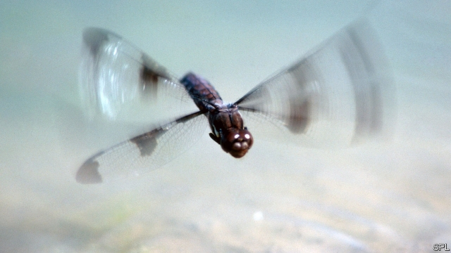

###### Endangered wetlands

# America’s natural kidneys need more protection, not less 

##### Why draining the swamp is a bad idea 

 

> May 23rd 2019 

EACH SPRING visitors flock to the Muscatatuck wildlife refuge in Indiana. Even under scudding clouds, a shallow lake shimmers. It brims with aquatic plants and is lined with reeds and willows. At least 33 types of dragonfly jostle for space. Four-toed salamanders, muskrats and beavers call it home. Box turtles brave roads to reach it. Even the odd human pops by. 

Farmers gave up on this marginal land in the last century, defeated by frequent floods. In the 1960s the area won national protection. An earthen berm was built to keep the lake in place. The restored wetland was a rare success. Tramping around its muddy edge, Adam Ward of Indiana University says that nine-tenths of the state’s wetlands have been filled in, farmed or built over. In some other midwestern states the loss is almost total. 

Insects, migrating birds and other wildlife lose their habitats as a result. And humans can feel the loss of wetlands, too. Todd Royer, also of Indiana University, points out that they have many uses, from recreation to storing flood water. Upstream wetlands once slowed the release of rainwater to rivers. Without them, deluges are more likely downstream, such as those now swamping cities and farms along the Mississippi. In Baton Rouge, Louisiana, officials said this week that the river had been at “flood stage” for more than 136 days, surpassing a record set in 1927. 

Wetlands also clean water, removing pollutants that leach into rivers and contaminate wells. Mr Royer calls wetlands “the kidneys of the landscape”. Rivers used to be fouled by “point source” pollution from outlets such as tanneries or factories. National laws like the Clean Water Act of 1972 mostly ended that. The lingering problem is “non-point” pollution, mostly nitrates washed from fields and suburban lawns, or phosphorus, pathogens and other nasties in urban wastewater. 

Water overloaded with nutrients is a curse. It takes roughly two weeks for a drop entering the Wabash river in Indiana to wend its way, via the Mississippi, to the Gulf of Mexico. Each summer algae blooms in the river, fed by nitrates. As these die they feed bacteria which suck oxygen from the water. The result, when the Mississippi gushes into the brine of the Gulf, is a huge oxygen-free dead zone. Last summer the hypoxic area covered 2,700 square miles. 

As the cost of losing wetlands is better understood, the case for protecting them should strengthen. Mr Ward fears the reverse is happening. The Environmental Protection Agency last year proposed a rule to redefine—and almost certainly reduce—which waters come under the Clean Water Act. Its final plan, which will probably appear this autumn, is expected to give landowners and officials, rather than scientists, more say on whether a body of surface water counts as a flowing stream worth looking after. 

Protection of many wetlands, in turn, depends on their being close to protected streams. If the EPA pushes on with its plan this year, as much as 39% of the existing wetlands in the Wabash river basin could lose federal protection, estimate Mr Ward and his colleagues in a recent paper. States could continue to protect water. But without strict federal rules, “I doubt all states would protect wetlands as they do now,” says Mr Ward. Idyllic corners such as Muscatatuck may become more precious than ever, and the dead zone in the Gulf of Mexico may grow. 

