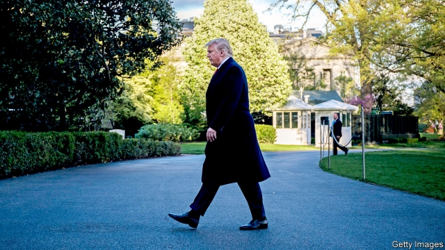

###### Donald Trump’s financial records

# Congress is winning the legal battle against the White House 

##### If the president defies a court order, it’s game on 

 

> May 23rd 2019 

THE BARRICADES are up at the White House, where President Donald Trump has vowed to fight “all the subpoenas” flying from Democrats in the House of Representatives. Early engagements have not gone well for Mr Trump. This week he lost two crucial skirmishes. 

On May 20th a judge in Washington rejected Mr Trump’s request to block a subpoena instructing Mazars USA, his accounting firm, to hand over financial records stretching back to 2011. Two days later a judge in New York thwarted an attempt by Mr Trump, three of his children and the Trump Organisation to stop Deutsche Bank and Capital One from delivering banking records to two House committees. 

In the first case, a committee demanded records after Michael Cohen, Mr Trump’s longtime lawyer, testified in February that his former boss altered the estimated value of his assets and liabilities to suit his needs. These allegations, legislators said, may point to conflicts of interest that “impair his ability to make impartial policy decisions”. They could also provide evidence that Mr Trump has profited from his office, in violation of the constitution’s foreign-emoluments clause. 

The president assured reporters that the ruling was “crazy” and “totally the wrong decision by, obviously, an Obama-appointed judge”. Judge Amit Mehta was indeed appointed by Mr Trump’s predecessor. But his 41-page ruling is a straightforward application of a 90-year-old Supreme Court precedent recognising that Congress’s power to secure “needed information” is “an attribute of the power to legislate”. It is not “fathomable”, Mr Mehta wrote, that the constitution would grant Congress “the power to remove a president for reasons including criminal behaviour” but deny it “the power to investigate him for unlawful conduct”. Both Mr Mehta and Judge Edgardo Ramos, who said the Deutsche Bank suit did not raise “any serious questions”, refused to put their rulings on hold while Mr Trump appeals. 

The cases could eventually go to the Supreme Court, where Mr Trump has installed two justices. But Laurence Tribe, a scholar of constitutional law at Harvard University, cannot imagine the president prevailing there. And if the president defies a court order, the constitutional crisis that some Americans have predicted since 2016 will arrive at last. 

