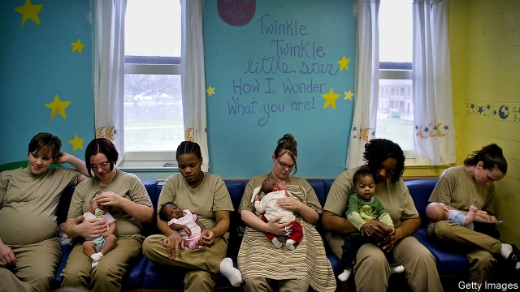

###### Prison childcare

# Why some American states are locking up toddlers 

##### It is probably better than separating mothers and children 

 

> May 23rd 2019 

LIKE MANY people in prison, Ada Lynn listens more than she speaks, spends most of her time with people she knows best and is deeply wary of strangers. In fact, when she sees one she tends to burst into tears—because, unlike most people in prison, she is ten months old. Natalie Myers, Ada Lynn’s 23-year-old mother, was pregnant when she was imprisoned for vehicular homicide. Washington is one of just a few states that offer residential nurseries for women who give birth while behind bars. Ms Myers loves the programme. “This is the best thing that has ever happened to me,” she says. “I always thought I’d never be a functional person because I dug myself into such a hole. But here I’m figuring out who I am with my daughter.” 

Not everyone shares her optimism. Carolyn Sufrin, a professor at Johns Hopkins University, worries about the effects on children’s development. Prison is prison, no matter how prettily the nurseries are decorated. Others believe that the programmes would not survive a court challenge brought on behalf of a baby imprisoned without due process. 

According to the Bureau of Justice, 225,000 women were behind bars in 2017, 99,000 of them in state prisons (jails contain people awaiting trial or serving short sentences, whereas prisons house people convicted of more serious crimes). That is around one-tenth the total number of people incarcerated, but it is nearly ten times as many women as were locked up in 1978. As the number of convicts in America has fallen since 2008, in most states the female prison population has either continued to grow or declined more slowly than the male population. 

According to Dr Sufrin’s study, as of December 2016, 3.8% of newly admitted women prisoners were pregnant. In 1976 the Supreme Court ruled that states must provide health care for prisoners, but what that means in practice varies, particularly for pregnant women. They are sometimes shackled while giving birth—a practice that often continues, according to Amy Fettig, a lawyer with the American Civil Liberties Union, even after states outlaw it. 

New York opened the first prison nursery in 1901; today 11 states have them. Admission rules vary, but in general women convicted of child-related or violent crimes are ineligible, as are women with behavioural or mental-health problems, or with a poor disciplinary record in prison. To be accepted into Washington state’s scheme, women must be pregnant at the time of their imprisonment and have less than 30 months to serve from the time of delivery; mothers and children are released together. 

Prison nurseries seem to be the best of several bad options facing pregnant inmates. Researchers have found that they are associated with lower rates of reoffending, compared with women forced to give up their children, and with fewer behavioural and disciplinary problems than among women in the general prison population. But whether that is because of the programmes, or because women capable of complying with the strictures that prison-nursery programmes impose were heading down the right path anyway, is unclear. That raises another question. “If women meet these conditions, what are they doing in prison?” wonders Dr Sufrin. “I think it’s essential to find ways to maintain family bonds. I just think we need to do it in ways that don’t involve barbed wire.” 

