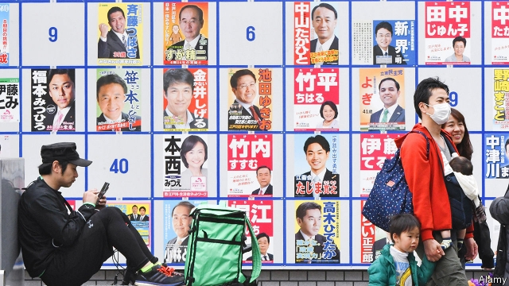

###### No contest

# Local elections in Japan are running out of candidates and voters 

##### As the population ages and shrinks, people do not see the point 

 

> May 30th 2019 

ARMS ALOFT, Noriko Suematsu three times chants her victory cry: “Banzai!” She has just won a third consecutive term as mayor of the city of Suzuka in Mie, a prefecture in central Honshu, Japan’s main island. To pose for the cameras recording her triumph, she is given a lobster and a red sea-bream—auspicious celebratory props often used by politicians. This time is different from her two previous wins. “It was my first time winning the race uncontested,” she confesses. “It felt strange.” 

Odd perhaps, but such walkovers are far from uncommon. In the most recent nationwide local elections, held in April, 30% of city mayors ran uncontested, up slightly from the previous poll in 2015. A whopping 45% of mayors in towns and villages were elected unopposed. A record number of local-assembly members, elected in each municipality, also won seats with zero votes. In some rural areas there were more assembly seats than candidates. 

The number of uncontested races has been climbing since the early 1990s, particularly in the countryside. One reason is that the population is falling and the pool of candidates is shrinking. The National Institute of Population and Social Security Research, a government think-tank, reckons about 95% of local municipalities will have fewer residents by 2045. Already, 80% are experiencing declining populations. 

At the same time, interest in local elections is sagging. In the 1950s more than four-fifths of the electorate would vote in local races. But in April turnout sank to record lows, under 50%. Voters have been put off by frequent scandals, from petty corruption to sexual harassment. Moreover, “people don’t understand what these local lawmakers do,” says Ken Victor Leonard Hijino of Kyoto University. 

Despite a small increase in young and female lawmakers—like Ms Suematsu, who is in her forties—local politics is still dominated by old men. “In these municipalities, candidates are so old they have a hard time putting up election posters,” says Shigeki Uno of the Nippon Institute for Research Advancement, another think-tank. Indeed, three-quarters of town and village assembly members are over 60. The oldest, aged 91, holds a seat on a city assembly in Shizuoka, in central Japan. 

Young people are loth to stand because local politics is not a financially rewarding profession. The law bans assembly members from holding other jobs concurrently. Their pay averages around ¥300,000 ($2,740) a month, hardly enough to support young families. “It’s basically a job for the retired,” sniffs Mr Uno. And for little pay, the workload is onerous. 

There has been talk of allowing local lawmakers to hold second jobs and to convene meetings out of office hours. Some towns have raised wages. One almost doubled salaries for assembly members under 50, from ¥180,000 a month to ¥300,000. A couple of depopulated villages on Shikoku island are thinking of abolishing the elected assembly in favour of a system of direct democracy based on referendums. 

None of this on its own, however, seems likely to end the spate of uncontested polls. “We need to spread the word about the appeal of being involved in local politics,” says Ken Nakamura, a former mayor who now leads Waseda University’s Research Institute of Manifesto. Local politicians have a lot of say in policies relating to everything from child care to road safety. He hopes that, when children are asked about their dream job, more of them will say “politician”. That might make Japan unique. At least it might encourage more to become voters when they grow up. 

