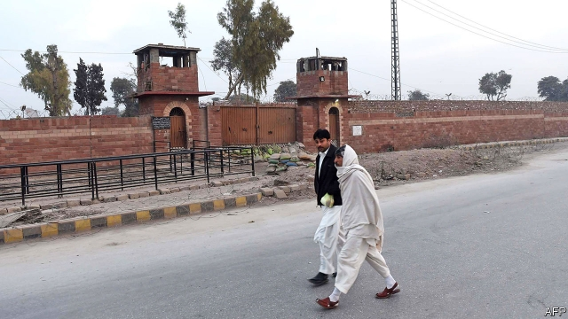

###### The ultimate injustice

# Most convicts on death row in Pakistan should not be there 

##### The Supreme Court overturned 97% of death sentences it reviewed last year 

 

> May 30th 2019 

THE DAY Ghulam Qadir and Ghulam Sarwar were acquitted of murder after a miscarriage of justice should have been a moment to celebrate. The brothers had been awaiting execution for over a decade, only for the Supreme Court belatedly to quash their case. Eyewitness testimony against them was shaky and the prosecution case flimsy, the justices declared. Yet when officials sought to bring the pair the good news, they had a shock. They had been hanged a year earlier. No one had told the court or their lawyer. 

This combination of injustice and incompetence is common in capital cases in Pakistan, a new report argues. Two NGOs, the Foundation for Fundamental Rights, which is based in Pakistan, and Reprieve, based in Britain, have studied the 310 known cases in which the Supreme Court reviewed death sentences between 2010 and 2018. They found that the justices revoked 78% of them. About half of those overturned ended in outright acquittal. The rest saw sentences commuted or a review initiated. If these proportions hold for Pakistan’s 4,700 death-row prisoners, some 1,800 should be set free. As many should have their sentences commuted or their cases retried or reviewed. But such reprieves do not come quickly. The average death-row prisoner spends ten years under threat of execution before the case reaches the Supreme Court. 

The country’s highest judges often complain that lower-court convictions rely on dubious “eyewitness” testimony. Sometimes it is directly at odds with the physical evidence. Particularly suspect are “chance” witnesses—people unrelated to killer or victim who, prosecutors claim, happened to observe a murder or other crime by coincidence. These witnesses often give evidence deemed clinching even if there is no proof they were present when the crime was committed. Such witnesses are sometimes people known to bear a grudge against the accused. 

The Supreme Court also often questions the reliability of the police. Corrupt cops have been found not only to tamper with (or concoct) witness statements, but also to plant evidence and collude with victims or their families. Confessions are often extracted by beating. 

Blundering and inconsistency are also rife. Bungled identity parades, in which the police do not stick to required procedures, undermine even cases in which credible witnesses identify culprits. The lower courts can be arbitrary, too. Evidence strong enough to send one suspect to the gallows, for instance, is deemed too weak to convict his co-accused. 

Then there is the question of which offences merit execution. A total of 27 crimes can lead to a death sentence, ranging from murder, treason, kidnap and drug smuggling to blasphemy. But many Pakistanis are put on death row for crimes the highest court does not believe warrant execution. Over the nine years the NGOs looked at, the court did not uphold a single death sentence for a non-lethal offence. Even for murders, it appeared to favour life sentences for all but the most heinous. Yet lower courts often impose death sentences for drug crimes, for example. 

More than 500 people have been executed since 2014 (pictured is the central jail in the north-western city of Peshawar, where some of the hangings took place). And yet the Supreme Court seems ever more sceptical about capital cases. In 2018 it upheld the death penalty in just 3% of those it reviewed. Among the death sentences it overturned was, most famously, that imposed on an alleged blasphemer, Asia Bibi, which it said was based on “concoction incarnate”. Amnesty International, a London-based watchdog, has recorded a drop in recent executions, from at least 87 in 2016 to 60 in 2017 and 14 in 2018. Yet Amnesty recorded at least 360 death sentences handed down in 2016, over 200 in 2017 and upwards of 250 last year. 

Concerns about the use of the death penalty are long-standing. The Pakistan Peoples Party (PPP), in power from 2008 to 2013, introduced a moratorium on executions in 2008. But the Pakistan Muslim League Nawaz, which defeated the PPP in the election of 2013, pledged to lift the moratorium to tackle a tide of crime and militancy. Indeed, it did so just days after an attack in 2014 on the Army Public School in Peshawar, where the Taliban killed more than 140 people, including 132 children. 

In their new report the NGOs argue that Pakistan’s capital-punishment regime is so broken that the government elected last year, led by Imran Khan, the prime minister, should impose another moratorium immediately. He seems unlikely to listen. That leaves it to the Supreme Court to temper some of the injustices of the judicial system over which it presides. 

