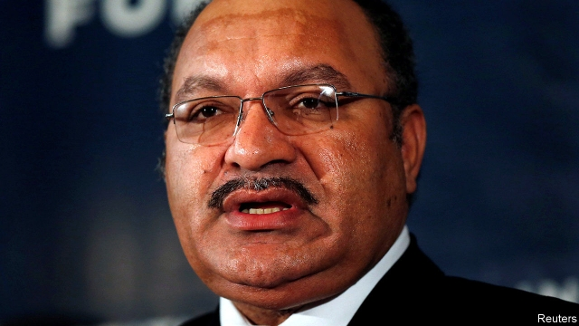

###### A departure unmourned

# Papua New Guinea’s prime minister has resigned 

##### Peter O’Neill leaves office with little to show for his eight years in power 

 

> May 30th 2019 

POLITICAL TRANSITIONS are rarely plain sailing in Papua New Guinea (PNG). The country’s prime ministers like to cling to office regardless of mass desertions of their political allies to their opponents’ side. Its parliamentary speakers defy the rules to keep their jobs. Governments sometimes put pressure on the judiciary and office of the governor-general to help them stay in power. So it was in 2011 during the political turmoil that eventually resulted in Peter O’Neill taking over as PNG’s prime minister. And so it has been again recently, as he has fought to keep his job. Finally, on May 29th, he tendered his resignation to avoid the humiliation of defeat in an impending vote of no-confidence. 

While in office Mr O’Neill presided over a boom in the export of minerals. A $19bn project, launched in 2014, involved the extraction of liquid natural gas in the Southern Highlands, a province. It is the biggest ever private-sector investment in PNG. But Mr O’Neill’s opponents say it has brought little benefit to local people. Paul Flanagan, a former treasury official in PNG, says the country’s living standards have been falling in the past five years. 

A no-confidence motion against Mr O’Neill was originally due to take place in February. But he avoided it by declaring a three-month suspension of parliament. In April discontent grew over another natural-gas deal, worth $13bn, with ExxonMobil, Total and Oil Search, a local firm in which the government has a big stake. Some politicians alleged that its terms were too opaque, and appeared to favour the foreign companies. Some of Mr O’Neill’s cabinet colleagues agreed. First the finance minister, James Marape, resigned. Others soon followed. 

On May 7th Mr O’Neill suspended parliament for another three weeks. When it reconvened it became clear that he could no longer stem the tide. By resigning before the no-confidence motion, Mr O’Neill allowed ministers and pro-government legislators to regroup behind Mr Marape as his replacement. Mr Marape won the resulting election by 101 votes to eight. He is unlikely to push for big changes in policy. 

Australia may have reason to miss Mr O’Neill. He won much favour there for accepting unwanted seekers of asylum in Australia, many of them from war-afflicted regions, on a remote island. Other countries will wonder how the leadership change in PNG will affect their interests. Both China and America have been trying to court favour there to strengthen their influence in a region of strategic importance. They have been pouring money into infrastructure. America has pledged to help rebuild a mothballed naval base. 

But Mr O’Neill’s departure will be little mourned at home. He came to power in 2011 pledging to fight corruption. There has been little progress. His remote, mountainous country remains mired in poverty. Nearly 90% of its 8m citizens live in rural areas. Many of them are subsistence farmers with negligible access to state services. His successor faces a colossal challenge. 

