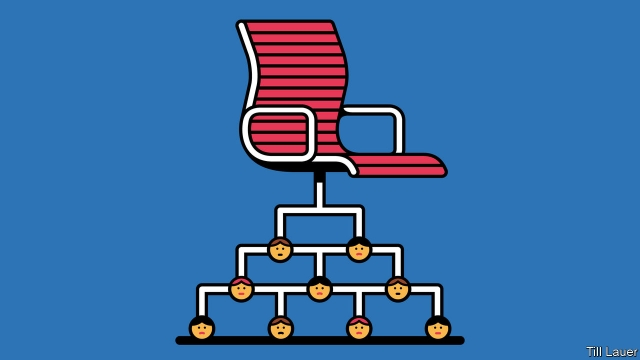

###### Banyan

# The word for “condescending old person” in Korean 

##### What ”kkondae” reveals about young South Koreans’ struggle against hierarchy 

 

> May 30th 2019 

DO YOU FEEL that nobody around you shares your commitment to work? Do you offer unsolicited advice on the fashion choices or love lives of your younger colleagues? Are you irked when a junior office-mate fails to fetch you coffee? Beware: you are well into kkondae territory. South Korean youngsters suggest that you engage in quiet reflection to help you overcome your inflated sense of self-importance. You have to earn their respect. You cannot take it for granted just because you are older. 

Kkondae is a modern word of uncertain origin—perhaps an adaptation of the English word “condescend”. It means an older person, usually a man, who expects unquestioning obedience from people who are junior. A kkondae is quick to criticise but will never admit his own mistakes. He retaliates against people who challenge his authority. South Koreans apply the word to everyone from narcissistic bosses to overbearing uncles and corrupt politicians. There are websites offering tests of kkondae-ness and tips on how to avoid the condition. A television channel recently dedicated a talk show to discussion of it. 

South Korea is notorious for its suffocating workplace hierarchies based on age, sex and length of service. Many South Koreans are outraged when younger colleagues or relatives fail to use the correct honorific to address them. It is difficult for office workers to decline invitations to after-work drinking sessions or weekend hiking expeditions with the boss. During the lunar new year and autumn harvest festivals, women grudgingly spend days cooking and cleaning at their husband’s parents’ homes, with no help from the men. “I have to help my mother, and my brother just sits there doing nothing,” says Park Ji-soo, a 24-year-old student. “Everyone thinks this is completely normal.” 

However, the popularity of kkondae as an insult is a sign of change. Open rebellion against hierarchical strictures is still rare and frowned upon. But young people are beginning to question authority. Ms Park says she stands up to her brother, if not her older relatives. Women report that they feel a bit less pressure than before to defer to men. Mothers can even persuade their husbands to hold their babies in public and (less frequently) to help with housework. Some youngsters, nudged along by the recent introduction of a 52-hour legal limit to the work week, are starting to say “no” to boozing after work. In private they are also paying more attention to their individual needs and less to gaining society’s approval, says Cho Han Hae-joang, an anthropologist at Yonsei University in Seoul. 

Education partly explains this shift. Younger people tend to have more of it than their elders. That gives them greater power to challenge the kkondae, says Moon Seung-sook of Vassar College in America. But like their peers elsewhere, young South Koreans also feel insecure. Lee Do-hoon, a sociologist also at Yonsei University, thinks that those who have come of age in the past two decades have a sense of precariousness because of the Asian financial crisis of 1997-98 and the global one a decade later. They fear that even a good education will not guarantee them security or status. That makes them chafe all the more at a social order which some think is rigged against them. 

South Korea’s evolving political culture has been making an impact, too. Since democracy began to take hold in the country in the late 1980s, belief in universal rights, including people’s right to be treated equally, has become stronger. This has encouraged people to question their deference to others. The death of 304 people when a ferry sank five years ago also caused soul-searching about the dangers of blind obedience. Most of the victims were high-school students who drowned after following instructions to stay put (most crew members abandoned ship early on). The government’s botched response to the disaster triggered mass demonstrations which led to the impeachment and conviction for corruption of Park Geun-hye, who was then South Korea’s president. 

An ancient culture of authority is unlikely to disappear overnight. Young people are becoming more willing to challenge hierarchy, but what will happen as they get older? Some of today’s young upstarts will not achieve the success they dream of. They may find themselves yearning for the kind of deference their elders once automatically enjoyed. Today’s kkondae critics may grow up to be kkondae themselves. But whether tomorrow’s young people will let them get away with that is doubtful. 

