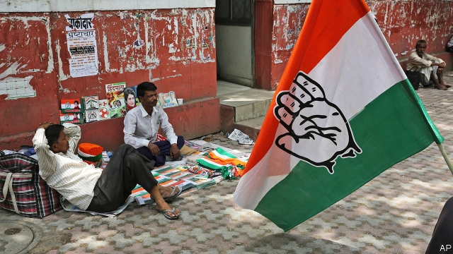
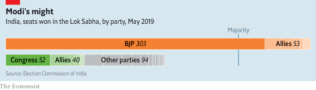

###### In need of a hand

# Troubles have grown for India’s grand old party 

##### Congress has many lessons to learn before the next general elections in 2024 

 

> May 30th 2019 

WHAT COULD be worse in politics than for a governing party to lose four-fifths of its seats in a single election? Try spending years clawing your way back to relevance, only to see your rival do even better in the next poll. And what could be worse than that? Ask India’s Congress party. Pummelled by the upstart Bharatiya Janata Party (BJP) in 2014, and trounced again in a marathon general election that wrapped up on May 23rd, the grand old party that dominated Indian politics for a generation after the country gained independence in 1947 is now in even deeper trouble than it was five years ago. 

With Congress’s rank and file demanding accountability for the party’s defeat, its president, Rahul Gandhi—who lost his own traditional family constituency—has sworn to resign. But the Nehru-Gandhi family has dominated Congress for five generations, and many wonder who else can hold it together. Seeking patronage, smaller, allied parties are drifting towards the orbit of the prime minister, Narendra Modi, and his BJP, which is actively sniffing out potential defectors. Small wonder they are attracted. In constituencies where it faced Congress in a straight one-on-one race, the BJP won 92% of the contests. 

Already reduced to a rump opposition in India’s capital, Congress now risks losing remaining provincial toeholds. Along with allies, it controls just six of India’s 31 states and territories. Local elections in four of them—Rajasthan, Madhya Pradesh, Chhattisgarh and Karnataka—had only recently brought Congress to power. But voters seem to feel differently about state and national elections. All four states have just voted overwhelmingly for the BJP. Congress must now struggle to keep its tenuous hold on its handful of state assemblies as the BJP tempts its legislators with money or future cabinet posts. Without weight in the states, Congress’s sources of income and influence would shrivel. 

It is not just Congress that is hurting. The just-concluded elections to the Lok Sabha, or lower house of parliament, saw the BJP make deep inroads in states that had been seen as resistant to its charms, because they either had strong local parties or felt culturally distant from its emphasis on the Hindi language and a narrow version of Hinduism. Even politicians who had been friendly to Mr Modi, such as the powerful chief ministers of Telangana and Odisha, found his party eating away at their electoral bases. In Andhra Pradesh a rising political star, Jagan Mohan Reddy, had signalled willingness to join a BJP-led coalition. His plan was to extract concessions, including more central revenue for his state. But Mr Modi’s majority proved so big that he has no need of Mr Reddy, even if the young politician did indeed sweep the polls in his own state (where the BJP hardly bothered to campaign). 

 

Most shocking of all was the BJP’s successful invasion of West Bengal, a state with 100m Bengali-speaking people, nearly a third of them Muslim, who have traditionally favoured local parties. Its fiery chief minister, Mamata Banerjee, had been a thorn in the side of Mr Modi, accusing him of lying, cheating and sowing sectarian division. The BJP fought back with all its formidable logistical and financial might. Its party workers are said to have been paid three times what Ms Banerjee offered. 

Not only did the BJP take an unprecedented 18 of the state’s 42 parliamentary seats. Disturbingly for Ms Banerjee, it won 57% of the Hindu vote, up from 21% five years ago, suggesting that Mr Modi’s tactic of stirring fear of Muslims, and calling critics “appeasers”, had worked. Ms Banerjee’s party now looks uncomfortably like the Muslim front that the BJP had unfairly said it was. More dismaying still, dozens of its elected officials are defecting to the BJP. 

Even without its coalition partners, the BJP now controls 303 of the Lok Sabha’s 543 seats. Despite such dominance, India’s peculiar constitution still denies the BJP a majority in the 245-seat Rajya Sabha, the upper house of parliament, where indirectly elected members serve six-year terms that expire not all at once, but in a complex bi-annual rotation. Congress, despite its diminished strength, still has enough residual clout in the chamber to block legislation. But with numerous seats due to fall vacant, the reckoning is that the BJP and allies should acquire a full majority in the Rajya Sabha sometime towards the end of 2021. At that point, Mr Modi will be able to legislate at will. 

Whether untrammelled power in the hands of such a politician proves good for Indian democracy remains to be seen. Many Indians relish the idea of a muscular leader with a proven record of pushing far-reaching change. In the past five years, however, many of the balancing institutions that temper overzealous governments, such as the press, courts and regulatory bodies, have come under pressure to bend to Mr Modi’s will. Despite the impressive scale and enthusiasm of elections, Indian politics remains less than honest or efficient. Among incoming MPs in the Lok Sabha, some 29% have criminal cases against them serious enough to merit five years in prison, up from 21% in the outgoing parliament and 14% in the one before. 

This trend is not encouraging for India, but it may be consoling for Congress. The growing number of criminals in office shows that the cost of entry into politics is rising. This makes joining a party such as Congress, with a long-established brand, more attractive than starting a new one and campaigning to establish its name. After all, despite winning a mere 52 Lok Sabha seats, Congress did win some 125m votes, around 20% of the total. It is still a big fish among the opposition minnows, and the only likely rallying point for a serious challenge to the BJP. The party may also note that in numerous constituencies across the country, the BJP won by pluralities solely because the opposition failed to stitch together timely alliances to fight Mr Modi. Perhaps Congress will learn such lessons and play better next time. But just now 2024 looks an awfully long way away. 

