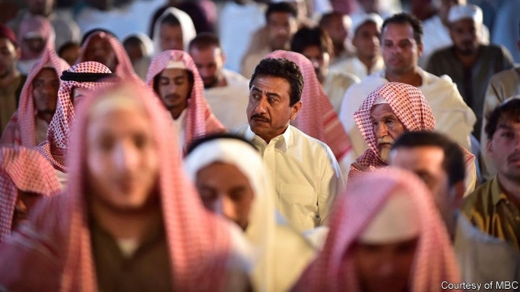

###### Princely drama

# A Saudi TV series hints at the change that is afoot 

##### The shows broadcast over Ramadan are a barometer of Arab states’ moods 

 

> May 30th 2019 

THE EPISODE starts on an ordinary night in Mecca in 1979, as worshippers file into the grand mosque for prayers. Viewers are given a few hints of what will follow: characters swap furtive glances; a camera zooms in ominously from above. But any Saudi watching “Al-Asouf” this Ramadan already knew the twist. Rifles were unpacked. The doors of the mosque were chained shut. A siege that would last two weeks and transform the kingdom began. 

“Al-Asouf” (“Winds of Change”) is not, in fact, principally a series about the siege of Mecca; the clash does not feature until episode 15, which aired on May 20th. Earlier hours were languid, focusing on the transformation of Riyadh, a sleepy town soon to become a modern metropolis. 

But the scenes in Mecca are the denouement. The broadcaster, MBC, used them in advertisements. Saudis discussed them endlessly on social media. With good reason—the siege was a seminal event in Saudi history. Its leader, Juhayman al-Otaibi, was once a member of the praetorian guard. He left the force in 1973 and slowly became an extremist, angry about the supposed decadence of the royals and the intrusion of “Western” culture. After the siege was resolved King Khaled, fearful that these criticisms might find wider support, steered Saudi Arabia in a more conservative direction. Cinemas were closed; gender segregation was strictly enforced. 

Ramadan is the biggest month for Arab television, when families spend hours in front of the set after breaking their fasts. In a region with little free media, the shows broadcast at this time are a barometer for politics—a glimpse at the messages Arab governments wish to send their citizens. As Egypt slides further into a repressive dictatorship, for example, producers churn out police procedurals that glorify the security services. “Al-Asouf” was not conceived by the government. But it could not have aired on MBC, which is mostly state-owned, without official blessing. 

This is the first dramatic portrayal of the siege, long a taboo subject—but one the crown prince, Muhammad bin Salman, is now eager to broach. Last year women gained the right to drive. Sexes mix freely in Riyadh’s cafés; the once-feared religious police are nowhere to be found. To justify all this, the prince has sought to cleave the kingdom’s modern history in two. In his telling, the years since 1979 have been an aberration, foisted on the country by political Islamists and Iran (which had its Islamic revolution months before the siege). 

As historical scholarship, this is questionable. The modern state was founded as an alliance between the royal family and puritanical clerics. No one would have confused mid-century Riyadh with free-wheeling intellectual capitals like Cairo or Beirut. But it is astute politics. The first season of “Al-Asouf”, which portrayed the early 1970s, depicted adultery, boozy parties and illegitimate children. In this version of history, Saudi society was once more tolerant; religious conservatives were interlopers who went too far in purging its diversity and imposing a doctrinaire vision. 

The series is a shift for its star, Nasser al-Gassabi, previously known for his role in the long-running satire “Tash ma Tash” (“No Big Deal”). That show had its own political allusions, lampooning the religious police and other aspects of Saudi society—humour that felt like a despairing rearguard action. These days, the kingdom is still deeply conservative; social reforms are coupled with harsh political repression. Still, many Saudis see this as a hopeful moment—a time not for dark humour but for thoughtful drama. 

