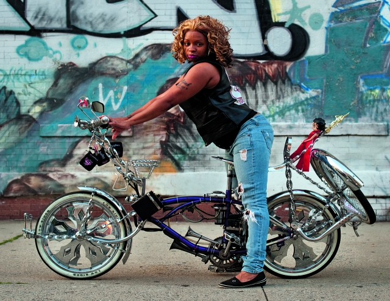

###### The listening cure

# A Wall Street trader’s photographic journey to “back row” America 

##### Chris Arnade sets out to restore dignity to neglected parts of his country 

 

> Jun 1st 2019 

Dignity: Seeking Respect in Back Row America. By Chris Arnade. Sentinel; 304 pages; $30 and £25. 

EIGHT YEARS ago Chris Arnade, a physicist turned Wall Street trader, ventured up to Hunts Point, a rough and isolated section of the South Bronx, armed with curiosity and a camera. A habitual walker, Mr Arnade had begun to feel a sort of moral restlessness in the wake of the financial crisis. In his view, his industry was responsible for—yet largely insulated from—the effects of the recession. 

He realised that he knew far too little about the many Americans who were much poorer than his social circle. So, in the Bronx, he began talking to people and photographing them. What he encountered “wasn’t what I was told I would find—it was welcoming, warm and beautiful, not empty, dangerous and ugly.” Thus began a 150,000-mile, multi-year journey through unthriving America—urban and rural, black and white, from Lewiston, Maine, to Bakersfield, California, with many waypoints in between—that Mr Arnade has woven into “Dignity”, his deeply empathetic book. A few of the pictures he took on his travels appear here. 

“Dignity” is “about” inequality in much the same way that James Agee’s “Let Us Now Praise Famous Men”—a seminal study of tenant farmers in Alabama, illustrated with stark photographs by Walker Evans—was “about” the Great Depression. Both works illuminate the reality of political and economic forces that might seem familiar in outline, by showing their effects on ordinary people. 

Mr Arnade offers a handy framework for thinking about inequality. People like him are “akin to the kids who sat in the front row”—strivers eager to learn and achieve. Front-row people believe in science, data and progress. They cluster in big cities, often leaving their home towns behind, both for the sake of opportunity or because they felt judged, out of place and hemmed in. They are careerists, often liberal in politics but afflicted by immense blind spots. “We had compassion for those left behind,” Mr Arnade confesses, “but thought that our job was to provide them an opportunity (no matter how small) to get where we were.” That, he discovers, was a patronising mistake: “It didn’t occur to us that what we valued…wasn’t what everyone else wanted.” 

Back-row people did less well at school—because they disliked it, or were obliged to leave to earn money, or were distracted by personal problems. Affinity, family or lack of alternatives kept them more bound to place than the nomadic denizens of the front row. As a woman in Cairo, Illinois, tells Mr Arnade: “When you don’t have anything else all you got is your home.” A generation or two ago, many such people could have stayed put in comfort. Factories provided plentiful jobs at decent wages in small and medium-sized towns across America. The pay might not have made anybody rich, yet it provided a middle-class life for people who had a sound work ethic but no college education. 

 

More important, jobs conferred dignity. This, argues Mr Arnade, is what (deliberately or not) the front row routinely denies the back row, and what he seeks in some measure to restore. On that score, his book succeeds. Mr Arnade went to a lot of places that his peers have little cause to visit. He talked to a lot of people who are often ignored, and has rendered them visible. 

Some of the characters he evokes are haunting: the prostitute who left home after finding her mother unconscious in the company of strangers; the shrewd and diligent drug-dealer in Selma, Alabama; the welcoming wife of a storefront-preacher; the retired factory workers catching up over morning coffee at a McDonald’s on Milwaukee’s north side. Mr Arnade spends a good deal of time in McDonald’s restaurants across America, which often become de facto community centres. 

His photographs—of addicts and street scenes, invalids and sports events—are uncaptioned, which lends them an everyman air. But they are intimate and unflinching. He quotes people at length, letting them define themselves on their own terms. “Everyone wants to feel like a valued member of something larger than themselves,” he writes. In his telling, back-row Americans find this sense of belonging in places “that [do not] demand credentials”, whether it be church, family or people who share their drug habit. 

 

The portrayal of front-row Americans is much less nuanced. It may be true that America’s elite move more often and value education as a path to advancement. But it does not follow that all of them define “success as all about how much you can learn and then earn”, or put “owning more stuff” above everything else. It is true that racism persists in America, but for a middle-aged man raised in the small-town South, as Mr Arnade was, to say that race relations today are “just the same ol’ thing, dressed up differently” is both facile and inaccurate. 

 

Still, these caricatures may let his front-row readers know how it feels to be stereotyped. To Mr Arnade’s credit, he shies away from prescriptions beyond observing that “we all need to listen to each other more”. Self-deprecatingly, he calls that “wishy-washy”, but it is not; for adults caught in the maelstrom of jobs and relatives and daily life, listening is hard. “Attention is the beginning of devotion,” wrote Mary Oliver, an American poet. Mr Arnade is scarcely the only commentator to worry that Americans have grown less attentive to each other. But in listening himself, and reminding his compatriots to do so more, he sets out a path to greater devotion. 

