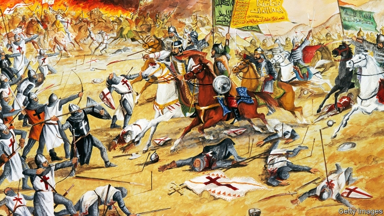

###### A noble enemy

# How Saladin became a hero in the West 

##### He defeated the crusaders—and inspired a legend 

 

> May 30th 2019 

The Life and Legend of the Sultan Saladin. By Jonathan Phillips.Yale University Press; 520 pages; $32.50. Bodley Head; £25. 

THE WEST has few Muslim heroes but, astonishingly, a 12th-century jihadist is one of them. Saladin broke onto the Middle East’s map in a drama not unlike the recent eruption of Islamic State. Born on the banks of the Tigris, he carved out an emirate which by his death in 1193 stretched from the modern-day borders of Tunisia to Yemen, Turkey and Iran. Powerful realms fell like matchsticks before him. He ended the crusaders’ 88-year reign in Jerusalem, reducing their kingdom to a few fortress towns dotted along the coast of the Levant. 

Warrior monks scorned Saladin as the whore of Babylon and son of Satan. Medieval England named a tax after him, the ultimate slur. But from the first the opprobrium was tinged with admiration. Crusader accounts celebrated his reputation for mercy, generosity (lavished on Christian as well as Muslim visitors to his court), and above all his adab, Arabic for chivalry. Decades after his death Boccaccio and Petrarch extolled him. In “The Divine Comedy”, he merits a place in Dante’s first circle of hell, alongside virtuous pagans such as Plato—and seven levels above the Prophet Muhammad. He was a hero of Victorian romantic novels; in the 20th century he gave his name to a British battleship and a type of armoured car. It is “impossible to think of another figure from history who dealt such a deep wound to a people and a faith,” writes Jonathan Phillips in his gripping biography, “and yet became so admired.” 

As its title indicates, the book distinguishes the life from the legend. Mr Phillips finds much to praise. Unlike the crusaders who killed the inhabitants when they captured Jerusalem, Saladin spared them when he recovered it. The crusaders defiled Islam’s third-holiest mosque, using al-Aqsa for stables. Saladin preserved Christian places of worship, including Jerusalem’s Church of the Holy Sepulchre and Hospital of the Order of St John. He ransomed a Christian woman from her kidnappers; he generously redistributed the wealth he took in plunder. 

Yet the glowing contemporary accounts owed much to Saladin’s tame and prolific propagandists—courtiers, chroniclers and muftis who were rewarded handsomely for their efforts. Contrary to French bodice-rippers, he never seduced crusader princesses. Walter Scott’s “The Talisman”, in which a disguised Saladin heals an ailing Richard the Lionheart, is also bunk. The two men never met. 

And Saladin’s conquests owed more to artifice and luck than to military prowess. Potentates in Egypt and Syria made way for him by dying. He negotiated truces to avoid fighting on several fronts and to stall for time while he rearmed. He won Jerusalem at the negotiating table, but lost Acre in battle. His greatest military victory, at the battle of Hattin in 1187 (reimagined above), was a masterpiece of guile. He goaded the crusaders into a summer march through parched land, then choked them with bush-fires and taunted them by spilling water on the ground. 

Many Muslim contemporaries had a decidedly lukewarm impression. Saladin was not above the occasional massacre. His road to Jerusalem involved a long detour through other people’s territories. Conquests in Egypt, Yemen and Mosul helped amass the forces and revenues needed to take on the crusaders, but it was only in his last years that the interlopers became his primary target. Perhaps most damning of all was Saladin’s role in stemming the intellectual curiosity, pluralism and joie de vivre that characterised classical Islam, and in precipitating its descent into intolerance and fundamentalism. 

In his zeal to impose Sunni orthodoxy on the Middle East, he closed Alexandria’s 120 pubs and crucified a philosopher in Aleppo. Shias in Egypt still dub him Kharab al-Din, the destroyer of religion, not Salah al-Din, its righteous reformer. They deride him for toppling the magnificent Shia Caliphate of the Fatimids, selling off its vast library and turning pleasure palaces into madrassas for learning jihad. 

So why the hero-worship? Gamal Abdel Nasser, Saddam Hussein and Osama bin Laden venerated Saladin as a role model for fighting Western imperialism and recovering Jerusalem. The West’s adulation is more perplexing. Mr Phillips suggests that crusaders back from the Holy Land needed an explanation for losing. They elected to emphasise chivalry over Islam. The West needs Muslim heroes, but Saladin may not be the most fitting choice. 

