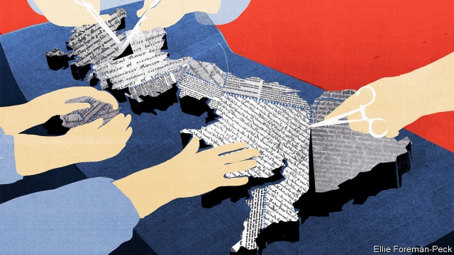
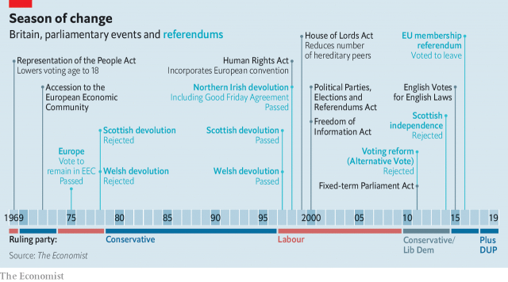
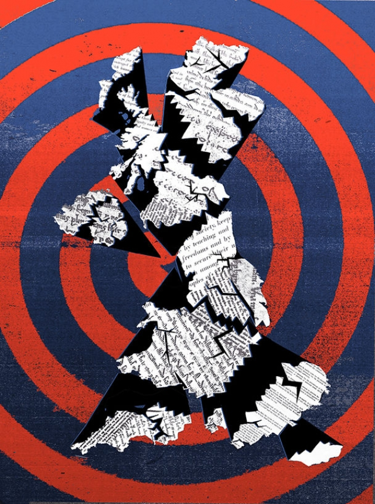

###### The next crisis

# The Brexit referendum and the British constitution 

##### It is not just the country’s politics which are a mess; so is the structure they rest on 

 

> May 30th 2019 

AT SOME POINT in June or July roughly 124,000 people in Britain can expect to receive a ballot paper in the post. It will offer them the names of two Conservative MPs. The one they select will, shortly thereafter, enter 10 Downing Street as prime minister. The rest of Britain’s 66m inhabitants will have no say whatsoever. 

Britain has changed prime ministers without elections many times before. But the coming replacement of Theresa May, who announced her resignation as Tory leader on May 24th, is different. Previously the new leader would have been picked by elected MPs. But since 1998 the role of the Tory party’s MPs has been to whittle the candidate list down to two. Unless one of those two then withdraws (as was the case when Mrs May was elected) the final choice will be left to the membership. A group of people more likely to be of pensionable age than not, more than two-thirds male, just half the size of Wolverhampton and far less ethnically diverse has become Britain’s electoral college. “It is weird, isn’t it,” says Shaun Gunner, one of the party’s younger members. “My family and friends don’t get to choose the prime minister. And I do.” 

The power that has been given to Mr Gunner and his colleagues might be less unnerving if their chosen prime minister were easy to oust, or if his or her powers were clearly and formally constrained. Neither is the case. For Tory MPs to turn on the leader their members had just given them would be a mixture of fratricide and suicide; the Fixed-term Parliaments Act of 2011 upturned established conventions on confidence votes within the Commons, leaving confusion among MPs over both how to bring a government down and what happens when one falls. And the quirks of British parliamentary procedure provide various ways in which a sufficiently bloody-minded prime minister might force a “no-deal” Brexit without a majority in Parliament. This has all the makings of a constitutional crisis. 

The British constitution is unusually opaque and poorly grasped even by those whose powers it governs: “The British constitution has always been puzzling and always will be,” as the queen has put it. In normal times, this does not matter all that much. In abnormal times it does, and Brexit has brought abnormal times. 

The dominant party in Scotland, the SNP, rejects Brexit, seemingly to no avail; the dominant party in Northern Ireland, the DUP, refuses the Tories’ vision of Brexit but props up their minority government nonetheless. As a result legislation put together to bring about the Brexit the people voted for in a referendum has repeatedly failed to pass the House of Commons. The two big Westminster parties won less than a quarter of the vote in the European elections of May 23rd. 

Such times test constitutions. The British one looks woefully hard put to pass its current test—in part because, over the past two decades, it has undergone an unprecedented spate of often poorly thought-through changes. 

Britain is often said to have an unwritten constitution, and many Britons have blithely taken this to be something of a badge of merit, one “bestowed upon us by Providence”, as the complacent twit John Podsnap says in “Our Mutual Friend”, a novel by Charles Dickens. In fact most of the constitution is written down, but not all in the same place or with the same standing. Statutes such as the Bill of Rights (1689) rub up against the Human Rights Act (1998) in a manner scholars call “uncodified”, which means messy. Many of the conventions for how Parliament goes about adding to such statutes are to be found in written references, such as the works of Thomas Erskine May, a Victorian clerk of the Commons. A few, such as who the monarch calls on to form a government, are indeed unwritten. 

Peter Hennessy, a British historian who sits in the Lords without party affiliation, argues that law, precedent and procedure provide a constitution which is as much a “state of mind” as anything else. For decades, the men who dominated Britain’s ruling class felt they knew what was in and out of bounds in politics just as they did in cricket. It was a constitutional approach which relied more than that of any other country, in the words of William Gladstone, on “the good faith of those who work it”. Lord Hennessy calls this the “Good Chap” theory of government. 

Over the past few centuries, the Good Chaps have mostly behaved themselves. They reformed the system in which they operated rarely, piecemeal and mostly in response to strong feelings among the public. The Representation of the People Acts of 1832 (the Great Reform Act), 1867 and 1918 expanded the franchise to all men not peers, incarcerated or insane; the Representation of the People Act of 1928 saw all women enjoy the same rights. Over the 20th century hereditary peers had their powers and their number reduced. 

Under Tony Blair’s Labour government this restraint disappeared. In its 1997 manifesto Labour promised to formalise the rights of the people and offer devolved power to the various nations and provinces of the United Kingdom. After referendums in Scotland and Wales a revived Scottish Parliament received significant powers, a brand new assembly in Wales rather less. The Good Friday Agreement which brought peace to Northern Ireland changed its constitutional status, too, in various ways. Later, new statutory instruments ensured that laws affecting only England had to have the consent of a majority of the MPs representing English constituencies. 

The Human Rights Act of 1998 and the ratification of the European Charter of Fundamental Rights in 2000 beefed up the rights of citizens. Freedoms that previously depended on Good Chaps in Parliament became protected by increased powers for the judiciary instead. The conflict inherent in the fact that the Law Lords sat astride both parliamentary and judicial horses was resolved when their judicial role was hived off to a new Supreme Court. 

Almost as striking as the breadth of the reforms was the insouciance with which they were carried out. When he recalls the day he introduced legislation for referendums on devolution in Scotland and Wales in his memoirs, Tony Blair chirpily adds “and we announced a seven-point plan to revive the British film industry”. Richard Wilson, who was Britain’s top civil servant at the time, recalls the speed at which the legislation flew through Westminster as “breath-taking”. The hurried inception of the Supreme Court was, in the mocking words of its former president, David Neuberger, “a last-minute decision over a glass of whisky”. 

When David Cameron took office in 2010 he kept up the pace. But whereas most of Mr Blair’s reforms had the legitimacy that comes from being outlined in a manifesto, Mr Cameron’s did not. They were for the most part stop-gaps to convince the Liberal Democrats to enter a coalition with Mr Cameron’s Conservatives. The Fixed-term Parliaments Act got rid of the power that prime ministers had previously enjoyed to call an election at any time, thus reassuring the Lib Dems that the Tories would not cut and run as soon as they fancied their chances. A referendum on electoral reform—only the second ever nationwide referendum—was further Lib Dem bait, though Mr Cameron led the No side and won. When faced with an SNP majority in the Scottish Parliament, Mr Cameron agreed to a referendum on Scottish independence. Again, he won. 

Why did the long years of constitutional stasis come to an end? One answer is that there were fewer lessons in constitutional instability to learn from. In the 19th century Britons watched countries such as France and the United States tear themselves apart. In the first part of the 20th century, they saw the rise of totalitarianism. They recognised that the delicate British constitution had to be taken seriously, argues Robert Saunders, a historian at Queen Mary University of London. 

 

Mr Blair and Mr Cameron, by contrast, came to power when history was said to have come to an end. They saw no need to take particular care of the constitution. The constitution was just another archaic part of public life to modernise according to the dehistoricised dictates of the age—or to mess with for short-term advantage. Mr Cameron is said to have first hatched the idea of an EU referendum over a pizza in Chicago O’Hare airport. 

“Time and again we do constitutional change as if we were anaesthetised, and then we slowly wake up,” says Lord Wilson, the former cabinet secretary. “It is painful.” It can be worse than that. Some of the wounds left by the recent impromptu surgery are re-opened and infected by Brexit. 

Take the relationship between Westminster and the devolved institutions. Instead of providing a clear differentiation of powers, devolution brought a fudge whereby Westminster would “not normally” legislate on devolved matters without permission from the relevant institutions. When the Brexit vote showed that Scotland (62% against) and England (53% for) differed on something fundamental, that fudge became inedible. Many Scots felt that Mrs May’s insistence that the United Kingdom which had joined the EU as one country would leave it as one country ignored two decades of devolution. “It is constitutional illiteracy,” harrumphs Michael Russell, the SNP’s minister for constitutional affairs. But when the question ended up with the Supreme Court, the judges ducked. The fudging convention, they ruled, was a matter of politics, not law. Keep us out of it. 

Attempts to leave the EU show up constitutional shortcomings in part because membership helped to hide them. Devolved policy areas often overlapped with EU competencies, and Scotland was happier under the EU yoke than the English one. The Good Friday Agreement was made feasible by the fact that Ireland and Britain were both EU members sharing EU rules and both happy to be under the aegis of the European Court of Human Rights. 

Mr Blair’s government also used Europe to provide constitutional protections. Should Britain leave the EU, the Charter of Fundamental Rights, which allows judges to poke their noses into any legislation that touches EU competencies, will no longer apply. Thus Britain is shifting back from a protected constitution, in which rights are guaranteed by a judiciary, to an unprotected one where they are at the mercy of Parliament, argues Vernon Bogdanor, one of Britain’s foremost commentators on the constitution. But the fact that post-Brexit Britons will enjoy fewer rights in law does not mean that judges will necessarily acquiesce in a shrunken role. Some may seek to step into the breach. 

The country may thus see a new conflict over where sovereignty lies—the constitutional question which, above all others, Brexit has dragged into the light. The splendidly bearded Victorians who sought to clarify the constitution held that in the modern world sovereignty, once settled in the monarch, rested with the crown in Parliament. Parliament could thus do what it wanted, including overturning what previous parliaments had thought good. This vision offered little scope for referendums. 

The only national referendum held in the 20th century was called by Harold Wilson two years after Britain joined the European Economic Community, the predecessor to the EU. Because some prominent Labour and Tory politicians opposed this, the 1974 Labour manifestos promised to first renegotiate membership and then put it to a popular vote. Two-thirds of the people voted to stay. Mr Cameron presumably hoped that his Brexit referendum would be as similar in result as it was in form. 

Instead, Parliament ended up with an instruction most of its members disagreed with, but about which they seemed unable to do anything. This is not a problem with referendums per se. Other countries use them, sometimes quite liberally, without collapsing into political disorder. In Ireland, for example, the constitution, which is well codified, says that referendums are required if the constitution is to be changed. Voters choose between the status quo or a fully cooked proposal. But the British constitution, uncodified and long referendum-averse, makes no such clarifying provisions. 

The decision to resort to a referendum that produced a result capable of many interpretations cannot take the whole blame for the current chaos. After all, both the Tories and Labour vowed to honour the people’s revealed will in the general election of 2017 and between them they took 82% of the vote. Some of the subsequent mess rests on the back of the Fixed-term Parliaments Act of 2011. Before this a prime minister whose flagship legislation was voted down—just once, never mind repeatedly—would have been expected to call an election. If he or she had not, a vote of confidence would have followed which a minority government would have been near certain to lose. The 2011 act replaced this convention with statute which says that a lost confidence vote triggers a two-week period during which any MP can attempt to win the backing of the Commons and form a government to avoid an election. When asked what this would actually look like, the clerk of the House of Commons responds: “I really don’t know—I don’t think anybody knows.” 

Britain finds itself in a halfway house which may be the worst of both worlds. Partial codification has removed a mixture of predictability and flexibility while providing neither certainty nor clarity in recompense. A readiness to change the constitution has provided some statutory and legal checks and balances to rein in bad actors. Yet these new rules are weak and may encourage perverse outcomes. They have probably also lessened the expectation of good behaviour and restraint. 

 

Such norms matter. Even countries with strong, written constitutions and clear separations of power are at risk without unwritten conventions on how that power is wielded, argue Steven Levitsky and Daniel Ziblatt in “How Democracies Die”. In 1951 a jeremiad offered by Lord Radcliffe, a former Law Lord, warned of Britons “losing their character, and being left with their institutions; a result disastrous indeed.” It has come to pass with the institutions in disarray. 

The situation is made worse by changes within the parties. The Brexit referendum weakened the parties; the parties, for their part, have weakened Parliament. Their memberships, not their MPs, get the final say on who leads them and thus who can become prime minister. As a result, British politics resembles a selectocracy. Rather than ending up with a leader designed to appeal to a wide range of voters, activists pick candidates who satisfy their own niche concerns, argue Frances Rosenbluth and Ian Shapiro in “Responsible Parties: Saving Democracy from Itself”. Tory MPs can, under some circumstances, depose their leader; Labour ones cannot be sure of the same power. When the parliamentary Labour Party voted by 172 to 40 to remove Jeremy Corbyn in 2016, the party’s members simply re-elected him to his post. 

The Tory selectocrats who will choose Britain’s next prime minister would, polling suggests, prefer a no-deal Brexit over staying in the EU by three to one; the electorate as a whole swings three to two the other way. The prime minister will thus have to either disappoint those who have given them their job, or those in whose name they will rule. The dodginess of the prime minister’s claim to legitimacy will be seen by many in Parliament as justifying a selective approach to precedent and convention in order to thwart the prime minister’s intentions. 

John Bercow, the Speaker of the House of Commons and thus arbiter of its procedure, has shown an elastic attitude to what had been seen as rigid precedent. He is said to have reconsidered his previous intention to resign this summer. “The idea that Parliament is going to be evacuated from the centre stage of debate on Brexit”, he said on May 28th, “is unimaginable.” 

The possibility of a crisis in the House, like the possibility of an outcome that ignores the wishes of Scots so blatantly as to drive them to independence, underlines what David Pannick, a lawyer in the Lords, sees as the central irony of Brexit: it at once makes constitutional reform more necessary and less likely. It is not just that “the exam paper is simply too big,” as Robert Hazell, a professor of government at University College London, puts it. There are fundamental issues of trust. Though Labour and the Liberal Democrats have both pledged to hold a constitutional convention if they come to power, the chances of their creating the space for an honest debate of who has what powers, codifying their results and getting them agreed is very small—and any attempts to do so would be widely interpreted as nefarious. 

The relationship between the United Kingdom’s constituent countries needs to be settled. So does the position of Britain’s judges and the further role, if any, of referendums. Britons must decide whether they are comfortable with a largely unconstrained executive in the gift of all-powerful party members. But without a stable constitution, in what forum can this all take place? 

