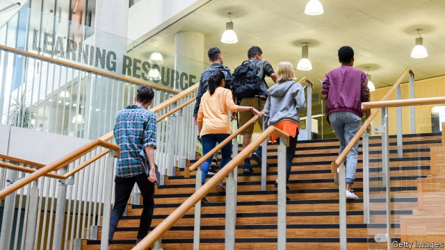

###### A for effort

# A long-awaited report proposes overhauling higher education 

##### The Augar Review says government policy has favoured universities at the expense of technical education 

 

> May 30th 2019 

IN AN ATTEMPT to kickstart her spluttering government, Theresa May last year announced a review of higher education. While doing so the prime minister became the latest in a long line of politicians to rail against “outdated” attitudes that favour academic over technical qualifications. Since then speculation has centred on little apart from what the recommended annual tuition fee would be for students attending university. 

On May 30th Philip Augar, the banker commissioned to produce the report, delivered his thoughts. Under the plans, fees would be capped at £7,500 ($9,500) a year, down from the current level of £9,250, and students from poor families would benefit from the return of grants to support them while studying. It is not, however, all good news for students. The report also suggests fiddling with terms on the loans, including by moving back the date at which they are written off, so that more people—especially middle-income types—will end up repaying the entirety of the cash they borrow. The recommendations, which lay out reforms to the whole higher-education system, are backed up by 210 pages of analysis and charts. 

The plans are designed so that universities would not be too hard hit financially. Although income would not rise with inflation, the report envisions that the government would make up the gap in tuition-fee funding, and notes that demographic trends mean they will soon benefit from an influx of 18-year-olds. Since the marginal cost of educating each extra student is relatively low, that could prove a windfall for the institutions. 

The report frowns upon the recent growth in the number of creative-arts and business degrees, which are cheap to provide, but whose graduates are unlikely to repay their loans. It therefore asks the government to use funding to incentivise universities to provide more economically valuable degrees, although it remains vague on precisely how this will work. Not everyone is convinced. Jo Johnson, the universities minister between 2015 and 2018, argued the report’s proposal would destabilise university finances, and that the Treasury would be unwilling to cough up the funds to plug the gap. 

The report’s central desire is to reverse what it terms the “neglect” of post-school education outside universities. It proposes a raft of changes, starting with a £1bn capital investment to get further-education colleges back on their feet after years of low funding. The plans would allow students to get loans to study for some technical qualifications, and would introduce a “lifelong-learning loan allowance”, to the value of £30,000, that could be spent on high-level technical and academic study whenever the recipient needs it. The hope is that this will build the prestige of non-academic qualifications to the point where university is not the only game in town. 

This would be a lot to get on with for a government at the height of its powers, let alone one limping to its demise. Any change in the level of tuition fee would, for instance, require new legislation, something that is unlikely anytime soon. Labour, which wants to abolish fees altogether if it comes to power, immediately dismissed the plan as “all talk, empty promises and very little action.” The report has dreamy aspirations. They are unlikely to be fulfilled. 

