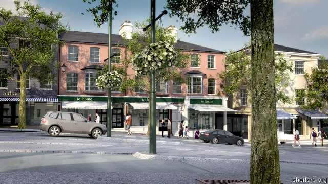

###### End of the road

# British planners are sending cars into towns 

##### For years big new roads avoided settlements. No more 

 

> May 30th 2019 

THE NEW town of Sherford, just east of Plymouth, is “building futures”, according to a large sign at its entrance. They are futures with a distinctly old-fashioned look, given that the development is largely Georgian in style. Much of the town, which is 10% complete and will in a couple of decades be home to 12,000 people, consists of terraced houses and mews buildings overlooking village greens, in contrast to Plymouth’s post-war suburbs of detached homes in cul-de-sacs. Most quaintly of all, Sherford has no bypass. 

One of the central ideas of British transport planning, established with the publication of “Traffic in Towns” by Sir Colin Buchanan, an urban planner, in 1963, is to separate cars and people. To keep traffic flowing and preserve peaceful town centres, planners built bypasses, roads sending motorists speedily around the edge of towns rather than crawling through them. People driving into the centre would park at multi-storey car parks and walk to a pedestrianised high-street, sometimes via underpasses as traffic rumbled overhead. 

Now planners are bringing cars and pedestrians back together. Sherford is one of several new towns being designed without a bypass. Instead, the main road doubles up as a high street that funnels traffic into the town rather than round it. Nansledan, a new extension to Newquay, has no bypass. And in Lawley, which reaches out from Telford, engineers have replaced a big roundabout that spun traffic away from the town with an urban boulevard that draws it in. 

Some existing bypasses are being bulldozed. A dual-carriageway which took traffic around Ashford, in Kent, has been torn up. Birmingham’s inner ring-road was turned into an ordinary street as pedestrian underpasses were removed, putting cars and people back on the same level. And although a number of new bypasses have been commissioned by the government’s Housing Infrastructure Fund, these roads are mainly to open up sites for new developments, rather than steer motorists away from them. 

There are two reasons why the conventional bypass is falling out of favour. One is a desire to bail out high-street shops, which are losing business to online retailers and out-of-town malls. In its planning submission for Sherford, the developer, Red Tree, argued that “planning policies and traffic rules have worked against [high streets] by taking all the uses they provide and relocating them on the edge of town for the single benefit of the motorist.” Andrew Cameron, a transport consultant on the Sherford project, says he wants to “use the traffic to support shops and businesses, by letting it into the town on our terms.” Sherford’s main road has low speed limits and tight corners to slow down drivers. 

The other reason is local opposition. Some campaigners argue that bypasses simply open up land for development and destroy natural habitats (they also ruin the view). The Shropshire Wildlife Trust recently challenged a detour round Shrewsbury on the same grounds. Opponents of a proposed bypass round Hereford claim that most of the traffic approaching the town is heading for the centre anyway. Bypasses face ever more roadblocks. 

