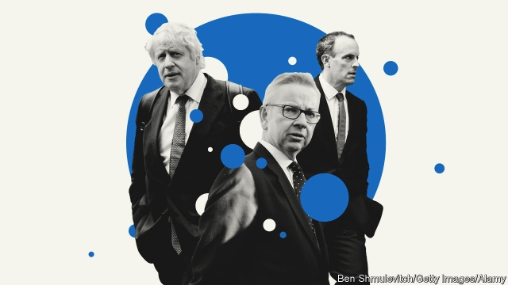
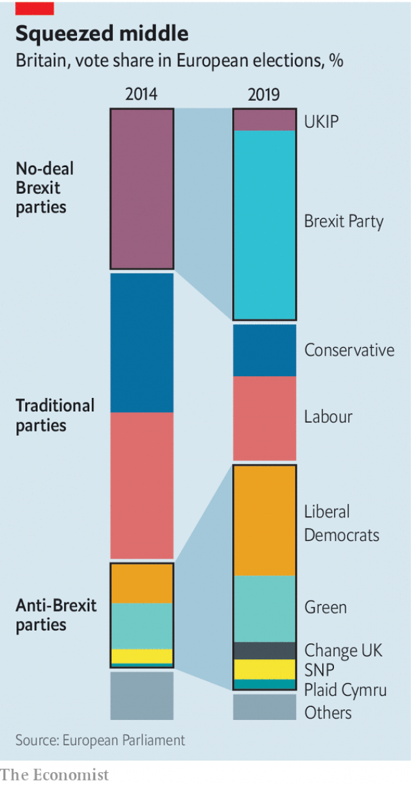

###### Brexit and the Tories

# Britons are ever more polarised between no-deal and a second referendum 

##### A new Conservative leader may find compromise impossible 

 

> May 30th 2019 

EUROPEAN ELECTIONS are rum affairs, but the latest were stranger than ever. On May 23rd voters went to the polls in elections nobody wanted, as Brexit was meant to happen in March. As expected, Nigel Farage’s new Brexit Party stormed into first place, with 32% of the vote and 29 seats. It was a striking result for a party set up only in February, and was five points better than Mr Farage achieved as leader of the UK Independence Party in 2014. Adding in the rump UKIP vote makes the total for parties backing a no-deal Brexit 35%, a big number but less impressive when turnout, though higher than in 2014, was only 37%. 

If hard Leavers had a good night, so did hard Remainers. The Liberal Democrats took 20% of the vote and 16 seats, while the Greens got 12% and seven seats. Adding in the new Change UK party, which had a terrible night and won no seats, and the Scottish and Welsh nationalists takes the combined score of pro-Remain, pro-second-referendum parties to 40%, more than the no-dealers. 

The big losers were the Tories and Labour. Their combined vote share was just 23%, down from as much as 82% in the 2017 general election and less than half their share in 2014. In effect, the European elections saw the centre squeezed to the advantage of extremes on both sides. On Brexit, the country is more obviously split down the middle than ever. 

For an opposition party, Labour’s performance of coming third with just 14% of the vote and ten seats was abject (see article). But it is the collapse of the Tories to a mere 9% of the vote and four seats, the party’s worst election result in 185 years, that will have more immediate consequences, because Theresa May, the prime minister, is resigning. A leadership race starts on June 10th. Some 11 MPs have already put themselves forward. These will be winnowed down by their colleagues to two, who will then be voted on by party members. The hope is that this process finishes by the end of July, with the winner immediately becoming prime minister. 

The big question for all candidates is how best to respond to Mr Farage’s success. Many believe that the only way to defeat the Brexit Party now is to back leaving without a deal. Among others, Dominic Raab and Boris Johnson, the front-runner, prefer a deal but want to keep no-deal as an option. Both also insist that Brexit must happen on October 31st, with or without a deal. 

Some are more nuanced. Most want to renegotiate Mrs May’s deal, yet are also against no-deal. Michael Gove, the environment secretary, is in this camp. Jeremy Hunt, the foreign secretary, has said no-deal is better than no Brexit. But this week he called no-deal “political suicide”. His argument was that trying to force it through could lead to a general election in which the Tories would be annihilated. Rory Stewart, the international development secretary and another candidate, has said he could not support a Tory prime minister who goes for no-deal. 

 

A key point is that Parliament has already voted against no-deal. Yet hardliners say that, since leaving without a deal on October 31st is now the legal default, MPs cannot stop it. The Institute for Government, a think-tank, points out that the routes used before to prevent no-deal are no longer available. But John Bercow, the Commons Speaker, promises that Parliament will not be sidelined. Since he also has no intention of vacating his post as he previously promised, he will surely find a way for MPs to block a no-deal Brexit if they wish. 

What of Brussels? EU leaders were categorical when extending the Brexit deadline that there would be no renegotiation of the withdrawal agreement, which includes the Irish backstop to avert a hard border with Ireland. That rules out a time limit on the backstop, which would negate its purpose. On this, EU leaders cannot overrule Leo Varadkar, the Irish prime minister. They may be open to another extension, but they will surely reject concessions to a hardliner like Mr Johnson, whom most dislike. 

Yet that could change if a more emollient figure with a clear parliamentary majority emerged. The EU is happy to revise the political declaration that accompanies the withdrawal agreement. And, as Mujtaba Rahman of the Eurasia Group, a consultancy, notes, one reason that the EU refused to offer Mrs May even marginal changes to the agreement was that it still doubted she would get it ratified. 

In her resignation speech, Mrs May talked of the need for compromise. Many retorted that her own Brexit problems were caused by her very refusal to compromise. The difficulty for her successor is that an increasingly polarised country is more inimical to compromise. That may point to further delays, but it also raises the risk of no-deal. The smart money increasingly backs another referendum as the solution. Whether it would deliver a clear answer is another question. 

