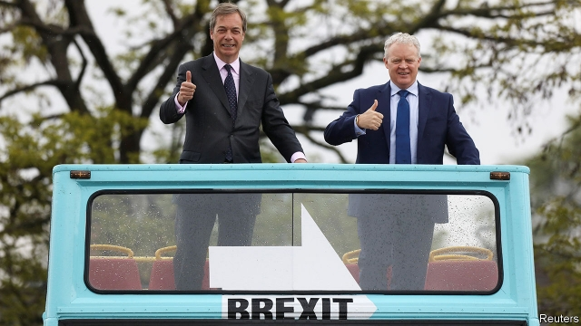

###### Now for a real test

# Can the Brexit Party gain a foothold in Westminster? 

##### A by-election in Peterborough offers the chance of Parliamentary representation 

 

> May 30th 2019 

WHEN NIGEL FARAGE took to the stage after his triumph in the European elections, he delivered a warning. “If we don’t leave on October 31st then the scores you’ve seen for the Brexit Party today will be repeated in a general election,” he said. “And we are getting ready for it.” His threat will now be put to the test in Peterborough, a small city in eastern England, which holds a by-election on June 6th. 

The Brexit Party’s predecessor, the UK Independence Party (UKIP), has long struggled under the first-past-the-post system used in Westminster elections. Although 61% of constituents voted to leave the European Union in 2016, Peterborough has never been a UKIP stronghold. At the general election two years ago, Labour took the seat from the Conservatives. But Labour’s MP, Fiona Onasanyo, was kicked out by voters a month ago, having been jailed for perverting the course of justice in attempting to dodge a speeding charge (she compared her conviction to the persecution of biblical figures, including Jesus and Moses). 

Despite its lack of political infrastructure in the city, the Brexit Party is a narrow favourite to take the seat, according to bookies. To do so the party will have to win over both Labour and Tory voters. During the European elections, it was keen to point out that it had left- and right-wing candidates. As a former participant on “The Secret Millionaire”, a reality-TV show in which business owners go undercover to hand out cash, Mike Greene, the party’s candidate, promises to attract jobs to the city, as well as to improve schools and build houses. Aside from a fervent desire to leave the EU without a deal, his priorities are not always those of a typical Faragist. “People talk of immigration as a huge problem. But look at Peterborough and it’s one of the things I love about it,” he says. “It makes us a great, multicultural city.” 

An attempt by small anti-Brexit parties to select a single Remainer candidate failed to get off the ground. And both the main parties are in bad shape, coming into the vote straight after a hammering in the European election. The Tories are in the unusual position of being unable to tell voters who their candidate will work under in Westminster. Labour has to win back support after the disaster of their last MP. “We can’t afford another Corbyn candidate in Peterborough,” insisted Paul Bristow, the Tory candidate, at a debate on May 28th. 

The sparse attendance at the debate suggests that voter fatigue may play a role. The vote is the third in quick succession in Peterborough, after local and European elections. As such, the poll will be a big test for Labour, which relied on a surge of enthusiastic new voters last time round, and its new candidate, Lisa Forbes, is an uninspiring trade unionist. The party is unlikely to have a good night on June 6th. But all it wants is to do well enough to hold off the Brexit Party. 

