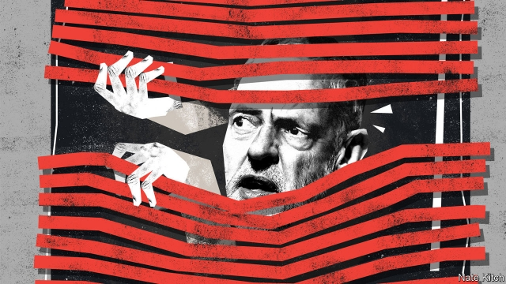

###### Bagehot

# Jeremy Corbyn is increasingly isolated in his own party 

##### The leader of the Labour Party is in his weakest position yet 

 

> May 30th 2019 

H.L. MENCKEN is said to have defined a politician as “an animal that can sit on the fence and yet keep both ears on the ground”. By that definition Jeremy Corbyn is failing in his vocation. The European elections bulldozed Mr Corbyn’s fence by giving the Labour Party just 14% of the vote in the country as a whole and 9% in its former stronghold of Scotland. They unleashed a furious debate that was ostensibly about the party’s stance on Europe in particular but also about Mr Corbyn’s leadership in general. 

Senior figures such as Tom Watson, the deputy leader, and Emily Thornberry, the shadow foreign secretary, were quick to blame Labour’s dismal performance on its refusal to offer wholehearted support for holding a second referendum and staying in the European Union. Others, particularly from the party’s working-class wing, were equally quick to push back. Gloria De Piero, MP for Ashfield, urged her colleagues not to let a single issue—Brexit—“wreck” the party. Len McCluskey, head of the Unite trade union, accused supporters of a second referendum of trying to launch a coup against the leader. Mr Corbyn did his best to rebuild his fence and climb back on it. He promised that “we are ready to support a public vote on any deal”. But he stopped short of offering Remainers what they want: unconditional backing for a second referendum whether or not there is an EU deal on the table, and a firm commitment to turning Labour into a Remain party. 

There is actually a good strategic reason for Mr Corbyn’s position on Europe. Labour risks alienating large numbers of voters, particularly in its working-class heartlands, if it turns itself into an overtly Remain party (most of its MPs sit in constituencies that voted to leave). And fudging may be a much more successful strategy in a general election, which will be fought over lots of issues, than in a European poll. But the party’s Euro-failure is only one of many. Labour has failed to pull ahead of a Conservative government that is doing everything it can to commit suicide. The forthcoming Peterborough by-election may see a Labour seat go to the Brexit Party. Labour is also likely to waste yet another summer in a row over anti-Semitism that can only do it harm. On May 28th the Equality and Human Rights Commission announced that it is launching a formal investigation into whether the party has unlawfully discriminated against, harassed or victimised people because they are Jewish, a measure that it last took against the far-right British National Party. Mr Corbyn is in his weakest position since taking over as his party’s leader in 2015, and his problems are mounting by the day. 

Senior Labour figures are increasingly willing to criticise his leadership. There is nothing new about Mr Watson’s hostility to Mr Corbyn. But the days when the deputy could be denied a platform at his own party conference are long gone. He has formed a centre-left group of 80 MPs and 70 peers to argue for more mainstream policies, and played a starring role at the People’s Vote march. Ms Thornberry harbours leadership ambitions of her own. She is also worried about the growing strength of the Liberal Democrats in her Islington South constituency. Sir Keir Starmer, the shadow Brexit secretary, is increasingly a force in his own right rather than just a lawyer for hire. For their different reasons close allies such as John McDonnell, the shadow chancellor, and Diane Abbott, the shadow home secretary, are critical as well. Mr McDonnell is determined to win power at any cost, and Ms Abbott represents a constituency that voted 80% to remain. 

At the same time Mr Corbyn is becoming the prisoner of his closest advisers, who are odd creatures even by the standards of Britain’s increasingly eccentric politics. They are all, in various ways, closely allied to Mr McCluskey, Labour’s most pro-Leave trade-union baron. Two of them, Seamus Milne and Andrew Murray, are privately educated Marxists who have a soft spot for the Soviet Union. Mr Murray was a member of the Communist Party for decades before his recent conversion to democratic socialism. Mr Milne, a ruthless dialectician, exercises a particularly tight hold over Mr Corbyn, a man who managed only two Es at A-level and who, after four years of intense intra-party battles, is beginning to seem worn out. 

Mr Corbyn is no stranger to challenges to his leadership: an attempt by MPs to remove him in 2016 only left him stronger. But the current wave of criticism is unusually damaging for two reasons. The first is that it undermines his claim to be a champion of the people against the elites. Mr Corbyn is in the uncomfortable position of resisting calls for “people power”, in the form of a second referendum, a ballot of all party members or a special conference on the Brexit question, and instead defending a policy of triangulation and prevarication cooked up by a sinister cabal of advisers. The second is that some of the fiercest attacks are coming from normally loyal allies on the left. Paul Mason, a commentator, has raised the possibility of a “Corbynism without Corbyn” and called for “the officials” who masterminded the party’s Euro-elections strategy to be “removed from positions of influence”, perhaps opening the way to Britain’s very own replay of the battle between the Mensheviks and the Bolsheviks. 

In most ways Mr Corbyn could not be more different from Britain’s departing prime minister, Theresa May. She was the dutiful grammar-school girl who went to Oxford whereas he was the rebellious private-school boy who dropped out and plunged into the Islington of Che Guevara posters and Irish rebel songs. But Brexit makes odd bedfellows, and in strange ways he is beginning to resemble her. Isolated in a bunker of close advisers, criticised by former allies, determined to avoid alienating both Leavers and Remainers, he is beginning to look tired, tainted and out-of-touch. To survive, Mr Corbyn needs to prove that he is both more flexible and more ruthless than his fellow ageing baby-boomer. 

