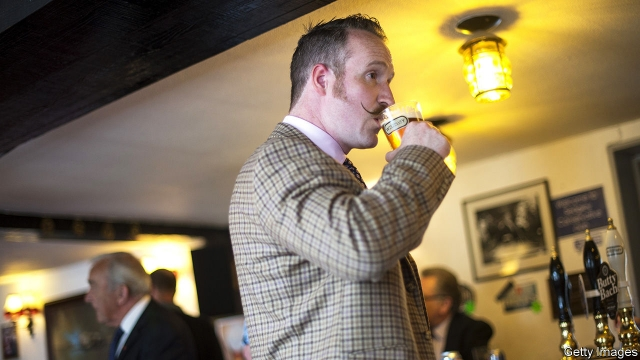

###### Ide Hill minds

# The (mostly) men who will pick Britain’s next prime minister 

##### The Conservatives’ 124,000 members will choose a leader from a shortlist of two 

 

> May 30th 2019 

IF THE Church of England is the Tory Party at prayer, garden parties are where it lets its hair down. Several dozen members pootle about the grounds of a country manor in the village of Ide Hill, in Kent, nibbling salmon canapés and admiring the moat. “Have you been to see my fruit cage?” the owner asks a guest. Others buy tickets for the raffle, hoping to nab biscuits from the Chelsea flower show or a box of after-dinner mints donated by their MP. “Live in Kent”, reads an old railway poster hanging in the pool house, “and be content.” 

The mood, however, is not. The Conservatives’ 124,000 or so members like to think of themselves as winners, foot-soldiers of the natural party of government. So Theresa May’s failure to implement Brexit has been unsatisfactory. “She’s been a total disaster,” says one member, shivering in a summer dress beside the swimming pool. “We’ve made a real mess of the last three years,” says another. 

It is in this disillusioned state that they will pick Britain’s next prime minister. Tory leaders used to “emerge” from backroom chats among party grandees. But since 1998 members have had the final say on a shortlist of two candidates picked by MPs. Eleven MPs have already announced their candidacy. 

Who are the selectorate? Research by Queen Mary University of London suggests they are mostly male, white and live in the south of England. Many are well off; one in 20 earns more than £100,000 ($127,000) a year. The average member is 57, but 44% are 65 or older. 

They are hardly modernisers. More than half support the death penalty and 84% believe schools should teach children to obey authority. They are keen on old-fashioned pastimes, too. One Tory association is advertising its 40th annual raspberry-and-wine evening. Another promises a stall at an upcoming leek show, “as always”. 

For now, they care about Brexit above all else. In one poll, three-quarters of Tory members ranked it the most important issue facing the country, compared with three-fifths of voters. Their views on the EU have become more extreme and intractable over the past four years. 

Polls suggest that a plurality of members would back Boris Johnson, who promises to leave the EU in October with or without a deal, if he makes it to the final run-off. At the garden party, most have strong views about Mr Johnson: half think he could be the party’s saviour; the rest, a disaster. The only other candidate to elicit such strong reactions is Michael Gove, the environment secretary, whom members blame for undermining Mr Johnson’s last leadership bid. “I wouldn’t trust him with a farthing,” insists one Tory, referring to a unit of currency that ceased to exist 59 years ago. 

But Mr Johnson should not be complacent. The frontrunner has failed to take the crown in seven of the past eight leadership races. David Cameron beat David Davis after giving an impassioned conference speech without notes. Televised hustings will give Mr Johnson’s lesser-known rivals a chance to demonstrate any election-winning credentials. “The members will listen,” says one Tory MP. “They are not beyond reason at all.” 

