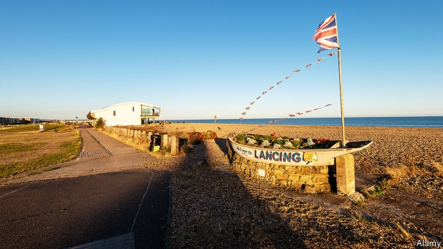

###### Nothing to sea here

# The travails of a town trying to tempt traffic 

##### Lancing, a village in Sussex, attempts branding, bunting and banners 

 

> May 30th 2019 

THE CENTRE of Lancing, an overgrown village of 19,000 on the south coast of England, is unremarkable: not the scene of a retail apocalypse, but not particularly inviting either. In addition to the three Ps—a post office, a Pizza Hut and a pound shop—the high street is home to a couple of bookies and a handful of charity shops. It needs more footfall to stay alive, says Helen Plant, the parish council clerk, or administrative head. But for people to come into the centre, they need to know it is there, she adds. 

Two major roads cross Lancing. The A27 runs though the northern end. The A259, a lovely but unloved trunk road connecting Folkestone with Emsworth, runs along the coast. Both bypass the centre. Lancing Council’s strategy was to commission some branding, put up some signs off the A259, and make the place a bit jollier—more “seasidey”, in Ms Plant’s description—in order to persuade traffic to pass through rather than by. 

One idea was to put up bunting. But the streetlights are owned by SSE, an energy company, which forbids “any attachments that tether a column”, especially bunting. Another was to install flags on the buildings in the village centre. But that would involve tracking down every private and public owner and seeking their permission. 

Banners on the streetlights remain an option, but are expensive and time-consuming. The lamp posts must be tested to ensure they can carry the weight of the banners and won’t topple over in high winds. The chap who did the tests for Christmas lights charged £575. A new test would cost at least as much. And then there is the three-stage application, which takes four weeks. 

The parish council drew up a brief and three local graphic designers sent in ideas. In May the winning slogan was unveiled on the council’s Facebook page: it read “Lancing-on-Sea” and “Be at the centre” set around an illustration of an idyllic English village. “We now need to know what YOUR thoughts are on this BEFORE the design is actually put to use,” the post insisted. 

The people of Lancing let their thoughts be known. One responded, “I never want to offend but this ‘banner’ is truly terrible!” Another commentator noted that it seemed to be missing a Pizza Hut logo. Most were baffled by the putative renaming of Lancing as Lancing-on-Sea. “Unfortunately, it is the name that people picked up on,” says Ms Plant, explaining that the “on-Sea” bit was simply branding, not a formal name-change. Given the response, “I think Lancing-on-Sea is a no,” she adds. 

Still, the parish council remains optimistic. There are plans to improve the road layout and make it friendlier for pedestrians. An old hotel has been renovated. And the town is trying to create a “history trail” with blue plaques—if it can find enough history. “There is nothing of obvious historic value,” says Ms Plant ruefully. But there are “lots of historic connections”. 

