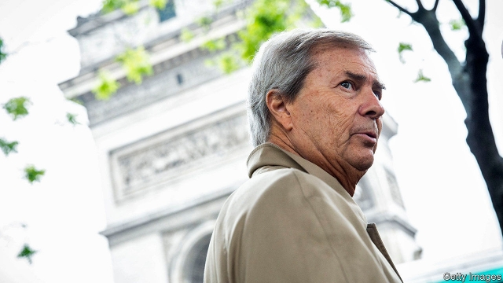
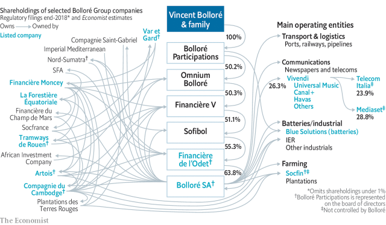

###### Empire builder

# Assessing Vincent Bolloré 

##### Untangling a French tycoon’s complicated legacy 

 

> May 30th 2019 

WHO IS FRANCE’S greatest capitalist? Americans might think this question is the beginning of a joke. Those who take it seriously may finger Vincent Bolloré, who over nearly four decades has built an empire spanning African ports and French pipelines, pay-TV, electric cars, the world’s biggest music label and much else besides. On May 29th the 67-year-old stepped down from the board of Bolloré SA, the holding company at his complex empire’s core. At an annual meeting outside Paris, he air-kissed fawning shareholders one last time and, as a parting gift, gave each one three bottles of wine (from a Bolloré vineyard). 

With sales of €23bn ($25.6bn) and 81,000 employees around the globe, Bolloré Group testifies to its boss’s knack for business. A more sober assessment of his reign reveals a complicated legacy. The tycoon emerges as a flawed exemplar of capitalism. His heirs should draw lessons. 

Though from 1822 five generations had built a Bolloré bible-and-cigarette-paper concern in Brittany, Vincent is what the French call un self-made man. In 1981, still in his 20s, he paid a couple of francs for the family concern, which had fallen into the hands of its creditors—a quixotic move for an up-and-coming investment banker. 

Mr Bolloré’s dynastic industrial ambitions, admired in French business circles, were soon paired with stockmarket raids à l’américaine, which were not. Not for him the polite ways of Parisian business, nor its endless cocktail circuit. He is part activist investor, part private-equity financier in a country which has little love for either; a corporate “pirate” eyeing the shareholder registers of august companies, whose family owners did not appreciate it. Some fell under his control, such as a shipping group that then formed the backbone of a logistics operation which now runs 16 container terminals in Africa. Others, like Bouygues, a construction group, and Lazard, a blue-blooded bank, persuaded less outré parties to buy his stake at a hefty premium. 

 

Stodgy French capitalism can use an outsider to shake it up. But Mr Bolloré’s norm-flouting has a less laudable side. For one thing, his touch is not as golden as some make it out to be. He has on occasion ridden roughshod over the principles of modern corporate governance. Lastly, he and Bolloré SA face charges of corruption, which both deny. 

Start with the business. Mr Bolloré is a risk-taker of the sort every economy needs. Investors who bought shares in Bolloré SA 30 years ago, soon after it listed, have made their money back 40 times over, compared with eight times for France’s CAC 40 blue-chip index. Its market capitalisation is now €12bn. The empire around it comprises 457 businesses. A simple total of their market caps gets to nearly €70bn. The three main pillars are logistics, batteries and media. 

The logistics and pipelines business has been the most successful. It includes ports in Africa, where Bolloré SA says it has invested €4bn, plus a freight-forwarding arm, three African rail concessions and French oil terminals. Analysts value it at €8bn or so, roughly half of Bolloré SA’s value including debt. It faces stiffer competition than it did, but margins are healthy. 

Those profits appear mostly to have been offset by losses from another transport bet: on a new type of lithium battery developed by a plastics operation which complemented the old paper business. Its only big customer has been a car-sharing scheme in Paris, Autolib’, which was run by Bolloré before collapsing in a heap of debt last year. The battery venture is now eyeing electric buses. It is worth perhaps one-tenth of the €3bn sunk into it. 

Vivendi, a media behemoth in which Bolloré SA owns a 26% stake worth around €8bn, has been a mixed bag. Mr Bolloré took control of the group in 2014, fulfilling a long-rumoured ambition to become a media baron. Universal Music Group, which is wholly owned by Vivendi but run at arm’s length from California, has prospered as streaming revenues from Lady Gaga, U2 and its other stars have soared. Its value is thought to have swelled from $8bn in 2014 to $30bn—more or less Vivendi’s market capitalisation. Vivendi has gained just €7bn in that period, reflecting poorer performance at other parts of the group. Canal+ has struggled to retain French pay-TV viewers in the age of Netflix; Havas looks too small to compete with PR-and-advertising rivals like WPP and Omnicom. 

Mr Bolloré’s expansion into Italy, in a bid to create a southern European content-and-distribution giant, has been costliest. Since 2015-16 Vivendi has tried to seize control of Mediaset, Silvio Berlusconi’s broadcasting empire, and Telecom Italia, a mobile operator. These bets have misfired: Mediaset’s share price has fallen by a quarter and Telecom Italia’s by nearly two-thirds since Mr Bolloré built stakes in them. A €1.1bn hit in the value of its Telecom Italia holdings all but wiped out Vivendi’s net profits last year (other holdings rose in value). As analysts at Morgan Stanley, a bank, recently put it, “great music story, unappealing wrapper”. 

As a result of these misadventures, Bolloré SA has lost shareholders money in the past five years, even as the CAC 40 has gained 40%. Such, Mr Bolloré’s defenders might reasonably argue, is the nature of risk-taking. Fair enough. But the wrapper has other unappealing qualities. 

Bolloré’s corporate structure would put Byzantium to shame (see graphic on previous page). At its heart is a corporate mille-feuille, where Mr Bolloré and his family control a company that holds the majority stake in a firm that in turn owns most of another, and so on. Alongside this sit companies that do actual business, including Vivendi. Such a model, which is not unique in France, allows minority investors to be brought in while a central shareholder—in this case Mr Bolloré—maintains control. 

What sets Mr Bolloré’s layer cake apart from similar ones is that those minority shareholders are often other companies in it. Bolloré SA part-owns at least ten companies with direct and indirect stakes in its own majority shareholder, Financière de l’Odet, and its parents. When a company pays a dividend, the money loops through a few holding companies before some of it returns to its own bank account. Several of the holding companies are listed but at least 90% owned by Bolloré entities. 

Analysts attribute over a third of Bolloré SA’s market value to shareholdings in its parents; these parents are also worth around €12bn in total. That does odd things to Bolloré SA accounts. When its value falls (like last year, when its shares lost 24%), that of the holding companies above it dips too. Because Bolloré SA in turn owns them, its balance-sheet and income must be adjusted downwards. This then affects metrics used to calculate the value of its shares, whose fall prompts a further adjustment. Share-price rises cause upward revisions. 

In 2015 Muddy Waters, a hedge fund which specialises in arcane companies, said the rococo empire was too complicated to be modelled in an Excel spreadsheet. Analysts and investors with the patience to track Bolloré SA disagree over basic things, such as who exactly is entitled to the profits generated by the underlying operations. 

All this makes it hard to gauge the Bolloré empire’s financial condition. It reports net debt equal to a healthy 17% of equity. This, though, assumes debts owed by one company in the structure can be repaid with cash held in another part. Bolloré SA’s accounts subsume all those of (much larger) Vivendi—not just the proportion, 26%, which it owns. Such consolidation is perfectly legal, for Bolloré SA controls Vivendi. But its claim on Vivendi’s cashflows would be as owner of a 26% stake, not of 100%. 

Information is patchy on where in the organigram debts sit (Bolloré says all the holding companies contain cash). Pierre-Yves Gauthier of AlphaValue, a research house, has spoken of “looming potential stress” in the structure. With €10.3bn in gross debt and €4.8bn in cash at end of 2018, its position looks reasonable. Its earnings before interest, tax, depreciation and amortisation were just under €1bn last year even before adding in Vivendi’s. The accounts of Omnium, near the top of the structure, paint a different picture. These consolidate the group but in effect strip out the cross-shareholding loops. They show net debt of €5.6bn supported by equity (excluding outsiders’ stakes) of just €482m at end 2018—gearing of over 1,000%. 

Such leverage is sustainable so long as cash keeps flowing into the system. Some observers suspect this is why Mr Bolloré has pursued ever-bigger companies with ever-bigger balance-sheets, like Vivendi. The company has been generating lots of cash by selling assets accumulated in an ill-fated acquisition spree initiated in the early 2000s. Under Mr Bolloré’s leadership, Vivendi paid fat dividends, which helped service debts that paid for his takeover of it. It is now considering the sale of up to half of Universal. That would let Vivendi send as much as $8bn to the Bolloré structure. 

Critics who worry that Vivendi is run for the benefit of Mr Bolloré and not its other shareholders point to such machinations as evidence. In June 2017 the purchase by Vivendi of Bolloré businesses’ 59% stake in Havas transferred €2.3bn in cash from Vivendi’s coffers into those of Bolloré entities, which owned around 20% of Vivendi at the time. Analysts questioned both the deal’s rationale and price. Independent experts have decried worsening corporate governance at Vivendi (to match Bolloré SA). 

Other bits of the business have attracted the gaze of the authorities. In April 2018 preliminary criminal charges were brought against Mr Bolloré, other Bolloré executives, and later Bolloré SA, in relation to corruption in Togo and Guinea. French investigating magistrates suspect them of sending Havas spin-doctors to work in the countries’ election campaigns. According to the charges, it was Bolloré businesses that footed much of the bill, not the politicians to whom the services were rendered. (Bolloré says it paid for bona fide work carried out.) Bolloré SA is said to have gained business after the politicians won. Mr Bolloré, who was briefly detained for questioning at the time, may face prison time if found guilty. Mr Bolloré, Bolloré SA and the other executives all deny the allegations. 

Many Bolloré ventures—ports, broadcasting—depend on government goodwill. In Africa Mr Bolloré and his businesses have maintained close links with current and former politicians. “He is a friend. I favour friends. And so what?” Guinea’s president, Alpha Condé, told Le Monde in 2016. Bolloré SA has recruited from France’s network of former ministers, spooks and other grandees, often with tangled business ties in its former colonies. Critics allege Mr Bolloré has skewed the coverage of his TV channels and newspapers in favour of politicians vital to his business interests. 

Mr Bolloré keeps close to French power, too. After winning the French presidential election in 2007, Nicolas Sarkozy holidayed on Mr Bolloré’s yacht. “I’ve known Vincent Bolloré for 20 years,” Mr Sarkozy explained at the time. Mr Bolloré’s son, Yannick, has called the current president, Emmanuel Macron, “a friend”. Bolloré père has reportedly lobbied the French state to keep its 3% stake in Vivendi. 

Mr Bolloré and Bolloré SA deny any impropriety in all these relationships. As for corporate governance, people close to Mr Bolloré dismiss concerns as specifically Anglo-Saxon. Family groups are lauded in Europe as long-term investors who see beyond quarterly earnings. Mr Bolloré has made no secret that his son Cyrille, 33, who chairs Bolloré SA, or Yannick, 39, who chairs Vivendi, will be in charge one day (a third son is not active in the business; a younger daughter is in its lower echelons). 

For now, despite stepping off the board of Bolloré SA, the patriarch remains the real boss. He retains positions—and influence—throughout the mille-feuille. He still calls the shots at both Bolloré and Vivendi. For years he has promised to relinquish all positions in 2022, when he turns 70 and the family business turns 200. Several Bolloré investors worry that the untested sons lack their father’s track record. Given the elder Mr Bolloré’s controversial tenure, others may see that as a virtue. 

