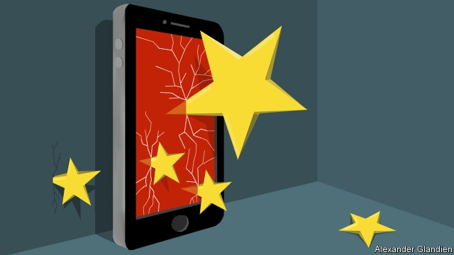

###### Schumpeter

# Does Apple’s boss have a Plan B in China? 

##### Brace for an iPhoney trade war 

 

> May 30th 2019 

LONG BEFORE Tim Cook became Apple’s boss, when his job was to wring costs out of the company’s supply chain, he learned of a problem with a supplier in China. “This is really bad,” he told his staff. “Someone should be in China driving this.” Thirty minutes later he saw one of his executives sitting at a table. “Why are you still here?” he asked quietly. The executive stood up, drove directly to San Francisco’s airport and bought a ticket to China. 

This anecdote, recounted in Walter Isaacson’s biography of Steve Jobs, Apple’s founder, is one of only a few tales in print that offer an insight into the management style of Mr Cook, who took over from Jobs shortly before he died of cancer in October 2011. It is telling. While Jobs, the irascible creative genius behind Apple’s bestselling products, stole the show, Mr Cook, who is both courtly and deeply private, plugged away behind the scenes to cement a relationship crucial to Apple’s soaring success: that with China. 

In the early days of Apple, Jobs wanted to make his Macintosh computers in America. With his trademark obsessiveness, he built a factory of pure white to produce them (and wore white gloves to check for dust). When Mr Cook joined the company in 1998 he changed all that, deploying his soothing Alabama lilt and a fearsome work ethic (he gets up at 4am) to forge an unrivalled supply chain running through Asia. Today labels on nearly all iDevices read, “Designed by Apple in California. Assembled in China”. 

Mr Cook’s bet on China extended beyond its factories to its consumers. Sales to the region have risen from next-to-nothing in 2010 to $52bn last year, or almost a fifth of Apple’s revenues. Since Donald Trump’s election in 2016, “Tim Apple” (as America’s president once called him) has jetted to Washington and Beijing to try to ease rising trade tensions between the two superpowers. Horace Dediu, a technology analyst, says Mr Cook “knows how to navigate the political mind”. 

Given his reputation as a logistical mastermind, it is worth asking why he has ignored the first rule of supply-chain management: the risk of keeping too many important eggs in one basket. In Mr Cook’s case, that basket is China. The trade bust-up is getting uglier. If it leads to an anti-American backlash in China, it could spell trouble for Apple—and for Mr Cook personally. 

Mr Cook’s lobbying has helped Apple avoid direct hits from Mr Trump’s tariffs, already imposed on $250bn-worth of Chinese imports. But its shares have fallen by almost 12% in the past month. On June 1st, after The Economist went to press, China was expected to retaliate with tariffs on $60bn of American goods, including components for Apple devices. Mr Trump has threatened a levy of 25% on $300bn more of imports if trade talks do not produce a breakthrough. This would cover the iPhone, by far Apple’s biggest source of revenue. Morgan Stanley, a bank, estimates that it could add $160 to the cost of a $999 iPhone XS. Apple could absorb the cost or pass it on to buyers. Either way, profits would suffer. 

A more immediate threat may be a Chinese reprisal for the Trump administration’s decision in May, on national-security grounds, to stop American companies from supplying Huawei, China’s tech champion (and the biggest seller of smartphones in China), with chips, software and other technology. A Chinese consumer boycott of Apple products could accelerate their shift towards other, cheaper brands. Because of the trade tensions, Citi, a bank, has halved its forecast for iPhone sales in China in the second half of this year, from almost 14.5m to 7.2m units. 

Others reckon that Apple could offset Chinese losses by luring customers away from Huawei in other countries—but only if it could continue to churn them out in Chinese factories. Although Apple has tentatively started production of some iPhones in India for local customers, it appears if anything to have increased its China exposure, even as Mr Trump’s trade bluster has intensified. According to a review of Apple’s top 200 suppliers by the Nikkei Asian Review, a Japanese publication, last year those from China (41) exceeded those from America (37) for the first time—though Apple stresses the importance of its American supply chain. China has recently released draft cyber-security regulations that cover threats to national security and supply chains. Andrew Gilholm of Control Risks, a consultancy, says these could be weaponised against big American firms in China if the situation deteriorates. 

That would be the nuclear option. It looks unlikely for the time being. The costs for China would be huge; Mr Dediu estimates that Apple contributes about $24bn a year to China’s economy. Some 1.5m Chinese help assemble Apple products. A further 2.5m Chinese software engineers create apps for the iOS operating system. Appetite for punishment may be weak. On May 26th Ren Zhengfei, Huawei’s boss, told Bloomberg TV that he would be the first to protest if China hits back against Apple. “Apple is my teacher, it’s in the lead,” he said. “As a student why go against my teacher? Never.” 

Mr Ren can always change his mind. So can China. Whereas Huawei claims to have a Plan B to survive its blacklisting by America, and Samsung, a rival smartphone-maker from South Korea, is shifting supply chains from China, Apple appears to have no clear alternative to assembly in China. Few other places possess the expertise to produce the high-end components that Apple needs. The existing network would take years to unscramble. 

One fix would be for Apple to develop another indispensable product that no self-respecting affluent Chinese consumer could do without. For all his success, Mr Cook has not yet managed this. Another would be to develop services that do not need production in China. Apple’s much-trailed announcement in March of new video-streaming, payments and other services shows it is trying. They may prove a hit, but would be no substitute for the iPhone. Mr Cook must be hoping that he has not miscalculated the risks to the supply chains he has so intricately engineered. 

