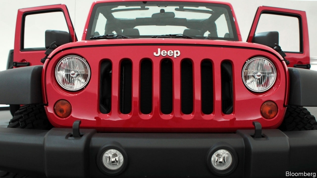
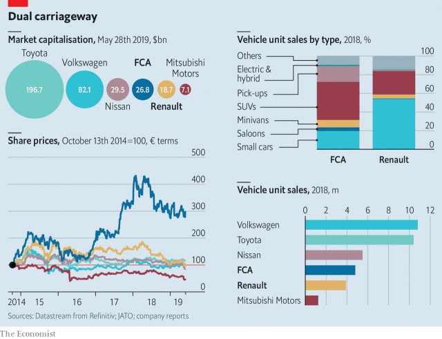

###### Building a juggernaut

# Fiat Chrysler seeks a merger with Renault 

##### Making it work will be tricky 

 

> May 30th 2019 

THE RISE of the SUV shows that carmakers have persuaded many customers that bigger is better. Renault and Fiat Chrysler Automobiles (whose chairman, John Elkann, sits on the board of The Economist’s parent company) are hoping to convince investors that the same is true of carmakers. On May 27th FCA, an Italian-American firm, said it was seeking a merger with its French counterpart, itself in a close alliance with Japan’s Nissan and Mitsubishi. If a deal goes ahead, it will create an automotive colossus. 

Together, the two companies sold nearly 9m cars last year and their combined revenues totalled €170bn ($190bn), with €10bn in operating profits. Only Toyota and Volkswagen (VW), each making over 10m cars a year, are bigger. Add Renault’s alliance partners, and the grand total of 15m cars would leave everyone in the dust. 

The deal—still subject to approval by Renault’s shareholders—can be seen as the legacy of two fallen giants of carmaking. Sergio Marchionne, FCA’s charismatic boss who died last year, had called for consolidation of the mass market, where slender profits are partly the result of duplicated investment in similar technologies, such as engines, that do little to differentiate brands. Carlos Ghosn’s Napoleonic personality helped him build and run the Franco-Japanese alliance. His plans for world domination were exploded by his arrest in Japan last year on charges of financial wrongdoing at Nissan (which he denies). 

Mr Ghosn had previously invited FCA to join his alliance. Both he and Marchionne would doubtless have coveted the driving seat of a merged firm. With their rampant egos out of the picture, blunt negotiating style has apparently given way to civilised talks between Mr Elkann, scion of Fiat’s founding Agnelli family, and Jean-Dominique Senard, who took over from Mr Ghosn as Renault’s chairman in January. 

Messrs Elkann and Senard appear to share Marchionne’s vision. If they are to survive, incumbent carmakers will need to get bigger to ride out the sort of economic downturn that the industry now faces. Consolidation allows firms to cut costs and to spread inevitable and massive investments in electric vehicles (EVs), self-driving cars and mobility services (such as ride-hailing and car-sharing). 

 

On paper, FCA and Renault look like perfect partners (see chart). They plug gaps in each other’s businesses both geographically and in terms of products. FCA’s strength and profits come from America; Renault’s from Europe. The French firm’s cheap models and EV know-how complement FCA’s pickups and upmarket brands such as Alfa Romeo and Maserati. 

Can the tie-up defy the patchy history of carmaking megadeals? The list of failures is long: Daimler and Chrysler, BMW and Rover, anything to do with Ford. Fiat and Chrysler show that partnerships can work. Renault-Nissan-Mitsubishi works, too. Both groups had exceptional former bosses, who adeptly managed component firms’ disparate cultures. But today the companies may be readier to overcome differences, since their prospects look so uncertain. And FCA believes the union could allow the combined firm to cut costs by €5bn a year—equivalent to around 3% of combined revenues and much more than Marchionne thought he could wring from the merger of Fiat and Chryler, which in 2010 he put at 1% of revenues by 2014. 

The trouble is that obstacles remain. Even if the firms can be engineered jointly, the same is not automatically true of ownership structures. This one is to be structured as a 50-50 partnership. This would hand the largest stake, of 14.5%, to Exor, the Agnelli family’s investment vehicle, which controls FCA through a 29% stake (Exor is also a shareholder in The Economist’s parent company). It is unclear where the merger would leave Nissan. The Japanese firm’s partnership with Renault looks creaky with Mr Ghosn out of the picture, and Nissan may worry that its influence will fall even further. But on the other hand its 15% non-voting stake in Renault will at least convert into a 7-8% voting share in the new firm. And the marriage to FCA may cool Renault’s ardour for a full merger with Nissan, which does not want one. 

Then there are governments, which regard carmakers as national champions. Politicians fear plant closures, job losses and the unpopular symbolism of industrial decline. The French state, which owns 15% of Renault, will apparently give up its double voting rights and accept a board made up mainly of independent directors. The French and Italian governments may have been reassured by FCA’s guarantee that no factories will close. 

Lastly, running an alliance that makes 15m cars a year will be a feat. Even Marchionne or Mr Ghosn may not have been up to the task—not least because these superstars excelled in rescuing failing carmakers. Mr Senard, who is likely to lead FCARenault, has a different task—to steer firms that are already on the straight and narrow. 

If size at the top of the industry moves from 10m to 15m cars a year, will others seek to follow? Ford and VW are in a partnership that could grow closer. PSA, which makes Peugeots and Citroëns, is open to offers. China’s government is perpetually rumoured to be planning a merger of its state-run firms. If they were still in charge, Messrs Ghosn and Marchionne would have cheered the consolidation frenzy on. 

