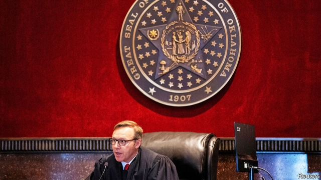

###### An industry in the dock

# Johnson & Johnson stands trial for the opioid crisis 

##### Other cases against drugmakers accused of stoking the opioid epidemic are in the works 

 

> May 30th 2019 

“OVERSUPPLY AND people will die.” That evocative line was at the heart of the opening argument laid out in a courtroom in Oklahoma on May 28th. Mike Hunter, the state’s attorney-general, accused Johnson & Johnson (J&J), a pharmaceutical giant, of misleading doctors and patients about the dangers of opioids, prescription medicines used to treat severe pain. After a heart-wrenching description of addicted patients and the plight of babies with neonatal opioid syndrome, Mr Hunter asked, “How did this happen? I have a short, one-word answer: greed.” 

The opioid crisis claimed nearly 400,000 lives between 1999 to 2017, and rages on today. Americans want someone to blame and to pay for cleaning up the mess, so politicians are taking to the courts. A federal trial in Ohio will aggregate claims of nearly 2,000 cities, counties, Native American tribes and hospitals, against a number of opioid-makers and distributors, but will not start until October. 

That is why all eyes are on Oklahoma this week. The J&J case is heavy with symbolism. It is the first of many against opioid manufacturers to reach trial. It is conducted in the same courtroom where Big Tobacco was humbled in 1998, which led to cigarette-makers agreeing to pay states $206bn over 25 years to settle lawsuits seeking to recover smoking-related health-care costs. Anti-opioid campaigners hope for a reprise. Wall Street is jittery—on the first day of the trial J&J’s share price sank by 4%. 

The campaigners should temper their expectations, for three reasons. First, Purdue Pharma, a middling drugmaker that, as opioids’ most prominent promoter, has become synonymous with their abuse, is no longer on trial in Oklahoma. The firm, controlled by the Sackler family, reached a settlement for $270m with the state ahead of opening arguments. Teva, an Israeli maker of generic opioids, settled for $85m. That leaves J&J, a big company but a bit player in the opioids market, as the sole defendant. 

J&J’s stout defence, laid out in its opening argument, suggests a guilty verdict is no foregone conclusion. That is the second reason for caution. Larry Ottoway, J&J’s lead attorney, fingered other culpable parties. He noted that America’s Food and Drug Administration (FDA), which regulates all pharmaceuticals, has in the past declared that opioids “rarely caused addiction”. The Drug Enforcement Agency strictly controls the import of precursor chemicals going into opioids and authorises doctors to prescribe them by issuing licences. In Mr Ottoway’s telling, Oklahoma’s medical supervisors were aware of opioid abuse as far back as the early 2000s but did not stop it. He summed up his opening remarks bluntly: “When you’re right, you fight.” 

Third, and most curious, Oklahoma’s case rests on a novel legal theory that has not been tested in a pharmaceutical context. Rather than allege fraud or product liability, Mr Hunter claims J&J infringed the state’s law governing public nuisances. Usually that argument is used against transgressions like polluting waterways or interfering with the use of parks. 

Richard Ausness, a legal scholar at the University of Kentucky, argues that “public nuisance is not the strongest claim but they are stuck with it.” Trying to litigate fraud may have proved problematic, he speculates, because the people allegedly defrauded were doctors and patients, not the state itself. 

Whatever the outcome of this trial, its verdict seems likely to be appealed at the state Supreme Court. The federal judge in the Ohio mega-case is pushing all parties hard to reach a settlement, but this is proving difficult. If they do not, the trial will begin in five months. There are other state trials in the works, but many state attorneys-general are still weighing up whether to go it alone or to join hands. 

These factors conspire to keep the legal outlook for the industry uncertain for the time being. But as the broader ramifications for all opioid-makers crystallise, those for Purdue are already clear. The company and its owners have turned toxic. JPMorgan Chase, a big bank that provides payment services to Purdue, and McKinsey, a consultancy that advised it on how to market opioids, both said last week that they are dropping the drugmaker as a client. Museums around the world, which once welcomed Sackler money, are now turning it down. The firm is considering declaring bankruptcy. 

For Americans angered by drugmakers’ role in the opioid crisis, that may seem a fitting comeuppance. That is not the same as recompense. If Purdue ends up in bankruptcy court, those financial proceedings could cause every opioid case involving the firm to grind to a halt, cautions Andrew Pollis of Case Western University in Ohio. “Chaos is possible,” he says. 

