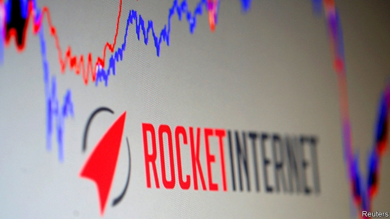
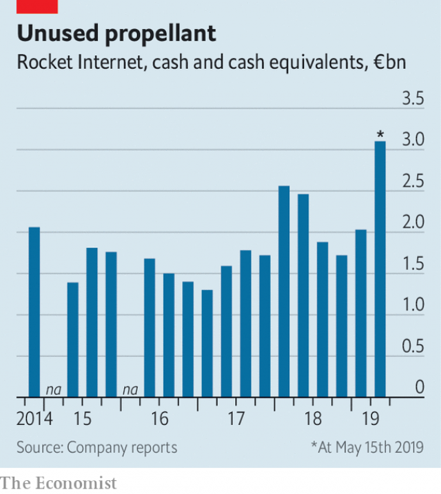

###### Stuck in orbit

# The next stage of Rocket Internet 

##### Five years after going public, analysts think Europe’s startup factory should take itself private 

 

> May 30th 2019 

ROCKET INTERNET is helping about 200 businesses reach for the stars, and has invested a total of €400m ($445m) in them. When the startup incubator unveiled its first-quarter results in Berlin on May 29th, analysts focused not on these firms but on Rocket itself—specifically, the next stage in its trajectory. 

Rocket went public in 2014. Its business model gained notoriety: apeing successful American online firms in Europe and emerging markets. The idea was to create local market leaders—or force American originals to acquire them. Early knockoffs included Pinspire (Pinterest), Plinga (Zynga), Wimdu (Airbnb) and Citydeal (Groupon). Investors loved it. 

Two years later the strategy stalled. Rocket proved better at launching companies than running them. Most of its startups lost money; a dozen folded. Its self-depiction as a “network of companies”, not an investment firm, left shareholders unconvinced. It issued its first profit warning in September 2016, by which time its market value had fallen to just €2.9bn, compared with a peak of €8.7bn in 2015. 

 

So Rocket changed course. It has jettisoned its previous hands-on approach and no longer has board seats at any of its listed companies. It is selling down its main holdings. That has proved lucrative: the sale in May of its remaining stake in HelloFresh, which markets meal kits, earned it €350m. It is set to make a killing on Jumia, an African e-commerce platform which has had a volatile listing this year in New York. 

All this has left Rocket with €3.1bn in cash, little debt—and a problem. It invests small sums early, and brings in more outside capital later. Running down its cash pile at the current pace could take decades. Oliver Samwer, Rocket’s boss, wants to spend more on its startups’ later funding rounds. But its current crop of firms—in “property tech” and business-to-business marketplaces—looks years away from scale. 

Rocket could use the cash to take itself private. Being public has not created value for shareholders. It has enough ammunition: even if it paid a 25% premium to buy out other investors, it would have €1bn in cash left over, says Sarah Simon of Berenberg, a German bank. That would be some re-entry. 

