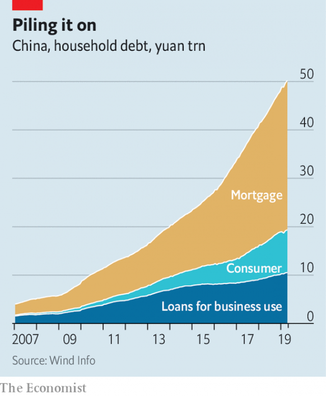

###### A way out

# China is getting tough on those who fail to pay their debts 

##### It should accept that some of them also need help 

 

> May 30th 2019 

THE CASE of Mr Ke, a carpenter from the eastern city of Taizhou who fell deep into debt, may one day be noted in histories of China’s financial evolution. On May 9th a local court announced that it had arranged for Mr Ke’s liabilities to be written off. This was made possible by what state media described as the country’s first ever regulations concerning the clearing of personal debt. Sadly, for now, they only apply in Taizhou. 

Mr Ke—the court did not reveal his full name—had fallen victim to fraud eight years ago. By last year the 54-year-old’s debts totalled 480,000 yuan ($70,000), owed to three banks. But the court took account of Mr Ke’s predicament. He has no income, a home with only one room and less than 100 yuan in savings—the equivalent of what he would earn in under seven hours on the local minimum wage. 

In America, Europe and many other countries Mr Ke’s problems would have been swiftly handled according to national regulations on bankruptcy. China, however, still has no such rules for discharging penniless people’s debts. Officials in Taizhou say Mr Ke is the first beneficiary of a procedure the city’s own judiciary devised for dealing with such cases. It is modelled on China’s law relating to the winding-up of insolvent firms. 

For an individual in China, it is easy to fall into debt without being spendthrift. Most at risk are the many millions of people who run small businesses. They often have to give a personal guarantee for their business-related borrowings. Medical bills are another common cause of ruin, as are natural disasters. After an enormous earthquake in the south-western province of Sichuan a decade ago, thousands of families who had lost their homes were asked to pay off their mortgages. 

In recent years easier access to consumer credit has been creating new risks for many people. The Chinese government has been cautiously promoting such borrowing because it wants people to spend more and thereby give the economy a boost and reduce its reliance on investment. The amount of household debt in China was about half of its GDP at the end of last year, up from less than one-third in 2013. In America the ratio of such debt to GDP is a little over 75%. China is catching up fast as its citizens make increasing use of mortgages, credit cards, bank loans and online lenders of varying repute. There may be much lending through the internet that is not captured by official statistics. 

 

Debtors who cannot keep up with payments can face horrors. First, there are the debt collectors. Agencies that employ them are becoming more professional. But late payers are still prone to abuse, especially if they have borrowed from shady people. State-controlled media say the collectors’ tactics have included threatening debtors with red liquids while claiming to have HIV. Two years ago a 22-year-old man was jailed for life after stabbing and killing a collector who, he alleged, had exposed himself to his mother (after an outcry, his sentence was cut to five years). Some collectors have worked out how to track their targets by hacking their instant-messaging apps. In February police said they had arrested a man who was selling people’s locations for one yuan per pinpoint. 

Then there are the lenders themselves. Disreputable ones have required borrowers to surrender the contacts stored on their mobile phones, so that family and colleagues can be hassled if payments are missed. Others have asked female borrowers to submit photos of themselves with no clothes on, to be released if they default. Reports abound of suicides by women in debt who fear being subjected to such humiliation. Some have been forced to provide sexual favours in return for having their photos kept under wraps. 

The government could do more to reduce unnecessary suffering. It is already trying to educate the public about the risks of borrowing and to eradicate the most shady lenders. But a personal bankruptcy law is also urgently needed. Reformers had hoped to create one during an overhaul of China’s corporate insolvency laws, which was completed in 2006. In the end lawmakers balked, fearing it would encourage the country’s legions of debt-dodgers. Such people could easily hide assets from creditors by transferring them to friends and relatives, or by means as simple as burying their cash. 

Since then, however, better property-registration systems have made it harder to conceal the ownership of assets. The spread of non-cash payment services has enabled people’s spending to be tracked more readily. The growth of credit-rating services has given lenders more confidence that those with bad histories can easily be identified. 

Lately the government has introduced tougher measures to make sure that individuals and legal representatives of businesses comply with court orders to repay debts. It is placing defaulters on blacklists. Those named are barred from taking flights or high-speed trains, staying in luxury hotels or sending their children to fee-paying schools (because, if they have money to spend on such things, they should be using it to service their debt). They can also be denied certain kinds of business licences and some state-sector jobs. In 2017 a county in the eastern province of Jiangsu introduced automated messages that would be heard by people who made phone calls to blacklisted debtors, telling them to “urge the person to fulfil his legal obligations”. 

Many people support the use of these sweeping and intrusive sanctions. However, honest-but-unlucky people whose borrowings are genuinely unmanageable urgently need help getting out of their predicament. The supreme court reckons that, in nearly one-fifth of civil and commercial lawsuits that are dealt with by courts, defendants are incapable of paying the sums required of them by judges. 

Introducing a personal bankruptcy system would help those who need a respite as well as reduce financial risks, says Li Shuguang of the China University of Political Science and Law. It might also help the economy by getting people swiftly back into business. An opportunity could arise in June, when lawmakers in Beijing will start discussing yet another round of changes to the country’s corporate bankruptcy law. Legal scholars hope that regulations concerning personal bankruptcy can be bundled with these amendments. Otherwise a separate law will be needed, says Chi Weihong, a lawyer and former judge. That could take several years. 

The government seems unsure what the scope should be of any rules on personal bankruptcy. Should they apply to overspending consumers or only to unlucky entrepreneurs? They worry about moral hazard, and whether China’s courts have the capacity to handle a flurry of individual bankruptcy cases. Drafting such rules is complicated by widely held prejudices against people who fall into debt, says Huifen Yin of Shanghai University of Political Science and Law. The government should start by accepting that people can make innocent mistakes. 

