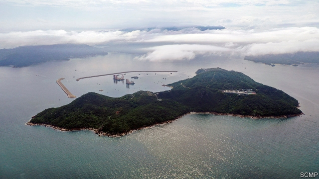
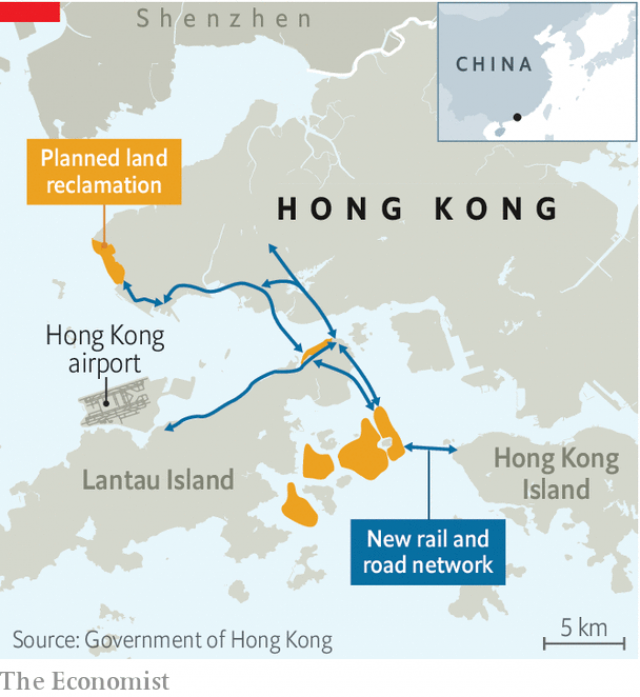

###### The Lantau row

# Hong Kong wants to build massive artificial islands 

##### More 1m people could live on them. But they will cost a fortune 

 

> May 30th 2019 

HONG KONGERS have less residential space than the people of any other big city: 15 square metres each. That is barely double the size of a standard prison cell in Hong Kong. The Chinese territory is also the world’s most expensive property market. The average price of a home is $1.2m, around 40% higher than the nearest competitor, Singapore. To be fair, 45% of Hong Kongers live in government-subsidised housing. But the average waiting time for such flats is five-and-a-half years. 

Carrie Lam, Hong Kong’s chief executive, has taken note. Last year she unveiled a colossal project, called Lantau Tomorrow Vision. It involves reclaiming 17 square kilometres of land off the coast of Lantau, Hong Kong’s largest island. That is about five times the area of New York’s Central Park. It is the biggest infrastructure project ever proposed in the city (see map). Housing on the artificial islands would accommodate up to 1.1m people, about one-seventh of the current population. The new flats would be bigger than average and 70% of them would be subsidised. On May 25th Hong Kong’s quasi-parliament, the Legislative Council, approved the launch of a feasibility study. Reclamation work is unlikely to start before 2025. 

The estimated price tag, including the cost of transport links, is at least HK$624bn ($80bn), officials say. That is equivalent to more than half of Hong Kong’s fiscal reserves. The government, citing a report by a professional body of surveyors, says land sales will recoup the full cost of initial outlays on reclamation and infrastructure-building. The idea is to turn part of the new land into a “core business district” which will be used by multinationals as their “global headquarters”. Officials hope that will create hundreds of thousands of new jobs and generate plenty of tax. 

 

Public opinion is divided. Nearly 60% of about 3,000 respondents to a government-commissioned survey supported, in principle, the construction of artificial islands east of Lantau. But many people worry about the project’s cost and environmental impact. Shortly after Mrs Lam announced the idea, thousands of people took to the streets in protest. Activists say they are planning more demonstrations. 

Chu Hoi-dick, a legislator who opposed even conducting a feasibility study (which will cost an estimated HK$550m), agrees that the government should do more to increase the supply of housing. But he says there are cheaper ways to do it, such as developing old industrial sites. Mr Chu is “not at all” convinced by official financial projections, which, he says, take for granted that land prices will continue to rise. 

In March seven local conservation groups called on the government to abandon the scheme. Chief among the risks they cited was the potential threat to endangered marine animals, such as the city’s iconic pink dolphins. Debbie Chan, a volunteer for one of the groups, Save Lantau Alliance, says the government often makes the right noises about protecting the environment but fails to monitor how its infrastructure-building affects it. 

But these worries are unlikely to stop Mrs Lam. Wu Chi-wai, another legislator who voted against the feasibility study, says he has never come across one commissioned by the government that concluded a project would not work. 

