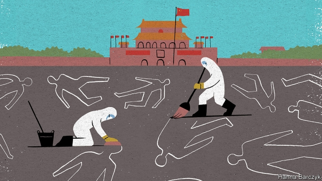

###### Chaguan

# Many Chinese know little about the bloodshed in Beijing 30 years ago 

##### What if China’s rulers pay no price for the massacre that ended the Tiananmen protests? 

 

> May 30th 2019 

THREE DECADES after troops used murderous force to clear protesters from Tiananmen Square and central Beijing, covering up that crime has become a bit of a chore. China’s security machine is ready to censor, arrest and imprison those who speak too candidly about events in 1989. But 30 years on this work of repression is carried out with cold, bureaucratic efficiency—a far cry from the terrors of June 3rd and 4th when soldiers and tanks shot and smashed their way into the ceremonial heart of Beijing, as loudspeakers metallically intoned that the army “loves the people”. 

The most recent jailing linked to the Tiananmen protests occurred on April 4th this year. A court in the south-western city of Chengdu sentenced an activist, Chen Bing, to three-and-a-half years in prison for “picking quarrels and provoking trouble”. His offence: labelling bottles of baijiu alcohol with the iconic image of the lone protester who stared down tanks near the square. That picture, and any other reference to Tiananmen in 1989, is politically taboo in China. Each year, as the anniversary approaches, the relatives of those killed by the army, including the mothers of school pupils gunned down in cold blood, are placed under surveillance or taken on enforced trips out of town. 

The cover-up is a headache for internet and social-media companies, which are obliged to employ armies of people to erase banned content. In order for these 20-somethings to be able to spot and delete references to Tiananmen, they must first be taught what happened there, the New York Times reported in January from one “content-reviewing factory”. 

Such ignorance was once thought impossible. In all, hundreds of people, if not thousands, were killed in Beijing and some in other cities. Tens of thousands, at a minimum, were arrested for involvement in what was declared a “counter-revolutionary riot”. Suspects were snatched from homes and workplaces, or off the streets. The protests had drawn students and workers, magistrates in court uniforms and police cadets, and journalists from state media who marched beneath banners reading “We want to print the truth”. None was safe. Many endured re-education meetings. The unlucky were jailed. A few, having suffered horrors in prison, were exiled. Millions witnessed these terrors or their aftermath. 

Zhao Ziyang, the Communist Party’s leader in 1989, was ousted during the unrest for opposing military action. In internal debates Zhao had called the protesters patriotic and endorsed their demands for a more accountable government, tougher anti-corruption measures and the observance of constitutionally guaranteed freedoms. He was purged and detained until his death in 2005. In a letter written from house arrest in 1997, he warned that the people would not forget the protests or the party’s demonisation of them. 

Yet there has been much forgetting, some of it the work of parents who see no good in filling children’s heads with politics. It is not hard to imagine the dream of modern party leaders: that all China should forget the passions, fears and dashed hopes of 1989, so that future anniversaries pass without a flicker of dissent. The same party leaders surely hope that foreigners let go of memories of 1989, too. Even as blood was being scrubbed from Beijing streets, Communist officials argued that they had crushed the protests to avoid civil conflict, and to restore party unity so that China could be stable and prosperous. Their argument today, in essence, is that China has succeeded because of that use of force, not despite it. 

It frustrates party officials that so many in the West doubt that claim, and suggest that China is weakened to this day by that legacy of violence, paranoia and intolerance of debate. It angers them that foreigners pay such heed to independent-minded people, whether religious believers, feminist campaigners, environmentalists or left-wing students working with unofficial trade unions. 

China’s leaders want the outside world to believe that they rule in a majoritarian compact accepted by almost all their citizens. They would include in that social contract the grim dystopia that they have built in the far-western region of Xinjiang, where perhaps a million members of the Muslim Uighur minority have been sent to re-education camps and millions more endure unsleeping high-tech surveillance. Party leaders insist that most Chinese approve of this, believing it a price worth paying for eliminating radical Islam and the threat of terrorism. 

Communist bosses should be careful what they wish for. Nobody knows how stable their support is because China is so secretive, and because the broad contentment of a country enjoying economic growth is easy to mistake for informed consent. But if a Tiananmen anniversary ever does pass without a flicker of dissent, that would be a dangerous moment, setting up the Chinese nation, and not just its rulers, for a backlash across the democratic world. For the party’s swaggering, authoritarian ways are a challenge to the universal values which help to define the West. That is true even though President Donald Trump is a disturbing outlier. He has described the violence in Beijing 30 years ago as a “strong, powerful government” quelling a “riot”, albeit with horrible force. 

For sure, foreigners have been guilty of a certain narcissism in imagining that ordinary Chinese, as they grow richer, will aspire to Western freedoms. But dissent in China matters. It allows Western governments to say that their disputes are with China’s leaders, not its people. It is because not all Chinese are seen as agents of the party-state that they are welcomed in the West as students and business partners. The party should be grateful that some citizens want a more transparent, accountable government, and distrust propaganda. They should welcome intra-party disagreements that pit reformers against hardliners. They should be glad that the chore of censorship never ends, on June 4th or any day. For a serenely unified, nationalist Chinese autocracy, unequivocally backed by its people, would be a terror to the world. 

