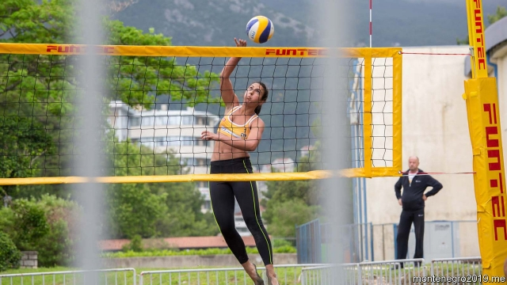

###### Small is beautiful

# Europe’s tiniest states square off in the Olympic mini-games 

##### A contest for countries with less than 1m people 

 

> May 30th 2019 

THE RAIN clears and the lavish opening ceremony can begin. Princes and presidents, princesses and regents are greeted, dancers twirl and stomp and an Olympic flame is lit atop a 17th-century tower. For athletes from Europe’s nine smallest countries the games, which opened in the Montenegrin resort of Budva on May 27th, are their chance to win gold. It is the only group of countries where Cyprus is a superpower and Liechtenstein, which has no coast, is a serious competitor at beach volleyball. 

To be eligible for the Games of the Small States of Europe, your country needs an Olympic Committee and a population of less than a million. “But who is counting?” laughs Janez Kocijancic, president of the European Olympic Committees. Turks from northern Cyprus don’t take part; if they did, Cyprus would be well over the limit. A majority of Monaco’s athletes are actually French but to qualify must live in municipalities neighbouring the principality. 

The Vatican’s priests would like to participate, as would the Faroe Islanders. But although the former is independent, the Pope has no Olympic Committee yet. The Faroes are part of Denmark. 

“Olé, allez Monaco!” whoops the crowd as their beach-volleyball players get one over the Maltese. A six-car motorcade purrs to a halt and out hops the principality’s Prince Albert, sporting a bright orange team shirt, to congratulate his players. They are cold, and the sand is sludgy. In a nearby sports hall the Icelanders have brought a drummer to whip up support as they play the Montenegrins, who take their volleyball extremely seriously. Beside the sea the sound of genteel clonks accompanies a knife-edge bowls match pitting Andorra against Luxembourg. 

The games have been held every two years since 1985. This year they have cost €2.5m, and involve 835 athletes. Most of Europe’s microstates get gold medals only for solving tricky tax problems for their wealthy residents, but the games give their athletes a chance to compete on a more even playing-field. Still, Gian Primo Giardi, the president of the San Marino Olympic Committee, makes clear there is a gulf between what he calls the city states and the “big” countries like Montenegro and Luxembourg. All involved belong to a matey circle though. After Budva many will meet again in three weeks in Belarus, where, at the European Games, they will compete with the rest of Europe and go back to winning only the very occasional medal. 

