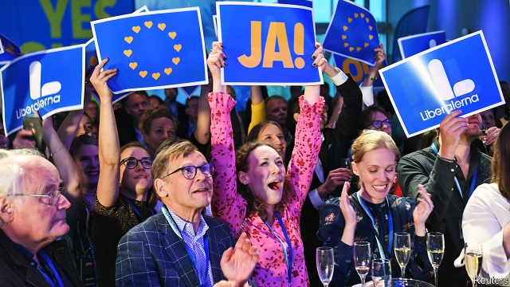

###### All the colours of the rainbow

# Fragmentation comes to the European Parliament. It might improve it 

##### The nationalist surge is less impressive than it looks 

 

> May 30th 2019 

THE MOST eye-catching political development in Europe recently has been the surge of nationalist populism. The Brexiteers in Britain, Marine Le Pen in France and the Alternative for Germany (AfD) have transformed their countries’ political landscape. Italy and Poland are both governed by anti-establishment Eurosceptics. Viktor Orban’s political dominance in Hungary is undermining liberal democracy and enriching the strongman’s friends and cronies. Many European nationalists have borrowed tactics from President Donald Trump. Steve Bannon, Mr Trump’s one-time strategy chief, even toured the continent hoping to turn the five-yearly European Parliament election into a repeat of his ex-boss’s triumph in 2016. 

The four-day election, the world’s second-largest democratic exercise after the Indian one, concluded on May 26th. Some 214m Europeans cast their ballots. At first glance, the results looked good for the Bannonite tendency. The Northern League of Matteo Salvini, Italy’s deputy prime minister, saw its share of the 751 seats in the EU’s legislature rise from five to 28. The Brexit Party triumphed in Britain to become the largest national party in the new chamber. Ms Le Pen’s National Rally beat Emmanuel Macron’s liberal slate to win in France. A closer look, however, reveals a more mixed pattern. The populist advance in Europe has slowed. Responsibility for that lies not with Mr Bannon, whom few of his hosts took seriously anyway, but with a broader trend: the fragmentation of the European party landscape. 

The three nationalist groups in the parliament gained seats overall. But their joint share rose only very modestly, from 21% to 23%, far below the one-third predicted. Without Mr Salvini’s Italian triumph they would have lost votes overall, as they did in many member states. Relative to the previous election, in 2014, Ms Le Pen in France, the hard-right Freedom Party in Austria and the nationalist Danish People’s Party all lost ground. So did Eurosceptic parties, taken collectively, in the Netherlands. In Germany the AfD only modestly increased its vote share, its disappointed leadership blaming a scandal in neighbouring Austria for the flop. Even in half-way-out Britain the Brexit Party—though seemingly coming from nowhere—was in fact largely cannibalising the old United Kingdom Independence Party’s vote. It is led by Nigel Farage, UKIP’s former leader. 

The big losers, it is true, were the two groups or families that have long dominated the European Parliament and European politics more widely: the centre-right European People’s Party (EPP) and the centre-left Socialists and Democrats (S&D). The seat tally of the EU’s unofficial “grand coalition” fell from 412 seats last time (55%) to 332 seats (44%). But it ceded these seats primarily to liberals and greens, who together gained 57 seats, or eight percentage points of the total. This shift occurred particularly in western Europe—with Mr Macron’s “Renaissance” list entering the parliament with 21 seats and Germany’s Greens doubling their share, to 21. But there were also traces of it in supposedly reactionary central Europe. In Slovakia and Romania pro-European, anti-corruption forces came first and second respectively. 

The fragmentation follows the pattern of recent national elections. The decline of big-tent parties and the rise of smaller rivals have made forming governments harder. Take Spain, where a two-party system has become a five-party one and decades of stable government have given way to a spate of wobbly, short-lived governments that have struggled to pass important laws. Yet the picture at a European level is not nearly so gloomy. The European Parliament’s problem has never been its inability to marshal deals and coalitions. No party alone has ever held a majority there, and yet the assembly passes about 90% of the legislation it considers in a process of “codecision” with national governments. 

What the parliament has lacked is a visible political contest. But for the first time in the four-decade history of elections to the European Parliament, turnout has risen; from 43% in 2014 to 51%. This may be explained by a combination of factors. The election of Mr Trump, no fan of the EU, and the Brexit vote have both reminded voters of the union’s vulnerability. New challenges that cross national borders, such as migration and economic disruption, have emphasised the EU’s role. Support for the union has risen and even Eurosceptic parties talk less about leaving and more about change from within. Personalities like Mr Macron, Mr Orban and Mr Salvini—and activists such as Greta Thunberg, whose youth climate strikes have swept European cities—have become EU-wide political figures. The result is a more plural, varied legislature resting on a foundation of higher public engagement with the union. 

 

In practice, three formations are possible in the new parliament. The first two are expanded grand coalitions. With either the greens or the liberals, the old EPP-s&D alliance would still wield a majority. But that would leave them vulnerable to rebellions, so a “super-grand coalition” could instead include all four parties for a solid majority of 131. Such an alliance would probably be necessary to push through big votes such as that on the EU’s next seven-year budget. But it would contain a vast ideological spectrum, ranging from quasi-Marxists on the left edge of the green bloc to hardened nationalists like Mr Orban (for now, though he may soon quit or face expulsion) on the right edge of the EPP. 

So yet other permutations may be needed to pass some of the legislation to come in the next European parliamentary period, which could include contentious measures like budget reforms, new common border controls, a convergence of minimum wages and a carbon tax. The EPP might rely sometimes on some of the saner right-wing nationalists to forge majorities on certain economic issues where the centre-left disagrees. The S&D might rely on the hard-left to pass social and environmental measures that lack the EPP’s wholehearted support. The liberal group’s stance will probably decide a lot of measures. The anti-establishment right by contrast may be able to organise blocking minorities on certain matters—especially if Mr Salvini is able to forge a single dominant nationalist group—but it is divided and lacks the numbers to set the agenda on its own. 

The first big test of the new arithmetic will be the parliament’s vote on the European Commission president. The candidate for the EU’s biggest job is nominated by national leaders but must secure the backing of a majority of the parliament—a first test of a super-grand coalition. It will also pit the union’s emerging left-liberal bloc, gathered around Mr Macron, against a conservative one grouped around Mrs Merkel (see article). With the decline of the EU’s two big duopolies, the Franco-German alliance and the EPP-S&D majority in the parliament, this will be a first taste of the case-by-case deals and stark political differences that are bound to become more important. The European election had been billed in some quarters as a nationalist blow to the ideal of a Europe-wide politics. Instead it may come to represent the invigoration of that ideal. 

