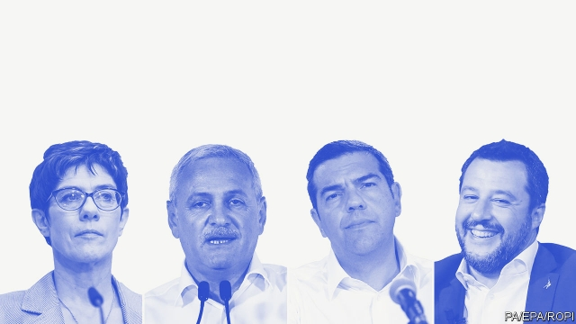

###### Old continent, new faces

# How the European elections will shake up domestic politics 

##### It’s not all about Brexit 

 

> May 30th 2019 

IT WILL TAKE weeks for the results of the European elections to take effect; the parliament does not convene until July. But in some countries events moved swiftly. Within days of the vote a chancellor was forced from office, a snap election called, a de facto leader sent to prison and some party chiefs left fighting to survive. 

The ruling Christian Democratic Union (CDU) and its Bavarian ally took first place in Germany, but with a record low score of 29%. The Greens surged into second place with over 20% of the vote. A poor national result for the far-right Alternative for Germany masked a strong showing in the country’s east, where the party came first in two of three states that will hold elections in the autumn. The biggest losers were the Social Democrats (SPD), the CDU’s coalition partner, who slumped to 16% and lost a separate election in the city-state of Bremen for the first time in over 70 years. 

Germany’s coalition is tattered but holding, for now. Yet a febrile mood has taken hold inside the ruling parties. Andrea Nahles, the embattled SPD chairwoman, has decided to flush out any internal foes by putting her leadership of the parliamentary group up for early election. But Annegret Kramp-Karrenbauer, leader of the CDU, managed to distract from the SPD’s woes by appearing to suggest that YouTube commentators should be subject to regulation during election campaigns, exposing her to charges (which she denied) of opposing free speech. Inside the CDU some wonder if the gaffe-prone Ms Kramp-Karrenbauer has what it takes to succeed Angela Merkel, her mentor, as chancellor. 

Elsewhere it was a mixed night for governing parties. The results in Italy reversed the roles of junior and senior partner in western Europe’s only populist government. Matteo Salvini’s nationalist Northern League doubled its tally from last year’s general election to 34% of the vote; the anti-establishment Five Star Movement (M5S) crashed from 32% to 17%. The opposition centre-left Democratic Party beat expectations to take second, with 23%. 

The League’s triumph could tempt Mr Salvini, the deputy prime minister, to force an election and dump the M5S in favour of a coalition with other right-wing parties. But after the result he said that his loyalty to the existing arrangement had “never been in question”. The bigger doubts are over the M5S. With the whip firmly in his hand, Mr Salvini has called for measures at which the M5S has balked, including immigration controls, infrastructure schemes and more autonomy for Italy’s rich north. Alarmingly for Brussels, the League leader also urged a tax-cutting stimulus. Italy already risks breaching euro-area budget-deficit limits, and the European Commission is reportedly preparing to begin disciplinary proceedings. But a defiant Mr Salvini said he had been given “a mandate calmly to revisit old and outdated parameters”. 

In Austria the election provided only brief respite for Sebastian Kurz, the young head of the ruling conservative People’s Party (öVP), amid a scandal that has shattered his government. On May 18th Mr Kurz ejected his coalition partner, the far-right Freedom Party, after a tape from 2017 surfaced showing its leader, Heinz-Christian Strache, promising government contracts to a woman he believed was related to a Russian oligarch. Perhaps benefiting from disillusionment with Mr Strache’s party, the öVP went on to win a record 35% of the vote. But one day later Mr Kurz’s government was toppled in a confidence vote. A caretaker government will take office before elections in September, in which Mr Kurz will hope to resume where he left off. 

Emmanuel Macron, the French president, will have been disappointed to lose to Marine Le Pen’s National Rally (formerly the National Front), which took 23% of the vote. Yet the outcome was far from devastating. Despite 28 weeks of gilets jaunes (yellow jackets) protests, and Ms Le Pen’s efforts to turn the election into a referendum on Mr Macron, she ended up with a slightly lower score than in 2014. Less than a percentage point separated the two lists. 

Perhaps most importantly, the result confirmed the upending of politics that Mr Macron brought about when he seized the presidency in 2017 with a new party, En Marche. The mainstream parties on the left (Socialists) and right (Republicans) together scored less than 15%. The only impressive gains came from the Greens, who took 13%. Mr Macron will now seek to reboot his presidency. He promises that policymaking will become more “human”, but also to stick to reform plans for pensions, unemployment benefits and the public sector. 

Nationalists struggled in the Nordics, especially Sweden and Denmark, against socialists and liberals. In the Netherlands the Labour Party secured a surprise win on the back of an energetic campaign by Frans Timmermans, a candidate to run the European Commission. But hard-right Flemish separatists did well in a general election in Belgium, held on the same day. 

In Poland the ruling populist Law and Justice (PiS) party won 45% of the vote, putting it in good stead to win a general election due in the autumn. The European Coalition, an ad hoc group of anti-PiS parties led by the centrist Civic Platform (PO), will struggle to remain united after taking a disappointing 38%. With other parties in trouble, the PiS-PO rivalry will continue to dominate Polish politics. But PiS, under its leader Jaroslaw Kaczynski, is setting the agenda with generous handouts and popular slogans. PO and others are struggling to find a coherent pitch to voters. 

It was a dreadful election for Liviu Dragnea, head of Romania’s ruling Social Democrats (PSD). Voters at home and abroad turned out in droves against a government widely perceived as corrupt. The PSD took just 23% of the vote, and 80% of Romanians backed a referendum opposing the government’s judicial reforms. A day after this drubbing Mr Dragnea, the architect of laws designed to reduce penalties for corruption that sparked huge protests, was handed a three-and-a-half-year prison sentence for abuse of office. With Mr Dragnea’s career surely over, the opposition will now seek to turf his party from office. 

Centrists enjoyed modest success elsewhere in central Europe. In Slovakia a coalition backed by Zuzana Caputova, a liberal who won March’s presidential election, came first. Viktor Orban’s Fidesz won half the vote in Hungary, though two small opposition parties did better than expected. 

Beyond MEPs, Spaniards also chose 12 regional governments and 8,131 mayors. A month after winning a general election, Pedro Sánchez’s Socialists took 33% of the vote in the European election, confirming them as comfortably the largest party. The results were also a relief for Pablo Casado, the new leader of the conservative People’s Party (PP). After a drubbing in the general election Mr Casado tacked towards the centre, winning 20% and hanging on to Madrid’s regional government. Other parties struggled. Ciudadanos, a centre-right outfit, slid to 12%. The far left and right faded. The two wings of the Catalan separatist movement secured 49% of the vote in the region. But legal troubles may prevent their two MEPs from taking up their seats. 

Mr Sánchez still needs to build a parliamentary majority. Albert Rivera, Ciudadanos’s leader, will face pressure to stop his veto of deals with the Socialists in protest at their conciliatory approach to the Catalan problem. Weeks of haggling lie ahead. 

Alexis Tsipras, Greece’s prime minister, called a snap election for July after his left-wing Syriza party suffered a crushing defeat at the hands of the centre-right New Democracy (ND). Nationalist voters punished Syriza for Mr Tsipras’s biggest achievement: resolving a 28-year dispute over the name of Greece’s northern neighbour, now known as North Macedonia. 

ND looks set to win the general election. That will reassure other euro-zone governments worried about Greece sticking to its post-bail-out reform plan, after Syriza embarked on a burst of pre-election spending. But Kyriakos Mitsotakis, ND’s leader, may struggle to form a coalition. And Mr Tsipras is unlikely to go into docile opposition. 

