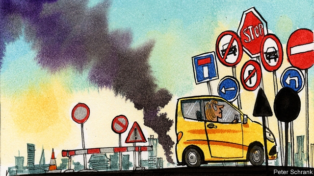

###### An enemy of the people-carrier

# Norway’s capital is the latest city to declare war on cars 

##### They paved the parking lots and put up a pedestrian paradise 

 

> May 30th 2019 

CONCERNED ABOUT pollution and congestion, a growing number of local governments are trying to reduce the number of drivers in Europe’s big cities. Some, like London and Stockholm, have imposed congestion charges to discourage driving during peak hours. Paris has tried banning cars from driving on certain days, depending on whether they have even or odd number plates. Perhaps the most ambitious plan to curb cars comes from Oslo. 

The most visible change in Norway’s capital has been the removal of public parking. Late last year, the government removed some 700 parking spaces from the city centre, replacing them with benches, bicycle docks and more pavement. The mere 50 or so spots that remain are largely reserved for handicapped residents and local businesses that rely on deliveries. 

Another big change has come in the form of zoning reform. Some roads in the city centre have been closed off to private cars; others have been changed so that traffic can only flow in one direction. Enforcement has been lax, though. The city government has placed signs informing drivers of the new rules, but not everyone has paid them much heed. It did not help that Google maps was rather slow to take in the new laws. The city council is due to vote on further reforms later this summer. 

Oslo’s plans have often been billed as a “car ban” by the press and driving enthusiasts. This overstates the magnitude of the changes. For one thing, the city’s new anti-car policies mainly affect only the compact city centre. Moreover, cars are hardly banned—walk through the streets of Oslo today and you will find there are still plenty zipping about. 

The reforms have not come easily, however. Norway’s conservatives are deeply wedded to the idea of car ownership, and shopkeepers worry that fewer cars might mean fewer customers. It is still too early to assess how effective the new measures have been. Still, early data show that pedestrian traffic in the city centre was up by 10% in the fourth quarter of 2018 over a year earlier, which suggests the reforms are working as intended. 

Hanna Marcussen, vice-mayor for urban development and a member of the Green Party, notes that Oslo’s most successful shops are on the high street, where most customers are pedestrians anyway. The government is busy compiling tax records to measure the economic impact of its reforms. Research on Stockholm’s congestion-pricing scheme finds that the benefits from factors such as shorter travel times and safer roads far outweigh the fees paid by drivers. 

Oslo’s new traffic policies represent a rare break for the Green Party. Although the left has dominated Norway’s national politics since 1927, it is actually the Conservatives who have governed Oslo for most of the past three decades. A change came in 2015, when the city made a leftward turn. The Labour and Socialist parties form the biggest coalition on the city council, but they were only able to take power with help from the Green Party, giving it extra political clout. 

The fact that the city’s efforts to curb traffic have been so controversial has forced the government to take an incremental approach, constantly negotiating with suspicious business owners. Local elections are due in September, but the Greens are confident they will stay in power. Ms Marcussen likens her government’s traffic reforms to Norway’s public-smoking ban, which was enacted in 2004. Many grumbled before the law was passed, but few today would clamour to let people smoke in pubs again. 

