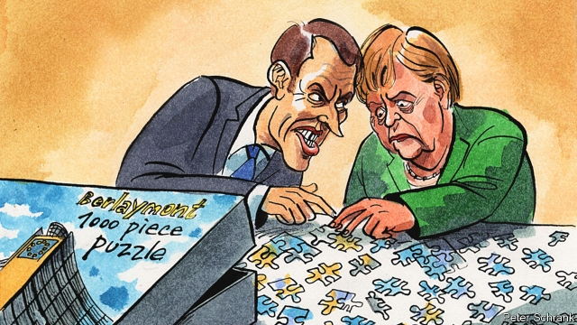

###### Charlemagne

# The race for the EU’s big jobs gets under way 

##### It shows what the block’s new political era has in store 

 

> May 30th 2019 

IT MAY NOT look impressive, but the Berlaymont building is the nearest thing the European Union has to a White House. Built on the site of a former convent on a hill above the centre of Brussels, the cross-shaped, 14-floor building houses the European Commission—the union’s executive, the guardian of its treaties and the sole institution that can initiate European legislation. Unlike the president of the European Council, the body comprising the 28 leaders of the EU member states, the commission president is more than a convener. His power (no woman has yet done the job) rests not in the fleeting politics of national capitals but in Brussels. It allows its bearer to set the EU’s long-term agenda. The view from the top of the Berlaymont has a big horizon. 

The commission presidency is the most glittering of the jobs up for grabs in the EU’s big post-election turnover. The process by which it is allocated has changed. For decades national leaders dictated their choice, but in 2009 the European Parliament obtained the right to elect the president, and in 2014 came the so-called Spitzenkandidat convention, by which only the designated “lead candidate” of a parliamentary group—probably though not necessarily the largest—can take the job. That time Jean-Claude Juncker owed his majority to the two big groups: his centre-right European People’s Party (EPP) and the Socialists and Democrats. The council did not expect this, and was bounced into accepting him. 

Again, after last week’s European elections, the EPP is the largest group. And again the socialists are second. But both suffered heavy losses. Manfred Weber, the EPP’s lead candidate, will need to win over not just the socialist group but also many liberal and green parliamentarians. Given his history of cosying up to Viktor Orban, Hungary’s authoritarian prime minister, that will be difficult. In the council he has the support of Angela Merkel, the German chancellor, but the Bavarian is strongly opposed by the French president, Emmanuel Macron, and others, who scorn his lack of executive experience. 

The battle for the commission presidency will be fought on two fronts. First, it is a power struggle between the council and the parliament. MEPs have gained strength in recent years and were emboldened by increased turnout in the election. They fear that if they do not stand by the Spitzenkandidat process, they will lose it and cede power back to the council—which has also gained stature over recent years, thanks to a succession of crisis summits that have made it the centre of attention. 

The second front is the contest between France and Germany, whose partnership is fraying. Mr Macron wants to break the EPP’s conservative dominance of the EU and is forming an alliance to do so with a bloc of liberal- and socialist-led states and a new, enlarged liberal group in the parliament. Ahead of a post-election summit on May 28th, he had lunch with the leaders of Spain, Portugal, Belgium and the Netherlands. The gang disagree on many things—Mark Rutte, the Dutch prime minister, is horrified at Mr Macron’s federalist fiscal designs—but are united in their opposition to Mr Weber, as well as on matters like climate change where they want the EU to do more, faster. They are arrayed against the EPP, which is dominated by Mrs Merkel’s Christian Democratic Union and is strongest in central and south-eastern Europe. Mr Macron’s western European gang fears stagnation and opposes Mr Weber; the EPP most fears disintegration and supports him. 

The upshot of these rivalries is that Mr Weber’s chances, though not negligible, are not great. “He will be shot down,” said one insider ahead of the summit: “whether diplomatically or not remains to be seen.” That leaves an array of alternative candidates, including three possible front-runners. Frans Timmermans is a multilingual Dutch vice-president of the commission who has tackled rule-of-law infringements. Margrethe Vestager, a Danish liberal, has won accolades as the EU’s competition commissioner for attacking uncompetitive practices and tax-dodging by American digital giants. And Michel Barnier is a moderate French conservative who has led the EU’s Brexit negotiations. Mr Macron name-checked all three as he arrived at the post-election summit. None is a “winning” lead candidate. But the Dutchman was the socialists’ lead candidate whereas Ms Vestager was one of seven leading candidates her group proposed. The election of one of the three would boost Mr Macron but all are probably acceptable to Mrs Merkel. Still, the process is likely to involve several stages of elimination and could even see a relatively unknown figure clinch the job. 

Whoever gets it, the choice will influence the allocation of the EU’s other big vacancies: those of European Council president, its “high representative” for foreign affairs, and the president of the European Central Bank, which is not attached to the EU’s political cycle but happens also to come up this autumn. Leaders will try to enforce some geographical and ideological balance. A liberal Nordic president of the commission like Ms Vestager might complement a leftish southerner, like Antonio Costa of Portugal, as president of the council, with a hawkish German ECB president to soothe Berlin and an easterner like Dalia Grybauskaite of Lithuania as high representative. The permutations are almost infinite. 

The horse-trading will last well into the autumn, and the EU’s new five-year political cycle will probably not get properly under way until early 2020. But various traits of that coming institutional phase will be become clear in the battle for the big jobs. It will be marked by an increasingly dysfunctional Franco-German relationship and growing influence for middling moderate states like Spain and the Netherlands; by debates about whether the EU needs a vanguard or should proceed at a common pace; by new tussles between the institutions; and by a more genuinely politicised European civic sphere. A new era—more fragmented, more political, more fluid—is dawning in Europe. 

