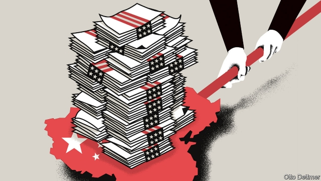

###### Free exchange

# China cannot easily weaponise its holdings of American government debt 

##### Neither country seems fully to understand the ties that bind them 

 

> May 30th 2019 

AN OLD SAYING: if you owe the bank $100 it’s your problem; if you owe $100m it’s the bank’s. The adage is silent on debts like America’s to China, of more than $1.1trn. The IOU looks like a source of leverage for China’s leadership—a reason for President Donald Trump to be cautious in waging trade war, lest his counterpart, Xi Jinping, command the People’s Bank of China (PBOC) to dump its Treasury bonds and plunge America into a fiscal crisis. An editorial on May 29th in the People’s Daily, a Communist Party mouthpiece, suggested that China might restrict exports to America of rare earths, which are used in smartphones, electric vehicles and much more. Seen against fresh threats, the $20bn-worth of long-term bonds China sold in March might seem a shot across the bow. Yet China’s bond pile is more blunderbuss than laser-guided missile. It is as likely to miss or blow up as to strike its target. 

China’s bond-buying began innocently enough. Its leaders, eager to follow the time-tested path to export-led development, favoured an undervalued currency. In the early 2000s, as rapid growth in output and exports put upward pressure on the exchange rate, the PBOC sold yuan and bought dollars, most of which it parked in American Treasuries. Cheap funding looked like a boon to America, at the time awash in red ink because of tax cuts and foreign wars. But as so often with China, something too small to notice quickly became too large to ignore. China’s official holdings of American government debt rose from just under $100bn in 2002 to a peak of nearly $1.3trn in 2013. It now manages the yuan against a basket of currencies rather than the dollar alone, and no longer buys very many Treasuries. But the reserve hoard remains. 

Its value as an economic weapon is dubious, however. The point of a bond dump would be to saturate the market for Treasuries. America’s hefty government debt needs continuous rolling over, and its stonking deficits add to the pile at a pace of about $1trn per year. Investors, for now, keep buying. But China, by selling Treasuries, might ply the market with more bonds than it can easily digest. To keep overfilled investors coming back, America’s government might need to offer higher interest rates. A big enough jump in borrowing costs could force it to choose between growth-crushing fiscal austerity and a fiscal crisis. 

But Treasuries are not a typical security. In 2011, for example, Standard & Poor’s, a ratings agency, cut America’s sovereign credit rating, citing its soaring debt and dysfunctional politics. Markets promptly gobbled up more Treasuries than ever; the yield on the ten-year bond soon fell by more than a percentage point. This anti-gravity effect derives from America’s hegemonic role in finance. It issues the world’s primary reserve currency and its most prized safe asset. The always-healthy appetite for American debt grows in times of economic uncertainty—even when America itself is the cause of the trouble. If Chinese bond sales rattle global markets, the flight to safety might well sop up the new Treasury supply. 

Even if markets remained calm, Chinese sales might prove a mere annoyance. An analysis published by the Federal Reserve in 2015 suggested that $1.5trn in bond purchases would be expected to reduce ten-year Treasury yields by between 40 and 50 basis points. A comparable rise in yields induced by Chinese bond sales would be uncomfortable, but hardly a disaster, especially since the Fed could intervene if rising yields threatened America’s economy. The Fed is currently shedding $15bn-worth of Treasury bonds each month as it unwinds the unconventional stimulus measures used after the financial crisis. Were China to start selling, the Fed could simply resume buying. 

Bond yields are only part of the picture. China bought its Treasuries to stop the yuan appreciating too quickly. Were it to sell them and convert the proceeds back into yuan, its currency would rise, hurting its already-beleaguered exporters and delighting Mr Trump. China could instead try to swap its Treasuries for other foreign assets. Alas, no other government-bond market matches America’s for size and safety. German bunds are rock-solid, but in short supply thanks to German fiscal surpluses. France, Italy and Japan offer large markets but more risk. All would fume if China turned its cash their way, causing their currencies to appreciate, hurting their exporters and perhaps inducing deflation, which they already struggle against. Their governments might respond by raising tariffs on China, a disastrous outcome for Beijing. 

China could use a bit of depreciation to offset American tariffs. Investors know this, and may be selling yuan now to avoid future losses. China’s recent Treasury sales probably represent an effort to keep the depreciation orderly, using dollars to buy yuan from bearish investors, rather than the start of a belligerent bond dump. If the pace remains slow, then China could offload more of its American bonds without angering other trading partners—but also without causing America much discomfort, if any. Moreover, as market forces push the yuan down, the value to China of dollar assets is obvious. They provide China with a bit more macroeconomic autonomy in a global economy dominated by the dollar. 

America’s place at the centre of global finance is unassailable in the short term. Yet neither America nor China appears to understand just why its position is so commanding. China might like to discomfit America by becoming a credible alternative hegemon: if investors could flee American assets in response to bad behaviour, America might behave better. But challenging America would require open markets, transparent financial institutions and the rule of law—all of which is difficult for an authoritarian regime. 

America seems just as clueless. A protectionist bully is an unappealing steward of the world economy. In abusing its privilege, it undermines the shared trust that makes Treasuries an asset without equal. This trade war has been built on mistaking strengths for weaknesses—and weaknesses for strengths. 

