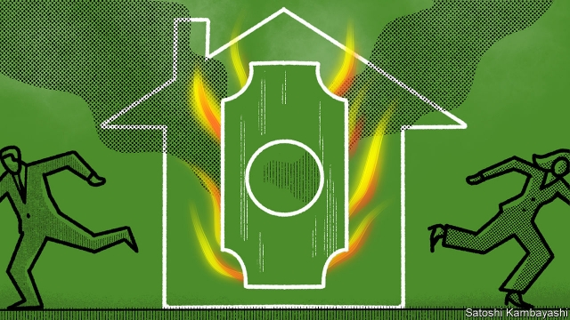
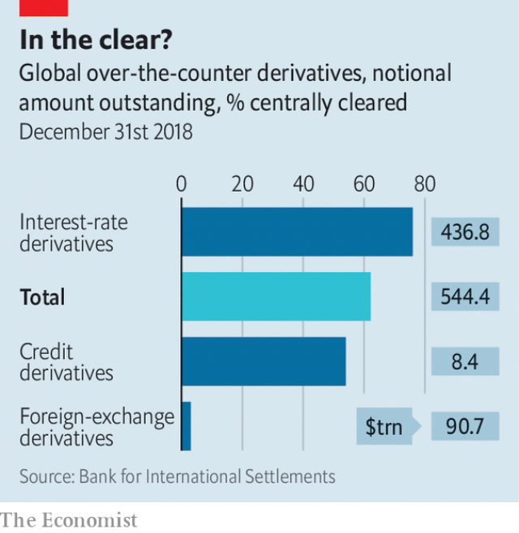

###### Flight to safety

# Have regulators created a new type of financial monster? 

##### Clearing houses pose new perils for the global financial system 

 

> May 30th 2019 

GRIMSTAD, NORWAY, is an unlikely setting for financial-market shenanigans. But the fishing town is home to Einar Aas, a trader who took huge bets on Scandinavian energy markets. His 15 minutes of infamy came in September 2018, when his bets went spectacularly wrong. Unable to cover his losses, he blew a €114m ($133m) hole in the capital buffers of Nasdaq Clearing, which handled his trades. Other members of the clearing house—mostly banks and energy-trading companies—were called upon to replenish its buffers. 

The affair sent shivers down regulators’ spines everywhere. In the midst of the global financial crisis in 2009, leaders at the G20 summit in Pittsburgh decided that the chaotic world of derivatives needed to be made safer by ensuring that they were centrally cleared. A decade later the notional value of all derivatives outstanding globally stands at a trifling $639trn, of which 68% are centrally cleared through a handful of clearing houses. Collectively these institutions contain one of the biggest concentrations of financial risk on the planet. 

Regulators fret most about a murky subset of derivatives: those that are traded over the counter by dealers and investors, rather than on exchanges. The notional value of these OTC derivatives is $544trn, of which 62% are centrally cleared (see chart). That is up from just 26% before the crisis. The share will rise further: traders who avoid clearing houses will soon be financially penalised by new rules. 

 

All this raises a queasy question: does central clearing, which was meant to make the system safer, come with new risks of its own? To answer that you have to understand Mr Aas’s fiasco better and peer into the complex cascades of liability that clearing houses manage. 

A call like Mr Aas’s is rare. Before trading through a clearing house, the parties must post an “initial margin”. When Lehman Brothers defaulted in 2008 a British clearing house, LCH, was able to cover all Lehman’s trades with its initial margin. If bets are souring, clearing houses can demand extra “variation margin”. Mr Aas posted a further $42m as markets moved against him. But when he failed to meet another margin call on September 10th, his positions were liquidated. Nasdaq had to dip into its default fund—a pool of money collected from its members. 

Nasdaq’s Scandinavian clearing house is tiny compared with the biggest, like LCH, which clears more than half the global market for interest-rate swaps, or ICE, which dominates clearing for credit-default swaps. The optimistic view is that had Mr Aas been a smaller fish, or the pond bigger and more liquid, Nasdaq might have been able to find buyers for his positions. 

Some regulators are unwilling to brush off the episode quite so easily. In a letter in March to Randal Quarles, the American Federal Reserve’s chief bank regulator, Paul Tucker, a former deputy governor of the Bank of England, expressed alarm that a single trader could wipe out two-thirds of the default fund of a clearing house—albeit a relative tiddler. It augured badly for giant institutions, he argued. 

Clearing houses can work as intended only if no one believes they can fail. Their purpose is to sit between market participants. If a hedge fund buys $100m-worth of Apple shares from an investment bank, say, and the transaction is centrally cleared, it is the clearing house that guarantees the bank gets its $100m and the fund get its shares. For simple transactions this is a small role. Cash-equity trades are settled within two days. The risk that a party goes bust before settlement is minimal. 

Now suppose the fund wants to buy an option—say, the right to buy $100m-worth of Apple shares at today’s price in a year’s time. The price it pays—the premium—will settle quickly, but the parties’ ongoing exposure will vary during the year. If Apple’s share price rises sharply before its end, the right to buy those shares at the old price becomes more valuable. If the bank holding the shares goes bust before the year is out, the clearing house will be on the hook. The longer the time between execution and settlement, the bigger this credit risk. It is magnified when products are highly leveraged, as options generally are. 

That is still better than the alternative—a bilateral trade, in the industry argot—in which the bank and fund face each other for the life of the option. This requires each to keep tabs on the other’s creditworthiness, which is hard when they do not know each other’s positions. If the fund wanted to close its position early, for example, it might sell an offsetting position to another bank. It would then appear to each bank that the fund was exposed to movements in Apple’s share price, though in reality its risks would cancel out. If its trades had been centrally cleared, that would be obvious to everyone. This lack of transparency played a big part in the financial crisis—hence regulators’ desire to shift from bilateral to central clearing. 

The trouble is that central clearing creates new risks. Incentives are skewed when the risk of default is spread across a group, making a weak counterparty everybody’s problem. Market participants may become less choosy about their counterparties. And most clearing houses are for-profit entities. Their profits rise with transaction volume, but losses for bad trades are largely borne by their members. That is a standing temptation to lower standards. 

Skimpy margin requirements or shallow default funds increase the chance that the default of a big member would leave a clearing house with large unmatched positions. It would then have just four possible sources of capital: its owner, usually an exchange; its members, usually investment banks; its customers, mostly investment funds—or, in extremis, the taxpayer. 

Each has problems. It is unclear that owners could be obliged (or could afford) to cover much. If a big burden were to fall on members, they too might be forced to default, or decide to cut their losses and walk away. If a clearing house looked likely to call on its customers’ margin, they might pre-emptively step back, closing positions to reduce their margin requirements and perhaps starting a market panic. And financial regulators are rightly determined that taxpayers should not be landed with the bill for another financial crisis. 

Clearing houses have collapsed before. In 1974 a Parisian house was felled by members defaulting on margin calls when sugar prices plummeted. In 1983 one in Kuala Lumpur came to grief when palm-oil futures crashed. But only one has been deemed too big to fail. After global stockmarkets crashed in 1987, the Hong Kong Futures Exchange clearing house collapsed and regulators shuttered the stock exchange while the government and city-state’s largest banks arranged a bail-out. 

A clearing-house collapse now would have far bigger repercussions. In his March letter Mr Tucker said that a clearing house that could not withstand a member’s default could be a “devastating mechanism for transmitting distress across the financial system”. Central counterparties, he said, were “super-systemic”. 

The shift to central clearing has been most pronounced in interest-rate derivatives, but is visible in other categories, such as credit derivatives, too. And it will continue. According to research by Citibank, an American investment bank, from September 2020, when margin requirements for uncleared trades come fully into force, investors may have to post three or four times as much margin when trading bilaterally as when using a clearing house. 

Regulators have reduced the risk that derivatives will cause as much disruption as they did a decade ago. But they have created a new group of institutions that are too big to fail. Without certainty about where a clearing house in distress can seek capital, its members and customers will be more likely to behave in ways that mean it needs that capital. Rules intended to protect taxpayers may have the paradoxical effect of putting them back on the hook. 

