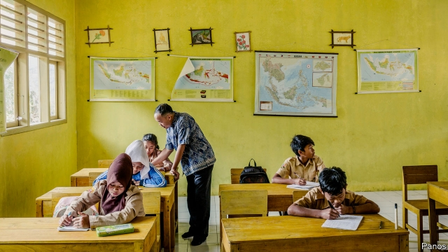
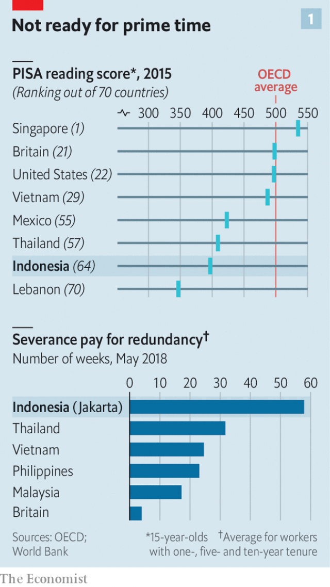
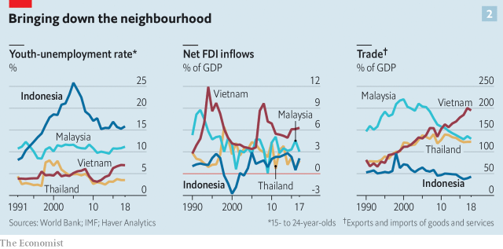

###### After infrastructure

# Jokowi wants to improve the quality of Indonesia’s labour force 

##### The best way to do that would be to attract skill-hungry businesses 

 

> May 30th 2019 

VICTORIA OPAI, a teacher in a remote part of West Kalimantan, Indonesia’s slice of Borneo, is charmed by the new road connecting her school to Putussibau, the nearest town. It is smooth, reasonably straight and cuts through swathes of jungle. It used to take three hours to get into town, she says. Now it takes 40 minutes. 

Over the past five years new roads, airports and railways have popped up across Indonesia. Reviving its ailing infrastructure was a pledge of Joko Widodo, the president, known as Jokowi, during his first term. Along with poverty-reduction measures, it helped him win re-election on April 17th. In his first term Indonesia grew by 5.1% annually; last year the IMF said ambitious economic reforms could enable Indonesia to grow at 6.5% by 2022. Jokowi promises to improve “human resources”, meaning education and the quality of the labour force. In a speech on April 30th he talked about “upskilling” Indonesia. 

In 2003 the constitution was amended to require the government to spend 20% of its budget on education. Previously it had spent about half that. And the share of 13- to 18-year-olds enrolled in school has risen over the past two decades, to 88%. But outcomes are poor. Over half of those who finish school are functionally illiterate. Between 2003 and 2015 Indonesia’s scores in the PISA tests run by the OECD, a think-tank of 36 countries, improved only slightly. In 2015 it came 64th out of 70 countries in the organisation’s rankings of 15-year-olds in literacy (see chart 1). 

 

The problem, says Daniel Suryadarma of the SMERU Research Institute in Jakarta, is not how much money goes on education, but how it is spent. Though half of the extra funding went on teachers’ salaries, pay rises were not tied to performance, so there was no impact on attainment. Meanwhile, facilities are threadbare. Half of primary schools have no electricity. 

Shoddy schooling makes it hard for people to find jobs. Red tape makes it harder still. According to the World Bank’s “ease of doing business” ranking, Indonesia has the world’s third-highest severance pay. An employee dismissed after a year is entitled to four months’ pay. Since it is expensive for firms to shed workers in lean times, they are reluctant to hire in good ones. Pricey severance also helps explain why 60% of Indonesian employees work in the informal sector, and why many of those who do not are on temporary, rolling contracts. 

Unemployment for 15- to 24-year-olds stands at 16%, which is high by regional standards and three times the rate for the working-age population as a whole. That may be partly because young people are holding out for plum jobs in the civil service, where kickbacks are easily extracted, or in the natural-resources sector, where pay is high, says Chris Manning of Australia National University. But youth unemployment is highest among university graduates, suggesting a mismatch between the skills taught and those needed. 

Hence an idea popular among policy wonks: to improve vocational schools and government training schemes. School reforms would take a generation to be felt, but better training for the existing labour force could create more jobs within a year, argues Chatib Basri, a former finance minister. That would give Jokowi the political capital and momentum he needs to press for further changes. 

The reform economists think would be most effective would be to make it easier for foreigners to invest. A study by the OECD found that Indonesia’s rules for foreign direct investment (FDI) were the third-most restrictive out of 68 rich and middle-income countries. FDI as a share of GDP has averaged 1.5% over the past three years, among the lowest in the region (see chart 2). Red tape makes it hard for foreign workers to move to Indonesia. They are less than 1% of the workforce. 

 

Loosening these rules would help to revive the ailing manufacturing sector. Indonesia struggles to compete with neighbours with better infrastructure and lower payroll costs. That is particularly the case in export-oriented industries such as smartphone assembly and shoemaking. In Vietnam the value of imports plus exports is around 195% of GDP; in Indonesia it is about 43%. Cutting import restrictions would also help. Mr Basri points out that 90% of Indonesia’s imports are raw materials or capital goods, such as machinery, which keep factories humming. 

An influx of foreign firms could have direct benefits for the education system, too. In Malaysia and Thailand, unlike Indonesia, foreigners can establish and operate universities. Moreover, foreigners could help train Indonesians. Skills are taught at least as well on the factory floor as in the classroom. Google has launched a scholarship to teach Indonesian students to code; it says it has already trained 110,000 app developers. Jokowi’s aim of upskilling Indonesia is admirable. The best way to do it is to attract skill-hungry businesses. 

