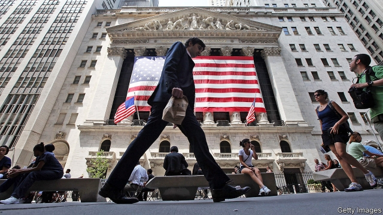

###### Far from home

# Will the trade war spell the end of Chinese stock listings in America? 

##### Hawks want a split in capital markets, but they face pushback 

 

> May 30th 2019 

AMERICAN INVESTORS wanting a piece of Chinese firms, whether state-owned oil majors or tech stars, need not stray beyond Wall Street. Over the past two decades some 200 Chinese firms have gone public in America, more than from any other foreign country. (Most have their main listing there; a few have a “secondary” one, with a main listing in China.) These firms’ total market value is more than $1trn. For America’s stock exchanges, that is a great triumph. But trade hawks are starting to describe it as a great liability. 

In a letter in April a bipartisan group of politicians led by Marco Rubio, a Republican senator, said American investors faced risks because of exposure to Chinese companies “that pose national-security dangers or are complicit in human-rights abuses”. Steve Bannon, President Donald Trump’s former chief strategist, expanded the focus to all Chinese stocks in America in an interview published on May 22nd in the South China Morning Post. “The next move we make is to cut off all the IPOs [initial public offerings], unwind all the pension funds and insurance companies in the US that provide capital to the Chinese Communist Party,” he said. 

Those threats might be dismissed as idle, but for the actions of a couple of their targets. On May 24th Semiconductor Manufacturing International Corp (SMIC), China’s largest maker of semiconductors, said it would delist from the New York Stock Exchange. Then on May 28th Bloomberg reported that Alibaba, a New York-listed Chinese e-commerce giant, was considering a second listing in Hong Kong. 

There are unglamorous corporate explanations for both moves. SMIC’s securities are rarely traded in America (its main listing is in Hong Kong), and Alibaba has long considered selling shares in either Hong Kong or mainland China, partly to broaden its capital base. But it was also easy to discern political motives. The two companies will gain some insulation from America’s capital markets and show support for their home side. That message was not lost in China. Several local reports quoted a line by Charles Li, the head of Hong Kong’s stock exchange: “Those who travel far always come home some day.” 

Yet it is premature to proclaim an end to Chinese voyages to the American stockmarket. Indeed, these have so far looked like an exception to the trade war. Just about every facet of the two countries’ economic relationship has suffered: trade, investment and even tourism have all declined. But last year more than 20 Chinese companies listed in America, an eight-year high. Another dozen have listed this year. 

Chinese firms benefit from deeper liquidity than they can get at home, and more flexible regulations. Profitability requirements have all but blocked Chinese tech firms from mainland exchanges. Last year Hong Kong drew nearer to the American norm by allowing founders to own shares with superior voting rights. But several rising tech stars still opted for Nasdaq, including Pinduoduo, an e-commerce firm, and iQiyi, a video-streaming service. “They view the American market as the gold standard,” says Drew Bernstein, the co-head of the China practice at Marcum BP, a firm of accountants. 

America has benefited, too. The presence of strong Chinese companies has reinforced its stockmarket’s position as the world leader. A series of scams, mostly involving smaller companies, have damaged the reputation of Chinese stocks. But bigger stocks have fared well (Alibaba trades at more than double its IPO price), providing investors with growth and variety. 

America’s exchanges would be loth to part with them. Shortly after Mr Bannon’s interview was published, Bob McCooey, a senior vice-president with Nasdaq, sent out a message to his contacts on WeChat, a Chinese messaging service, which spread quickly among Chinese investors. “Like many of you, I have seen the comments by President Trump’s FORMER and discredited adviser Steve Bannon. I do not believe these words to have any truth,” he wrote. Nasdaq, he added, still welcomes Chinese companies. It is a message he is likely to find himself repeating. 

