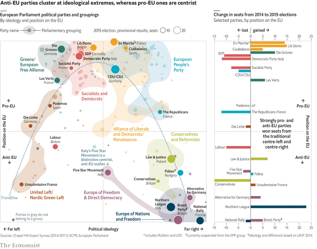

###### Europe’s elections

# Centrist liberals gained the most power in the EU Parliament 

##### Eurosceptics gained a similar number of seats, but are less ideologically cohesive 

 

> Jun 1st 2019 

EUROSCEPTICS HOPED that populist parties would sweep last week’s European Parliament elections. But voters delivered a murky verdict. Eurosceptics did make progress: parties in the top 15% of hostility towards the EU, as measured by a survey of political scientists run by the University of North Carolina at Chapel Hill, gained 30 seats. Yet parties in the most pro-EU 15% won 32 extra seats. The losers were the main centre-left and centre-right parties. 

For the first time in the parliament’s history, its two main blocs, the European People’s Party and the Socialists and Democrats, failed to achieve a majority between them. In theory, that could turn the Eurosceptics into kingmakers. In practice, the older parties back the EU and want nothing to do with the populists. That will force them to depend on the liberals instead. Moreover, the pro-EU parties are likely to form a more cohesive group than their adversaries will. 

Almost every possible mix of policy positions is present among the parliament’s 177 different parties. However, the Chapel Hill survey shows that some combinations tend to go together. Its authors assess parties’ views on dozens of issues, and aggregate them into ideological scores. The study was last run in 2017, so its ratings do not count recent political shifts. Nonetheless, its scores track well with other surveys, and with parties’ own manifestos. 

One pattern is the boomerang-shaped relationship between views on the EU on one hand, and older divides over economic redistribution and cultural openness on the other. Before the global financial crisis, Euroscepticism won few votes. But the EU’s bailouts of bankrupt member states and struggles to absorb refugees linked opposition to European integration with hostility towards bankers and foreigners. Sensing a chance to broaden their scope, far-right and far-left parties sharpened their criticism of the EU, and Eurosceptic parties became more radical on other issues. 

As a result, today’s anti-EU parties mostly land on either the far left (such as Unsubmissive France) or far right (like the Alternative for Germany). These two wings will struggle to find common cause over economic policy. The biggest exception, Italy’s Five Star Movement, sits in the centre only because it combines policies from both left and right extremes. 

In contrast, the surging pro-EU parties, including France’s En Marche and Britain’s Liberal Democrats, have much in common. They combine cultural liberalism with a centrist economic agenda emphasising equitable growth. These parties also tend to back efforts to fight climate change, making them natural allies of the Green parties that gained seats across Europe. 

European Parliament elections are sometimes dismissed as a mere opinion poll, since the body has much less power than domestic legislatures do. In terms of votes cast, pro- and anti-EU forces battled to a draw. But the parliament also has real duties, including approving the EU’s budget and laws. By this measure, liberals may have won the upper hand. 

