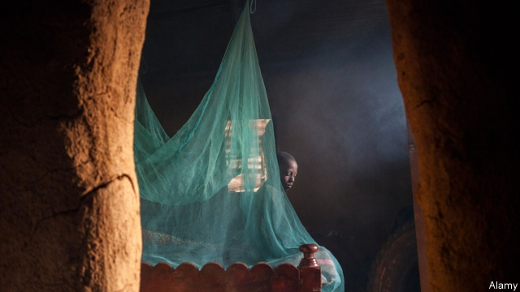
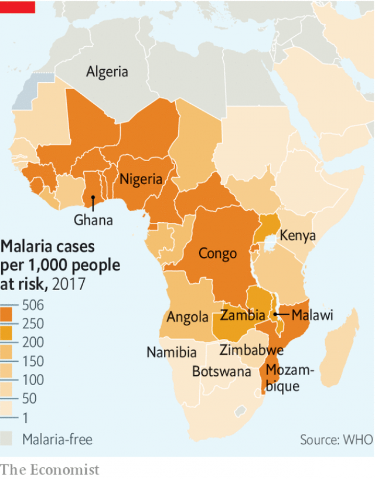

###### Trouble in parasite

# Malaria is fighting back against efforts to eliminate it 

##### In Africa cases are as frequent as ever; in South-East Asia drug-resistant strains are appearing 

 

> May 30th 2019 

THESE SHOULD be hopeful days for those battling malaria. Deaths from the disease have fallen to around 435,000 a year, from perhaps five times that number a century ago. On May 22nd the World Health Organisation (WHO) declared Algeria and Argentina malaria-free, bringing to 38 the number of countries now officially rid of the disease. Algeria will be regarded as a particular success because it is in Africa. The continent suffered 90% of an estimated 219m cases worldwide in 2017. But two big clouds darken the outlook. One is the stubborn persistence of malaria south of the Sahara. The other is the emergence of new strains of the disease resistant to the available treatments. 

Fewer Africans are dying from malaria but the estimated number of cases has barely changed since 2011. Ten African countries and India account for 70% of global cases. Numbers in India are falling, but not in the worst-afflicted African countries. Some places, such as Zambia (see article), are trying hard to tackle the disease. But malaria is proving resilient. One reason may be the declining share of families that use anti-mosquito sprays in their homes. Another may be resistance to the insecticides used in bed nets or sprays. And, though about three-quarters of the $3.1bn the world spends to fight the disease each year goes to Africa, funding per person has fallen in recent years in the most malaria-prone countries. Perhaps most important, these countries also have shoddy public-health systems, especially in war zones such as northern Nigeria. 

Such places are typically not equipped to cope with new treatment-resistant strains of the disease. More than 50 years ago, variants resistant to chloroquine, a past treatment, travelled around the world. And South-East Asia, where those variants appeared, is again suffering local outbreaks incurable by some of the main defences used against the disease, artemisinin-based combination therapies (ACTs). 

Work at Phuoc Long Hospital in Binh Phuoc province in southern Vietnam, which borders Cambodia, is thus of global interest. The facility’s 250 beds serve around 200,000 people. Funds are tight. As officials hold a morning meeting under a golden bust of Ho Chi Minh, Vietnam’s first communist leader, a toothless former soldier, still in uniform, pushes his bicycle through a courtyard with peeling paint. Doctors proudly show off new equipment for researching malaria. One reckons the hospital sees only 100-odd cases a year. But the rate of failure for one conventional ACT treatment is already frightening—above 60%, says Professor Hien Tran Tinh of the Oxford University Clinical Research Unit. Two types of malaria parasite most trouble the Greater Mekong Region. Plasmodium falciparum kills the most people globally. Plasmodium vivax is to blame for many of the cases of malaria outside sub-Saharan Africa. Less deadly than P. falciparum, it can linger in the liver after recovery and trigger a relapse. Its debilitating cycles leave victims susceptible to other diseases. 

Like any living organism subject to sufficient pressure, malaria parasites mutate to survive. In parts of the Mekong, the parasites Anopheles mosquitoes inject into the human bloodstream are resisting conventional treatment. By 2030, the WHO hopes to see malaria eliminated in the region before its resistant parasites spread. 

ACTs work in two main ways. The artemisinin lowers parasite levels in the body within about three days. A partner drug then works to clear them entirely over time. Resistance can develop to both artemisinin and the partner—and both are failing in some areas. Of the six ACTs most used in the Mekong, three are failing in parts of Cambodia, Thailand, Laos and Vietnam, and two in Myanmar. No one is sure why the Mekong seems to spawn resistance—its tropical climate, forests and rubber plantations are all thought to play a role. 

It also matters how locals behave. In Africa children and pregnant women are especially prone to malaria. In the Mekong it often affects young workers, sometimes engaged in dodgy practices such as illegal logging. Many fail to seek help quickly. Others turn to traditional healers before coming to clinics. Even when given treatment—which is free in countries such as Vietnam—victims often stop taking long courses of medication too soon. 

Weak governance is another obstacle. Failures in one country can cause trouble for its neighbours. “Vietnam should have eliminated malaria years ago but it can’t because of Cambodia,” explains one regional malaria expert. Meanwhile, more careful spending among big donors, such as the Global Fund to Fight AIDS, Tuberculosis and Malaria, a public-private body, means less money for local officials. It is therefore harder to get them to go to the remote areas where people need help. 

A prevention programme needs both to reduce the number of people bitten by infected mosquitoes and to shorten the time before infected people seek treatment. This requires adequate funding for rural health-care services and outreach programmes. Low-cost, rapid diagnostic tests remain one of the most important tools. Dr Hien slides one across the table in Phuoc Long, saying it is fairly easy and cheap to treat malaria if it is detected in the first three days. After that, “the outcomes are much more uncertain.” Real-time mapping platforms then allow authorities to track the disease and prepare accordingly. Thailand has created a notably successful one. 

Joined-up government makes a big difference. Benjamin Rolfe, who runs an alliance of Asia-Pacific leaders to combat malaria, says 12 Chinese ministries have in recent years held regular meetings on tackling malaria. Not a single indigenous case was reported in China in 2017. If national governments are sluggish, subnational leadership can help. Officials from Binh Phuoc province and Kratie province, its Cambodian neighbour, agreed last year to tackle malaria in a more co-ordinated way. 

Donors, drug firms and governments of rich countries are all working on multi-drug-resistant malaria. Pedro Alonso, the director of the WHO’s Global Malaria Programme, says the pipeline of treatments in research and development is “richer than ever”. The Medicines for Malaria Venture, which brings together donors and drug companies to develop new treatments, has had 19 new drugs approved for development over the past two decades and has trained 18,000 health workers. A new pill to treat P. vivax infections, Tafenoquine, may soon be available. It is used in a single dose, rather than as a 14-day course. Hopes are high that patients will take it appropriately. Phuoc Long hospital has a partnership with Novartis, a Swiss drug firm. Trials are being conducted into a new drug to fight malaria and two new ACTs. 

Dr Rolfe estimates that to register a new drug and conduct trials takes seven years. With drug-resistant malaria already emerging, that is an age. In 2016, $588m went into research and development globally—85% of the annual R&D spending the WHO estimates is needed globally by 2020 to cut both malaria cases and mortality rates by 40% by 2030. The total cost of meeting the goals is put at $6.6bn a year. 

 

Steady funding is essential to eliminating malaria. More than a third of the money spent on the cause around the world passes through the Global Fund. Meetings in October will determine how it spends its cash between 2020 and 2022. The hope is that the Mekong is not forgotten; its cases involving resistance remain dangerous. America provides more than a third of the funds for the global fight, so public-health executives are alarmed that the Trump administration plans to cut its anti-malaria spending by over $100m in 2020. 

Without political commitment and the cash to match, the world risks a relapse in the fight against malaria. Such backsliding occurred in the 1960s, squandering the progress in the preceding decade against the disease in many countries, including India and Pakistan. The hope is that this time success breeds greater commitment rather than greater complacency. 

Promisingly, a pilot vaccine programme was launched in April. Over the next three years the vaccine, known as RTS,S will be given out in parts of Malawi, Ghana and Kenya. It is used only on young children and works in perhaps just 40% of cases. Still it could save a lot of lives. Scientists have been struggling for decades to produce a really effective vaccine. The battle to vanquish malaria remains extremely long and arduous. 

