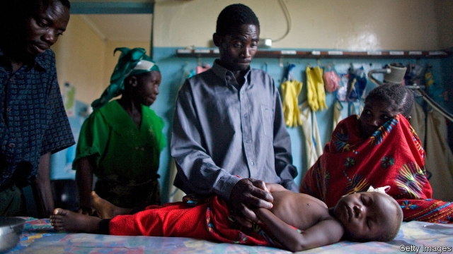

###### Aiming for zero

# Zambia cuts malaria fatalities, but not the number of cases 

##### Its aim of becoming the first malaria-free country in sub-Saharan Africa by 2021 looks very ambitious 

 

> May 30th 2019 

“IT’S BEEN a good day!” says Godwin Mathao, an elder in the village of Mwanga in south-west Zambia. Health workers have tested 34 locals for malaria. None has the disease. Such progress is difficult here—villagers often cross borders with Angola, Botswana, Namibia and Zimbabwe. It has also been hard, says Mr Mathao, to educate people about parasite-hosting mosquitoes. He points to a few houses where insecticide-treated bed nets are still used to protect vegetables from hungry chickens. 

Africa is where malaria is most tenacious. Nigeria alone has 25% of global cases. Congo and Mozambique have 11% and 5% respectively. Zambia has tried hard to tackle the disease. It was the first African country to use artemisinin combination therapy, the recommended treatment. Some 70% of Zambians have access to treated bed nets or indoor sprays. Most anti-malaria funding comes from the American government or via the Global Fund. Zambia’s government works well with foreign groups such as the JC Flowers Foundation, which funds efforts at border villages like Mwanga. But it also spends more of its own money per person at risk than its peers. 

According to the WHO, reported deaths fell from 9,369 in 2001 to fewer than 1,425 in 2017. But the number of cases—3.5m a year—has barely budged since 2014. Zambia hopes by 2021 to become the first sub-Saharan African country to eliminate malaria. That goal is admirable, but wildly ambitious. 

