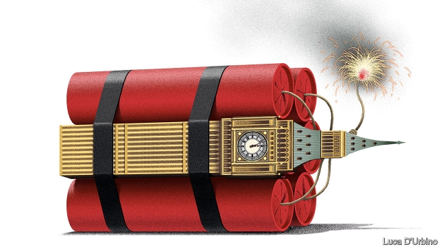

###### The next to blow

# Britain’s constitutional time-bomb 

##### Brexit is already a political crisis. Sooner or later it will become a constitutional crisis, too 

 

> May 30th 2019 

BRITONS PRIDE themselves on their “unwritten” constitution. America, France and Germany need rules to be set down in black and white. In the Mother of Parliaments democracy has blossomed for over 300 years without coups, revolution or civil war, Irish independence aside. Its politics are governed by an evolving set of traditions, conventions and laws under a sovereign Parliament. Thanks to its stability, Britain convinced the world that its style of government was built on solid foundations laid down over centuries of commonsense adaptation. 

That view is out of date. The remorseless logic of Brexit has shoved a stick of constitutional dynamite beneath the United Kingdom—and, given the difficulty of constitutional reform in a country at loggerheads, there is little that can be done to defuse it. The chances are high that Britons will soon discover that the constitution they counted on to be adaptable and robust can in fact amplify chaos, division and the threat to the union. 

On June 10th, three days after Theresa May steps down as Conservative leader, the race to succeed her will formally begin (see article). Some of the runners, including the favourite, Boris Johnson, vow that, unless the European Union gives them what they want (which it won’t), they will pull out of the EU on October 31st without a deal. The 124,000 members of the Conservative Party who will choose the next prime minister, an unrepresentative sample, to put it mildly, will thus take it upon themselves to resolve the question that has split the nation down the middle. 

Worse, Britain’s supposedly sovereign Parliament has voted against just such a no-deal Brexit on the ground that it would do the country grave harm. There will doubtless be more parliamentary machinations to stop a no-deal Brexit or force one through. The constitution is unclear on whether the executive or Parliament should prevail. It is unclear how to even choose between them. 

Behind this uncertainty lies the fact that Britain’s constitution is a jumble of contradictions scattered across countless laws, conventions and rules. As our Briefing this week describes, these can easily be amended, by a vote in Parliament or merely on the say-so of the controversial Speaker of the House of Commons—who this week vowed to stay in office in order to ensure that Parliament’s voice is heard. There was a time when most British lawmakers were mindful that playing fast and loose with the rules could undermine democracy. Perhaps that is why they used to practise self-restraint. But in recent decades, when liberal democracy seemed unshakable, Britain’s leaders forgot their caution. Instead, in a fit of absent-mindedness, they set about reinventing the constitution wholesale. 

Under Tony Blair and David Cameron, the Westminster Parliament ceded power to assemblies in Scotland, Wales and Northern Ireland and to the people directly through referendums. These innovations were often well-meant and, in themselves, desirable. But nobody gave much thought to the consequences for the constitution as a whole. 

The resulting mess has already stamped its mark on Brexit. The referendum endorsed leaving the EU but left the details for later. It provided a mandate for Brexit, but not for any of the very different forms Brexit can take. It is unclear how MPs should reconcile their duty to honour the referendum with the duty of each one of them to act in the best interests of their constituents. Other countries avoid that mistake. Ireland holds referendums, too. But Article 46 of its constitution is clear: the people vote on a change only after a bill has passed through the Dail with the details nailed down. Britain never thought to be so sensible. 

Brexit is itself sowing the seeds of further constitutional chaos, by threatening the integrity of the union. In the elections for the European Parliament (see article), the Scottish National Party (SNP) won an increased share of the poll. Scotland voted Remain in the referendum, and the SNP’s leaders can understandably claim that they have just won an enhanced mandate to leave the United Kingdom. Yet, at least one of the Tory leadership candidates is ruling out any further referendums. 

Breaking up the union would be a constitutional nightmare—if only because no process for secession is laid down. Merely choosing to hold a second Scottish referendum could be fraught. Mr Johnson is loathed north of the border. Plenty of English voters are calling for a second Brexit referendum. Mrs May told the SNP to wait until Brexit had been resolved. Legally, could Prime Minister Johnson hold the line against a determined Scottish campaign? It is unclear. 

The very act of leaving the EU would also load the constitution with fresh doubts. The Charter of Fundamental Rights, which enshrines EU citizens’ rights in law, would no longer govern British courts. Some would-be Tory leaders, such as Dominic Raab, want to scrap domestic legislation that embeds those rights. If Parliament passed oppressive new laws, the courts might complain, but they could not stop it. Voters who moan about meddling European judges might start to have second thoughts. Cue calls for a British Bill of Rights and another fit of ill-considered constitutional innovation. 

And that leads to a final worry. Britain’s ramshackle, easily amended constitution is vulnerable to the radicalised politics produced by three years spent rowing about Brexit. Jeremy Corbyn and his colleagues on the hard left could not be clearer about their ambitions to revolutionise Britain. It is naive to think they would focus on the economy and public spending, but leave the rules alone. A Labour government under Mr Corbyn—or, for that matter, a Conservative government led by a populist Tory—would be constrained only by its ability to get its way in Parliament. Labour has already called for a constitutional convention. 

Most Britons seem blithely unaware of the test ahead. Perhaps they believe that their peculiar way of doing things always leads to stability. It is indeed just possible that their constitution’s infinite flexibility will permit a compromise that gets the country through the Brexit badlands. More likely, however, it will feed claims that the other lot are cheats and traitors. 

Brexit has long been a political crisis. Now it looks destined to become a constitutional crisis, too. It is one for which Britain is woefully underprepared. 

