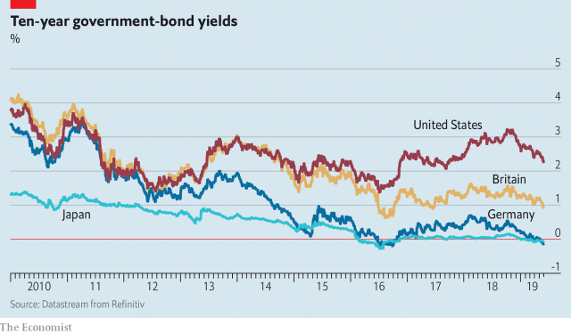

###### Calibration problem

# How central banks should prepare for the next recession 

##### They must change their targets and find new tools—while avoiding a populist takeover 

 

> May 30th 2019 

IT HAS BEEN a decade since America’s latest recession, and it has taken that long for the Federal Reserve to ask itself whether it is ready for the next one. On June 4th officials and scholars will gather in Chicago to debate how monetary policy should work in a world of low interest rates. The benchmark rate is 2.25-2.5%, which gives the Fed little room to cut before hitting zero—and less than half as much as it has needed in past downturns. As if to remind policymakers that rock-bottom rates are here to stay, the ten-year Treasury yield fell below 2.3% this week. Other central banks, many of which preside over still lower rates and weaker economies, are looking to the Fed for inspiration. 

The belated battle-planning, although welcome, is awkwardly timed. Central banking is becoming more politicised. President Donald Trump has called for the Fed to cut rates and tried unsuccessfully to appoint two of his cronies to its board. Left-wingers are increasingly interested in taking charge of monetary policy. In Britain they have suggested, variously, that the Bank of England should cap house-price growth and target productivity—as if the rate of technological change were a monetary phenomenon. Central banks are often eyed as a source of cash for infrastructure investment or for fighting climate change. The European Central Bank’s quantitative easing (QE), bond-buying with newly created money, is a source of tension between euro-zone countries, helping make the ECB’s leadership race even more political than usual. 

Given these pressures, central bankers’ caution should hardly be surprising. They surely fear that overhauling their targets and tools could lead to a free-for-all in which stability and independence give way to populist interference or even economic quackery. But that is not a sufficient reason to hold back. A worse danger is that the world faces a downturn it cannot adequately fight (see article). Central banks need to prepare for what is coming, by looking afresh at their targets and their tools, even as they strive to keep their independence. 

 

Unfortunately, the outcome of the review is likely to be just a tweak to the Fed’s target or its communications policy and a decision not to change to its tools. The Fed may pledge to redefine its inflation goal, of 2%, so that this applies on average over the economic cycle. Overshoots during booms would make up for shortfalls during busts. The theory is that this might help deal with interest rates stuck near zero, by boosting inflation expectations in a downturn. That would mean real rates were lower, giving the economy a boost. 

However that is likely to prove too modest. Start with targets. Inflation has undershot the Fed’s target 85% of the time since it was announced in 2012. Financial markets expect these shortfalls to continue for years. Investors may well ignore any new pledges from central bankers to get inflation above the target. And even if they believed the Fed, the cut in real interest rates would be too small to offset a bad bust. In the dark days of 2009 one rule of thumb for monetary policy suggested that nominal interest rates needed to be almost minus 4%. 

The tools are equally in need of an overhaul. Most central banks have three unconventional policies to stimulate depressed economies: QE, forward guidance (trying to talk down bond yields) and negative interest rates. Debate rages over the effectiveness of QE—some see it as little more than forward guidance in disguise. Yet forward guidance is not always credible, whether it is disguised or not. And deeply negative interest rates require reforms to prevent people from hoarding cash or from causing instability at banks, which will struggle to get people to pay them for taking deposits. 

If the reforms are inadequate, the result could be a long and ruinous slump. Avoiding that fate is worth the risks. Central banks should thus swap their inflation targets for something better—we favour a target for nominal GDP, a measure that is more closely tied to the fortunes of debtors and investors—and they should search for new sources of monetary ammunition. 

Politicians will inevitably play a part in the choice of such innovations—and rightly so, because they set the framework for the technocrats. What is more, the necessary work will take sustained effort, not a single meeting. The bankers should not be cowed by the threat of politicisation. Their work is too urgent and too important for that. 

