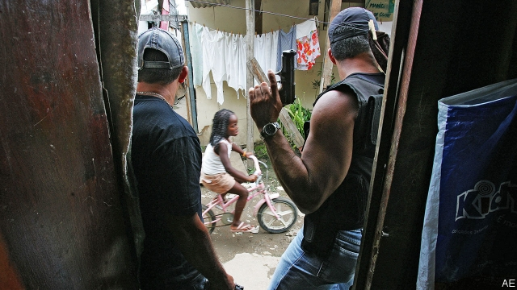

###### Fighting thugs with thugs

# Jair Bolsonaro will not defeat crime in Brazil by tolerating militias 

##### Like Rodrigo Duterte in the Philippines, he thinks more violence is the answer 

 

> May 30th 2019 

JAIR BOLSONARO, Brazil’s president, was elected last year on a promise to rid his country of a trio of plagues: economic stagnation, corruption and sickening violence. For residents of Rio de Janeiro, the last of these is most urgent. The number of murders in Rio state reached 40 per 100,000 in 2017, 14 times the rate in New York state. The government felt compelled to send in the army, temporarily, to quell the mayhem. Much of the city and its favelas are controlled by organised criminals, who are difficult to prosecute because residents are terrified to testify against them. Mr Bolsonaro is well aware of this. He was a seven-term federal congressman for the state of Rio de Janeiro and has deep personal ties to the city. Yet his prescription for fighting crime in Rio and places like it is clueless (see article). 

Instead of bolstering the institutions of law and order so that they can restore calm and prosecute gang bosses, Mr Bolsonaro thinks the way to tackle violence is with more violence. He has allowed more Brazilians to own and carry guns, encouraging them to confront criminals themselves. He also wants to make it harder to punish police officers who kill suspects. Under one proposal, a judge could suspend a cop’s sentence for homicide if he acted out of “excusable fear, surprise or intense emotion”. Yet how many cops do not experience “intense emotion” just before shooting someone? Unsurprisingly, the number of shootings by police has soared. In the first four months of this year, officers in Rio state shot dead nearly five people a day. That is more than all the police in the United States typically kill, while policing a population 19 times larger. 

Worse, Mr Bolsonaro has smiled on militias—paramilitary groups that are often run by current and retired police officers. These mafia-like organisations now, in effect, control a quarter of Rio’s metropolitan area and hold sway over a little under a sixth of its population—some 2m people. They claim to offer protection from drug gangs, and to provide services to people who live in the areas they control. In fact, they run their patch like a medieval estate, extracting money from residents with the threat of violence. Far from suppressing drug gangs, they have in some places held auctions where gangs bid for the right to distribute their wares on militia turf. 

Mr Bolsonaro has done nothing to stop the militias. He has argued, ludicrously, that they prevent violence. Until last year his eldest son, Flávio, now a federal senator from Rio, employed the wife and mother of a fugitive police officer accused of leading a militia called the “Crime Office”. Two of its members are accused of the murder of an opposition city councilwoman. Polling suggests most residents fear the militias, perhaps even more than drug gangs. Politicians, however, find them useful. They share loot with political patrons, shepherd their supporters into polling stations and intimidate their opponents. 

This should not need spelling out, but if Mr Bolsonaro wants to reduce crime, he should not allow police officers to run their own mafia. It is hard to foster respect for the law if cops can gun people down and run extortion rackets with impunity. It is also hard to instil in the cops themselves the necessary habits of patient detective work and the impartial gathering of evidence if they can close a case simply by pulling a trigger. Evidence from around the world shows that crime is lowest when the police are trusted; when officers come from the areas where they work, know the people who live there and are not seen as the enemy. 

In the past, Rio had started to do a better job of curbing gang violence. Before the football World Cup in 2014, the state government cracked down on revenge killings by cops and tried community policing. It also promised better infrastructure (such as piped water) and better services (such as schools and youth centres). The death toll declined. But then a fiscal crisis hit, the money dried up and the campaign to restore the rule of law fizzled. Now Rio has a governor who urges police to shoot criminals in their “little heads”. 

Ultimately, making Brazil safe will require an overhaul of its rotten, ineffectual institutions. If the government provided people with decent public services, taxed them fairly and cracked down on the corruption which keeps state spending from reaching them, lawlessness in the favelas would eventually fall. Sadly, there is little sign that Mr Bolsonaro or his trigger-happy allies have the patience for such a task. 

