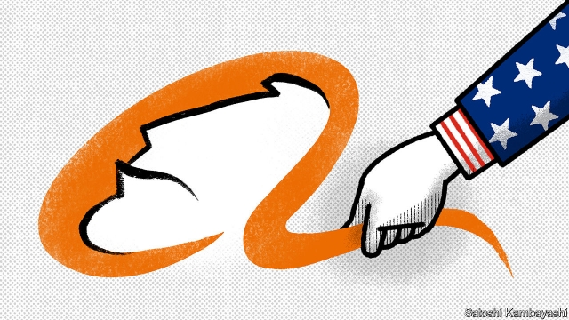

###### One thousand and one sleepless nights

# The trade war and finance 

##### Alibaba’s experience shows how relations between America and China have soured 

 

> May 30th 2019 

IF YOU WANT to understand how cooling relations between America and China are changing global business, a good place to look is Alibaba, an internet giant. It is China’s most admired and valuable firm, worth a cool $400bn. For the past five years it has also been a hybrid that straddles the superpowers, because its shares are listed only in America. Now it is considering a $20bn flotation in Hong Kong, according to Bloomberg. The backdrop is a rising risk of American moves against Chinese interests and the growing clout of Hong Kong’s capital markets. A listing there would be a sign that Chinese firms are taking out insurance to lower their dependence on Western finance. 

The world looked very different back in 2014, when Alibaba first went public. Although based in Hangzhou and with 91% of its sales in mainland China, it chose to list its shares in New York, home to the world’s deepest capital markets, which also permitted its complex voting structure. Wall Street banks underwrote the offering. Alibaba’s boss, Jack Ma, already a star in China, was toasted in Manhattan high society as the kind of freewheeling capitalist Americans could do business with. He was not alone: 174 other Chinese firms have their main listing in America today, with a total market value of $394bn, including tech stars like Baidu and JD.com. A recent notable arrival is Luckin Coffee, a Starbucks wannabe, which floated for $4bn in May (see article). 

As Alibaba has found, however, America has become less hospitable. The firm’s profits have soared and investors have made hay. But in January 2018 Ant Financial, its payments affiliate, was blocked from acquiring MoneyGram, an American rival, on national-security grounds. In November Mr Ma’s halo in America slipped when it was revealed he was a Communist Party member, like many Chinese tycoons (he is due to retire from Alibaba this year). Silicon Valley’s chiefs whisper that Alibaba’s global cloud business is a threat to American interests. If Alibaba invests in startups it could fall foul of a new law, known as FIRRMA, that requires foreign purchases of “critical technology” to be vetted. The firm is not yet under attack, unlike its compatriot, Huawei, but the mood is tense. 

The trade war between America and China has already spread from tariffs to encompass legal extradition, venture capital and the global dollar-payments system. It is easy to see how an American listing could become a vulnerability. If, for example, China were to boycott Apple (see article) or Boeing, America could respond by suspending the trading of Chinese firms’ shares and stopping them raising capital. 

Mainland China’s vast but immature capital markets are not a substitute for Wall Street. Hong Kong, China’s offshore hub, is far from perfect, not least because China appears intent on gradually undermining the rule of law there. Still, it has become a plausible alternative venue for China’s global companies. It now welcomes firms with dual-share classes after a rule change in 2018. It has expanded its role as a conduit through which mainland investors can buy shares and global investors get access to China. Last year more money was raised in listings in Hong Kong ($37bn) than on Nasdaq or the New York Stock Exchange. 

Hong Kong’s rise has been accompanied by an erosion of Western hegemony in Asian high finance. A decade ago Chinese banks were peripheral. Now Wall Street firms are not as essential as they used to be. Last year seven of the top 20 equity underwriters in Asia were Chinese. Chinese banks are among the largest cross-border lenders in Asia. America still controls the dollar-payments system, but in time that could change, too. 

With a Hong Kong listing, Alibaba would have another place to raise capital. It is still expanding fast—sales grew by 51% last year. New York will continue to thrive as a financial centre, even if Chinese firms start to shy away. But the bigger message is that, as the trade war rumbles on, the immensely complex global network of financial and commercial ties is adjusting. Big hardware firms are tweaking their supply chains. Retailers are shifting their sourcing so that goods sold in America are not made in China. Banks are cutting their exposure to counterparties that could face American sanctions. And even the world’s most successful firms, such as Alibaba, feel they need a backup plan. It is a very different vision from the one Mr Ma stood for when he rang a ceremonial bell at the New York Stock Exchange back in 2014. 

