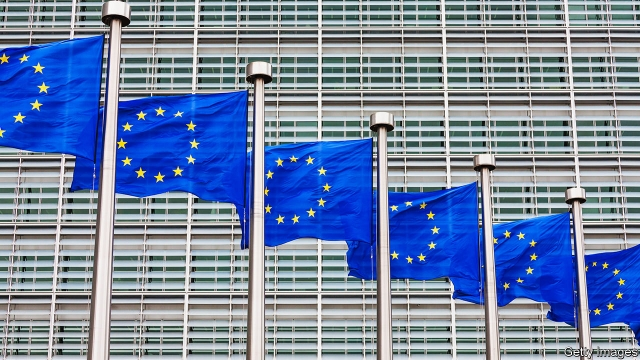

###### Buggins belongs at the back

# When picking leaders, the EU should put skill before box-ticking 

##### Surely Europe can find a better president than Manfred Weber? 

 

> Jun 1st 2019 

SEEN FROM afar, Europe is shrinking and ineffective. In Germany Angela Merkel’s chancellorship is winding down. Domestic woes bedevil the French president, Emmanuel Macron. Britain is leaving the EU, which is divided between east and west, north and south, liberals and authoritarians. The big centre-right and centre-left blocks are struggling, as politics fragments across the continent. If America or China wants to speak to Europe, it is less clear than ever whom they should call. 

The European Parliament elections have brought yet more fragmentation, with the two main groups losing seats and their joint majority in the EU’s legislature (see article). Liberals, Greens and right-wing populists gained. The union today resembles a patchwork of ideological and regional tendencies (see article). That makes the task of parcelling out its big jobs extra-fiddly. There are four vacancies: the presidencies of the European Commission (the EU’s executive), the European Council (its senate-like body of national leaders) and the European Central Bank (ECB) as well as the “high representative” for the EU’s foreign and security policy. A convention of 2014 says the commission job should go to the “lead candidate” of the largest group in the parliament. Under an older precedent, those appointed to the top positions are meant to include representatives of all corners of the continent and of the big political families. Different permutations are lined up until, like a Rubik’s cube, everything slots into place. 

A more complex political landscape puts both of these conventions in doubt. The top lot in the parliament is now, as before, the European People’s Party (EPP), a group consisting mainly of Christian Democrat parties. But the EPP won only 24% of the seats, which hardly justifies an exclusive claim to lead the commission. And the Rubik’s routine cannot hope to capture the variety of political families and regional patterns in today’s Europe. Even if a token southerner were appointed, for example, the difference between a candidate from pro-European Spain and one from Eurosceptic Italy might be vast. If Christian Democrats, Social Democrats and Liberals all get to run things, the only slightly smaller Greens will understandably object. The cube has too many dimensions. 

Perhaps that is just as well. For now, more than ever, Europe’s leaders should be concentrating instead on getting the right people for the job. President Donald Trump has questioned the transatlantic alliance, tariff wars threaten Europe’s prosperity, turmoil on its borders challenges its security, digital giants from China and America are dwarfing its firms, and economic storm-clouds are once again gathering above the euro zone. Leading a more fragmented Europe through these difficulties—let alone reasserting its interests and relevance in the world—will require seasoned leadership. 

The EU may not get it. Manfred Weber, the EPP’s candidate for the commission, has no executive experience and, judging by his association with Hungary’s authoritarian government, poor judgment. If he falls short, leaders may offer the ECB presidency to another German, Jens Weidmann, a banker with über-hawkish views, to ensure that a German gets at least one of the top jobs. But that should not be a given. In a more meritocratic EU the commission presidency might go to Margrethe Vestager, the dynamic (Danish) competition commissioner. Antonio Costa of Portugal, Leo Varadkar of Ireland or even Mrs Merkel, all skilled compromise-brokers, might lead the council. At the ECB, a moderate like Finland’s Olli Rehn would be better than Mr Weidmann. 

True meritocracy is improbable, alas. National egos and power politics will always require some horse-trading. But as much as possible, the EU should focus on substance. From the euro-zone and migration crises to the Brexit vote, the EU has had several brushes with mortality in recent years. More are doubtless to come. Its big jobs matter. Placeholders should not apply. 

