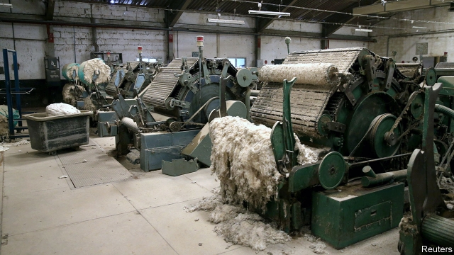

###### Protection racket

# Muhammadu Buhari has big ambitions for Nigerian manufacturing 

##### But his policies help only a few industrialists 

 

> May 30th 2019 

SUNLIGHT POURS onto yellowing cloth in the Gaskiya textile factory in Kano, northern Nigeria’s largest city, through gaping holes in its tin roof. Chickens in the carcass of a van pierce the silence. Before this textile mill closed in 2005, says Yau Muhammad, one of 4,000 former employees, it was among West Africa’s largest. 

In 1985, when Muhammadu Buhari—then Nigeria’s military ruler—cut the ribbon on this factory, industry was thriving in Kano. In the decades since many others in the city have suffered its fate, crippled by power shortages and cheap imports. More than 300,000 jobs have vanished from the textile industry alone. Mr Buhari, who was elected president in 2015, wants to promote manufacturing by getting Nigeria to make more and import less. 

His central bank governor has withheld foreign exchange for some goods (see article) or slapped hefty import duties on them. This has been excellent news for industrialists such as Aliko Dangote, a billionaire who grew rich selling cement at eye-watering profit margins that reached as high as 60% behind high import tariffs. It has not been so good for Nigerian consumers, who must pay more for their groceries and their homes, or for productivity. Companies must pay more for buildings; the government, for roads and bridges. 

Officials insist that protectionism works. They point to rice farming, which is booming thanks to a 60% tariff on imported rice. At the Umza Rice Mill on Kano’s outskirts, workers feeding machines with sacks of rice lifted from burlap mountains do not have time to stop and talk. Muktar Khaleh, the factory’s managing director, says its capacity has more than doubled since 2014 and that he has little sympathy for failed textile firms. “They need to modernise and try to compete with China, the way we compete with rice-producing countries like Thailand,” he says, ignoring the role tariffs play in nobbling the competition. Tariffs encourage smuggling, too. Thai rice exports to Nigeria have slumped since the tariffs were raised in 2016, but those to neighbouring Benin mysteriously more than doubled between 2015 and 2017. This tiny country of 11m people is now the world’s largest importer of Thai rice. 

For manufacturers who are not protected by tariffs, things are grim. This is especially so if they cannot get subsidised foreign currency from the central bank to import raw materials. A plastics-maker in Kano says he and most of his neighbours are operating at less than 10% of capacity. Many may be sunk by a planned two-thirds increase in the monthly minimum wage. Other managers complain that electricity supplies are unreliable and expensive. Even successful firms like the Umza Rice Mill rely on generators for their own power. “There is no way anyone in Nigeria can produce without them,” says Mr Khaleh. A Chinese textile importer laughs when asked if he would ever move production to Nigeria. 

The government says it is tackling the power shortage. To its credit, factory owners in Kano say power cuts have become slightly less frequent in the past year. It has extended loans to power distributors to help expand their capacity and has loosened regulations to allow companies to buy power from independent producers at whatever price they want, instead of the one set by the regulator. 

Even so, Nigeria’s electricity firms produce about as much power as the city of Edinburgh. Without a huge increase in capacity—let alone literacy rates— Nigeria has little chance of expanding its industry, says Charlie Robertson, an economist at Renaissance Capital, an investment bank. 

This is harsh news for the millions of Nigerians who will reach working age in the next few years. For many, like those laid off by Gaskiya textiles, the government’s manufacturing push comes far too late. Mr Muhammad gets a stipend from his union to guard his former workplace, so that its owners cannot sell off the land and machinery until they have settled unpaid wage bills. But, he says, most of his ex-colleagues are still out of work. “Muhammadu Buhari,” he sighs, “was our last hope.” 

