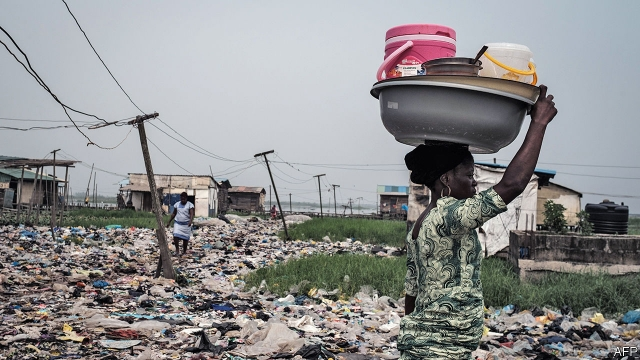

###### Baba go-slow

# Nigerians got poorer in Muhammadu Buhari’s first term 

##### He will need to solve a revenue crisis in his second 

 

> May 30th 2019 

LONG LINES of lorries stretch like tentacles from Apapa port, the largest in Nigeria. Drivers doze in their cabs, feet flung over dashboards; some sling hammocks beneath the chassis. Musa Ibrahim, an ebullient trader, says he has been queuing for two days. He gestures at empty buildings. “Most of the companies you see here they done close,” he sighs. 

The Nigerian economy is stuck like a stranded truck. Average incomes have been falling for four years; the IMF thinks they will not rise for at least another six. The latest figures put unemployment at 23%, after growing for 15 consecutive quarters. Inflation is 11%. Some 94m people live on less than $1.90 a day, more than in any other country, and the number is swelling. By 2030 a quarter of very poor people will be Nigerian, predicts the World Data Lab, which counts such things. 

Nigeria’s engine was already sputtering when President Muhammadu Buhari took the wheel in 2015. The price of oil, which makes up 9% of GDP and more than 90% of export earnings, had crashed. But “Baba Go Slow”, as Nigerians took to calling him, made a bad situation worse. Instead of letting Nigeria’s currency slide, which would have stoked inflation, policymakers rationed dollars to maintain the naira’s long-standing and artificially high peg to the dollar. To do so the central bank refused to release foreign currency for a long list of imports, ranging from toothpicks to shovels. Without dollars for equipment or supplies, factories closed and workers were laid off, leading to a recession in 2016. 

The central bank confused things further by introducing several exchange rates. First was the official one of 305 naira per dollar, an absurdly low rate useful for importing petrol and massaging political egos. Its second rate, of 320 naira per dollar, was used to funnel artificially cheap greenbacks to favoured importers. Naturally, there were not enough dollars to go around, so most Nigerians (especially those importing toothpicks) had to pay as much as 500 naira for one on the black market. Most of these rates have converged of late, at about 360 per dollar. But the confusion arising from having so many discourages foreign investment. 

The government thinks the answer to the “dollar shortage” is for Nigerians to make and grow more and import less (see article). To this end it has slapped import taxes on rice and is giving tax breaks for a huge new oil refinery. 

 

There is little sign of the kind of export-led industrial revolution that has lifted incomes in Asia. This is not only because the naira is overvalued. It is also because the state has spent decades neglecting basic public goods, like roads, schools and electricity. “In Nigeria if you set up a business you have to build your infrastructure, you have to build your power plant, you have to build everything,” says Abdul Samad Rabiu, the chairman of BUA Group, a conglomerate. Eghosa Omoigui, who manages a tech fund, compares running a business there to “running a nation state”. 

Where urgency is needed, Mr Buhari offers only caution. Few are holding their breath for any more drive in his second term, which began on May 29th. “We are trying to avoid shocks,” explains Adeyemi Dipeolu, his economic adviser. Sharp currency movements or hikes in electricity tariffs would be felt by ordinary Nigerians. Yet officials are postponing a crisis, not averting one. Consider borrowing. The debt-to-GDP ratio is 28%. But Nigeria collects so little in tax that interest payments swallow about 60% of federal revenues. 

“We don’t have a debt problem, we have a revenue problem,” insists Udoma Udo Udoma, the budget minister in Mr Buhari’s first term. The government plans to raise funds by selling off some of its share in joint-venture contracts with oil companies and might hike taxes on luxury goods. Revenues are rising, but fall far short of budget targets. Some of the gap is probably being filled by running up an overdraft with the central bank, which now holds more assets than all other banks in Nigeria combined. 

Public finances would be healthier if the government raised the price of fuel, which is imported by the state oil company and sold on at a loss. Last year this subsidy was worth at least 0.5% of GDP—as much as the government spent on health care. Politicians are scared to end it. An attempt to do so in 2012 led to massive protests. Although the government has expanded school-feeding programmes and is working on a safety-net for the poor, most citizens get few benefits from the state. Oxfam, a charity, ranks 157 countries on their commitment to reducing inequality, based on social spending, taxes and labour laws: Nigeria comes last. 

For Nigeria to prosper, the state could harness the vim of its 200m citizens. Instead it ignores them, except when politicians need votes. People have come to expect nothing from government, says Chika Okeke, who owns a small stationery shop in Lagos: “you struggle yourself.” 

