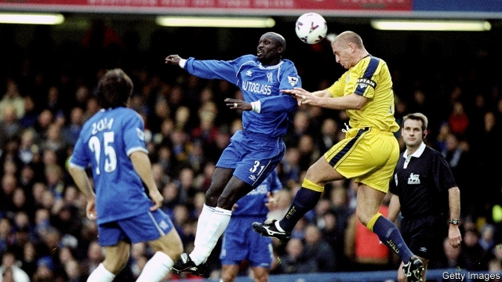

###### Liberia’s lurch

# President George Weah faces a slumping economy and protests 

##### Corruption, already bad, is getting worse 

 

> May 30th 2019 

GEORGE WEAH has usually had luck on his side. To be sure, skill and hard work propelled him from a west African slum to playing for the top teams of European football. But fortune also smiled on him. Take the award he won for “fair play” in 1996—just weeks after headbutting a player. 

Now president of Liberia, Mr Weah’s luck seems to be running out. Less than 18 months after being sworn into office he faces a wave of protests on June 7th. Some of the unhappiness with his government is caused by a stumbling economy. The IMF reckons that growth will slow to 0.4% this year, from 1.2% last year, and that annual inflation will have more than doubled over three years, to 22%. 

But people are also furious about corruption. About half of Liberians polled by Afrobarometer last June said they had been forced to pay backhanders for help from the police or to get public services. A similar proportion said graft had grown worse over the previous 12 months. 

It is not just Liberians who are fed up with corruption. A recent letter to Mr Weah from nine ambassadors—including those of America, Britain, France and Japan—raised concerns that his government was taking money from programmes funded by foreign donors, the accounts for which are held at the central bank. The letter, which was leaked to The Economist, demands that the money be returned without delay and that “such unacceptable practices cease immediately”. 

The World Bank has a similar gripe. In a separate leaked letter to Samuel Tweah, the finance minister, the bank complained about millions of dollars that had been taken out of accounts earmarked for providing drinking water or for projects such as responding to Ebola, a deadly virus that ravaged west Africa in 2014-16. It, too, demands that the money be repaid. 

The self-styled Council of Patriots, which is organising the protests, says it is demanding cleaner government as well as justice for atrocities committed during Liberia’s civil war. For many Liberians the very thought of unrest evokes memories of a conflict that raged almost continuously from 1989-2003 and destabilised the region. A succession of bigwigs from the African Union, UN and ECOWAS, a club of countries in the region, have flown in to mediate and call for calm. Mr Weah needs to get his eye back on the ball. 

