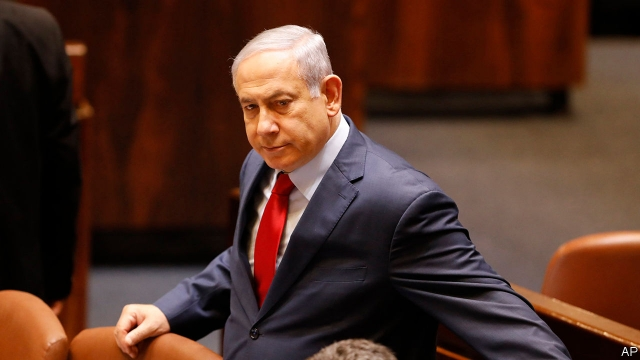
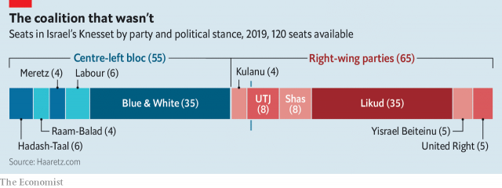

###### Back to the ballot box

# Unable to form a government, Binyamin Netanyahu calls an early election 

##### Not for the first time, his rivals sense an opportunity 

 

> May 30th 2019 

IT WAS NOT even two months ago that Binyamin Netanyahu declared “a great victory” after his Likud party took 35 seats in a hard-fought election. The voters seemed to have given the prime minister an unprecedented fifth term; soon he would become Israel’s longest-serving leader. His bloc of nationalist and religious parties held a 65-seat majority in the Knesset (see chart). All that was left was the haggling, over cabinet posts and policies, before Mr Netanyahu announced his new government. 

The haggling, though, got the better of him. Bedevilled by the demands of Avigdor Lieberman, a rival on the right, Mr Netanyahu was unable to form a government by the deadline on May 29th. To stop the president from asking the opposition to have a go, he and his right-wing colleagues (along with the Arab parties) finally agreed to dissolve the Knesset and call a new election. Many members had yet to make a speech when they voted to give up their jobs. For Mr Netanyahu it is an unusual failure—one that threatens his political survival. 

The situation is unprecedented. Every other election since Israel’s founding in 1948 has resulted in the formation of a government. The finance ministry says there is no money for a new election, which has been scheduled for September. (It will surely find the shekels.) 

 

The ostensible cause of all the chaos is legislation, drafted by the previous government, that would cut into the exemption of religious students from compulsory military service. Under the bill an increasing (though still small) number of such yeshiva students would be required to serve. Mr Lieberman, who leads Yisrael Beiteinu, a secular nationalist party, insisted that it be passed by the new Knesset without any amendment. But United Torah Judaism (UTJ) and Shas, ultra-Orthodox parties, oppose the measure. Mr Netanyahu needed the support of all three in order to have a majority. He could not bridge the divide. 

The exemption for yeshiva students has long been a political hot potato. Mr Lieberman insists that for him it was “a matter of principle”. But he is also positioning himself for the day after Mr Netanyahu. The two go back three decades. Mr Lieberman, a former Likudnik, served as his political aide and director-general of the prime minister’s office. He was Mr Netanyahu’s defence minister until last year—when he (unsuccessfully) tried to bring down the government by withdrawing his party from the ruling coalition. He again senses weakness and by choosing an issue popular with secular voters he believes he can increase support for his party in the next election, while hastening his rival’s downfall. 

 

Mr Netanyahu normally exudes confidence. But as the deadline to form a government approached, he looked desperate. He tried to tempt Labour to join him by offering it the defence portfolio—even though he has spent years branding the party as weak on security. Perhaps he was just trying to scare Mr Lieberman into a compromise. Perhaps he was scared himself. Mr Netanyahu has been indicted, pending a hearing, in three corruption cases. He was counting on his new coalition to pass laws that would grant him immunity from prosecution and limit the Supreme Court’s power to overturn legislation. 

Prosecutors accuse Mr Netanyahu of taking gifts from wealthy benefactors in return for favours, and offering help with regulatory matters to publishers in exchange for positive coverage. He denies wrongdoing. The allegations did not seem to hurt him during the last election. But even if he wins the next one, he may not have time (or a majority) to pass his desired laws before pre-trial hearings begin in October. His lawyers have tried to delay the proceedings. They are now ploughing through piles of evidence. 

Mr Lieberman is the first right-wing politician to rebel against Mr Netanyahu. Will others follow? Within Likud there are grumbles, but only one senior member, Gideon Saar, a former interior and education minister, has criticised the effort to grant the prime minister immunity. The party has never deposed its leader and Mr Netanyahu is still popular with the rank and file. Other potential rivals seem not to share Mr Lieberman’s assessment of the prime minister’s vulnerability. That Mr Netanyahu was able to convince a majority of lawmakers to fire themselves shows the hold he still has over the right wing. 

It is also a testament to the weakness of the opposition. Benny Gantz, the leader of Blue and White, which also won 35 seats in the last election, demanded that he be allowed a shot at forming a government. But he could not muster the votes to block Mr Netanyahu’s move. During the latest election he was unable to cut into the prime minister’s support, instead taking votes from other centre-left parties. Turnout was down. Mr Gantz may have trouble convincing voters to show up in September if he seems likely to lose again. 

Much can change between now and then. In late June the Trump administration will unveil the economic portion of its plan for peace between Israel and the Palestinians. It had delayed the announcement in order to keep it from becoming an issue in the last election. But the new vote will probably turn into another referendum on Mr Netanyahu, who has four months to convince voters to increase his mandate. 

