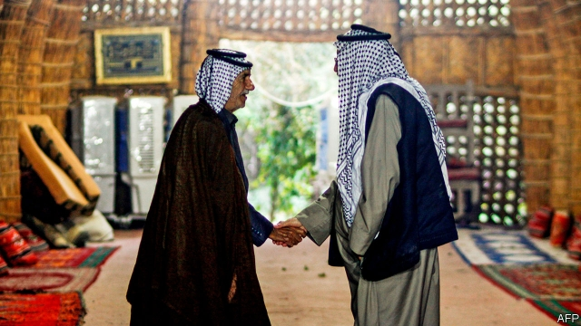

###### Rent-a-sheikh

# With Iraqi tribes settling more disputes, sheikhs are in high demand 

##### Not all who rent out their services are real 

 

> May 30th 2019 

AFTER DISCOVERING that one of his employees had embezzled $800,000, Saif took him to a court in Baghdad and won. When the thief still did not return the cash, he was thrown in jail. But he was soon released, probably after paying a bribe. Fearing he would never see his money again, Saif began negotiating with the thief’s tribe—or, rather, his rental sheikh did. Saif, who grew up abroad, was unfamiliar with tribal practices, so he hired a tribe to back him and its leader (the sheikh) to represent him. 

Iraq is home to around 150 tribes, whose sheikhs long helped resolve disputes. Saddam Hussein tried to weaken them, but after he fell in 2003, sheikhs filled the vacuum left by a fragile and corrupt state. Today even some corporate lawyers advise their clients to use tribal councils rather than courts, especially if the sheikhs involved have links to powerful militias. This has led to a booming new business: sheikhs who rent out their services. Only some are real. 

It is often hard to tell, especially in cities, where tribal bonds have weakened. Certain restaurants in Baghdad are known as meeting spots for rental sheikhs. Sometimes people on the wrong side of the law seek out the fake sort because they are too embarrassed to go to their real sheikhs. Saif, by contrast, didn’t know his own sheikhs. He found his rented tribe through a friend. It cost him thousands of dollars in meals and attendance fees, as the rental sheikh and his counterpart mulled over the case. As often happens, both sheikhs demanded a commission for a successful settlement. 

Relying on tribes to settle disputes has advantages. Courts dawdle; tribal negotiations can lead to deals in a matter of days. They are good at settling community or family feuds. But there is growing abuse of the system, especially as it takes on more commercial disputes. In rural areas tribes often extort money from oil and gas firms that operate nearby. In cities impostor sheikhs take money without producing results. Seven months into tribal negotiations, Saif had recovered only a fraction of the money that was stolen from him. 

One reason could be a recently passed law declaring tribal intimidation tactics, such as the degga ashairiya (tribal knock), acts of terror. The degga involved shooting (or “knocking”) at someone’s house. It was a useful way to get people to the negotiating table. It was also abused. Many Iraqis welcomed the ban. 

They complain, though, that the government has not also strengthened the legal system. After years of war Adel Abdul-Mahdi, the prime minister, has vowed to boost investment to bring down unemployment. But few investors dare inject money into a country where sheikhs and militias wield more influence than judges. Take the case of Muhannad, who turned to the tribes when a commercial tenant refused to vacate his building—then stuck an AK-47 in his face. According to a hand-scribbled tribal agreement, Muhannad must pay the tenant $140,000 to leave. “The government isn’t strong enough to finish the case,” said Muhannad. “So we prefer to buy our peace and safety with money.” 

